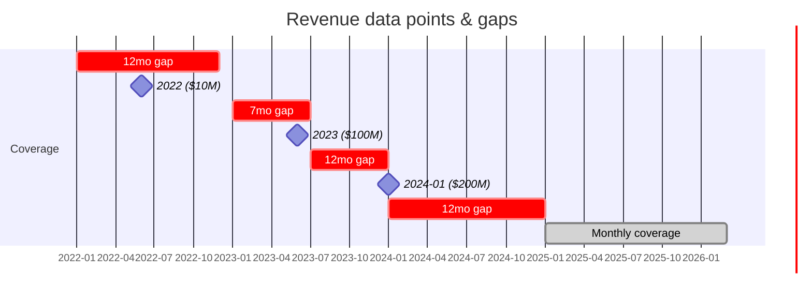
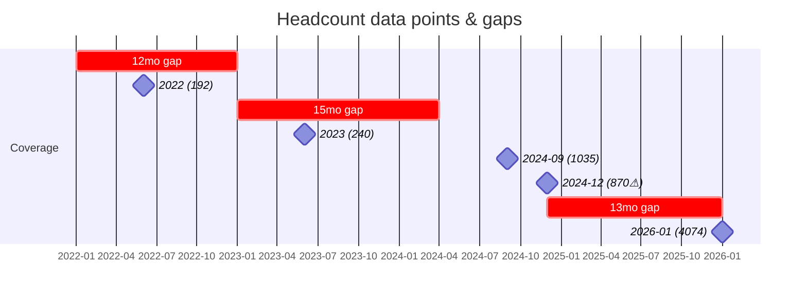
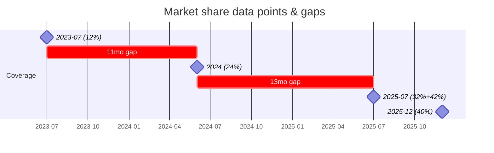
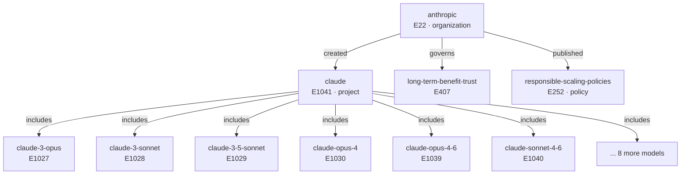

# Anthropic — Statement Ontology

> Generated: 2026-03-06 (v5)
> Review this file, add comments/annotations, then run `crux statements apply-draft anthropic`

This document defines what we want the Anthropic statement set to look like — organized by the questions these statements should answer. Each section shows the target state, what we have, what's wrong, and what's missing.

**Current state**: 122 active statements, 83 classified (68%), 39 unclassified.

---

## Q1: What is Anthropic's financial trajectory?

**Goal**: Revenue growth curve, capital raised, valuation, and unit economics over time.

### Revenue (10 statements)

| Date | ARR | ID | Issues |
|------|----:|---:|--------|
| 2022 | $10M | #11803 | ⚠ year-only — refine to month |
| 2023 | $100M | #11789 | ⚠ year-only — refine to month |
| 2024-01 | $200M | #11857 | |
| 2025-01 | $1B | #11761 | |
| 2025-05 | $3B | #11858 | |
| 2025-07 | $4B | #11760 | |
| 2025-10 | $7B | #11859 | |
| 2025-12 | $9B | #11759 | |
| 2026-02 | $14B | #11758 | |
| 2026-03 | $19B | #11798 | |

**Data quality**: #11803 and #11789 have year-only dates. Likely "end of year" ARR figures — should refine to `2022-12` and `2023-12` if sources support it.

**Junk to remove**:
- [x] RETRACT #11750 reason="revenue growth narrative — already captured by revenue time series data"
  > "Anthropic's revenue has grown over 10x annually for three consecutive years, from approximately $1 billion at the start of 2025 to $14 billion by February 2026."
  > This is a summary/analysis of the time series, not a new data point.

**Duplicate**:
- [x] RETRACT #11864 reason="duplicate of #11388 revenue-guidance"

### Revenue Guidance (2 statements after dedup)

| Date | Projection | ID |
|------|----:|---:|
| 2026 | $23B | #11762 |
| 2028 | $70B | #11388 |

### Funding Rounds + Valuations

These are really the same events. A Series D has both an amount raised and a post-money valuation. Currently stored as separate `funding-round` and `valuation` properties. Shown together to make the picture clear:

| Date | Round | Raised | Valuation | Funding ID | Val ID | Issues |
|------|-------|-------:|--------:|----------:|------:|--------|
| 2021-05 | Series A | $124M | $550M | #11611 | #11784 | |
| 2022 | Google strategic | $300M | — | #11710 | — | ⚠ no source URL, **date wrong: should be 2023-02** (FT reported Feb 2023) |
| 2022-04 | Series B | $580M | $4B | #11779 | #11785 | |
| 2023-05 | Series C | $450M | $4.1B | #11780 | #11786 | |
| 2023-09 | Amazon strategic | $4B | — | #11781 | — | |
| 2023-10 | Google strategic | $2B | — | #11614 | — | ⚠ Wikipedia source |
| 2024-01 | Series D | $750M | $18.1B | #11782 | #11787 | |
| 2024-07 | — | — | $30B | — | #11865 | Secondary valuation? No funding round paired |
| 2024-11 | Amazon strategic | $4B | — | #11617 | — | ⚠ Wikipedia source |
| 2025-01 | Google strategic | $1B | — | #11866 | — | |
| 2025-03 | Series E | $3.5B | $61.5B | #11783 | #11788 | |
| 2025-07 | DoD contract | $200M | — | #11870 | — | ⚠ NOT a funding round — this is a government contract |
| 2025-07 | Series F | $13B | $183B | #11725 | #11724 | ⚠ no source URL |
| 2025-11 | Microsoft+Nvidia | $15B | $350B | #11709 | #11757 | ⚠ no source URL |
| 2026-02 | Series I | $30B | $380B | #11763 | #11756 | ⚠ no source URL |

14 funding-round + 9 valuation = 23 statements.

**Issues found**:
1. **#11870 is misclassified** — A $200M DoD contract is not a funding round. Should be reclassified to a new property like `government-contract` or moved to a different category entirely.
2. **4 funding rounds have no source URL** (#11710, #11725, #11709, #11763) — these are large, significant rounds. Need citations.
3. **2 rounds cite Wikipedia** (#11614, #11617) — should find primary sources (press releases, SEC filings, TechCrunch).
4. **Series naming gap** — Series F (#11725) jumps to Series I (#11763). Citation verification clarifies: the Microsoft+Nvidia round was a "strategic partnership investment" without a series letter. The actual series sequence is A→B→C→D→E→F→G (Feb 2026 $30B). Our #11763 is labeled "Series I" but is actually **Series G**. #11709 has no series letter — it's a strategic investment, not a named round.
5. **Orphan valuation** — #11865 ($30B, 2024-07) has no corresponding funding round. Secondary market valuation? Should note this.

**Design question**: Should funding rounds and valuations be linked?
- **(A) Status quo**: Separate properties, implicitly linked by date.
- **(B) Use qualifiers**: Add `series:E` qualifier to both funding-round and valuation. Enables joins without schema changes.
- **(C) Compound type**: Single "funding event" with sub-fields. Requires schema changes.

Recommend **(B)** as future improvement.

### Other Financial

| Property | Value | Date | ID | Issues |
|----------|------:|------|---:|--------|
| total-funding (Google) | $2.3B | 2022 | #11794 | Outdated — Google total is now $3.3B |
| total-funding (Amazon) | $8B | 2024-11 | #11868 | |
| total-funding (Google) | $3.3B | 2025-01 | #11867 | |
| product-revenue (Code) | $1B ARR | 2025-11 | #11797 | |
| product-revenue (Code) | $2.5B ARR | 2026-02 | #11765 | |
| gross-margin | -94% | 2024 | #11863 | |
| gross-margin | 40% | 2025 | #11764 | Projected, not actual |
| infra-investment | $30B | 2025-11 | #11869 | Azure commitment |
| cash-burn | $5.6B | 2024 | #11799 | Only one year |

**Missing**: No 2025 cash-burn figure. No revenue breakdown by segment (API vs consumer vs enterprise).

---

## Q2: How big is Anthropic and what's its market position?

**Goal**: Track organizational scale and competitive position over time.

### Headcount (5 statements) ⚠ Inconsistency

| Date | Employees | ID | Issues |
|------|----:|---:|--------|
| 2022 | 192 | #11790 | ⚠ year-only date |
| 2023 | 240 | #11791 | ⚠ year-only date |
| 2024-09 | 1,035 | #11860 | ⚠ **contradicts next row** |
| 2024-12 | 870 | #11414 | ⚠ **RETRACT — broken citation (404), number not in any source** |
| 2026-01 | 4,074 | #11792 | |

**Inconsistency**: 1,035 in Sept 2024 → 870 in Dec 2024. Companies don't shrink 16% in 3 months without a reported layoff. One source is wrong.

**Citation verification results** (from URL checking):
- **#11860 (1,035)**: Cites trueup.io (company aggregator, returned 403). The 1,035 figure appears on multiple aggregator sites but lacks a primary source. Plausible but weakly sourced.
- **#11414 (870)**: Cites a SiliconAngle URL that **returns 404**. The related SiliconAngle article about tripling international headcount does NOT mention 870 employees at all. The 870 figure has no corroborating source anywhere.

**Recommendation**: Retract #11414 (870 employees) — it has a broken citation and the number isn't found in any source. Keep #11860 (1,035) as the weaker-but-plausible data point, and flag for primary source verification.

- [x] RETRACT #11414 reason="broken citation (404), 870 employee figure not found in cited source or any corroborating source; contradicts #11860 (1,035 in Sept 2024)"

**Missing**: No 2025 headcount data point. Gap from Dec 2024 to Jan 2026 is over a year during massive growth.

### Market Share (5 → 6 statements)

| Date | Share | Segment | ID |
|------|------:|---------|---:|
| 2023-07 | 12% | Enterprise LLM | #11520 |
| 2024 | 24% | Enterprise LLM | #11861 |
| 2025-07 | 32% | Enterprise LLM | #11800 |
| 2025-07 | 42% | Enterprise coding | #11766 |
| 2025-12 | 40% | Enterprise LLM | #11862 |

**Note**: Two different segments are mixed — "enterprise LLM" (general) vs "enterprise coding" (specific). Both are valid but readers could confuse them. A qualifier or segment tag would help.

Unclassified to add:
- [x] CLASSIFY #11768 property="market-share"
  > "According to Menlo Ventures data from July 2025, Anthropic holds 42% of the enterprise market share for AI coding tools, compared to OpenAI's 21%."
  > This appears to be a duplicate/near-duplicate of #11766 (same date, same 42%, same coding segment). Investigate before classifying — may need to retract instead.

### Other Scale Metrics

| Property | Value | Date | ID |
|----------|------:|------|---:|
| customer-count | 300K | 2025-09 | #11793 |
| user-count | 18.8M | 2024-12 | #11802 |
| api-volume | 25B calls | 2025-06 | #11804 |

All single data points. **Missing**: No user-count trend, no 2025/2026 customer-count update.

---

## Q3: Key people

**Goal**: Track founders, leadership hires, board members, and key positions. Standard organizational profile data.

### Founders (7 statements) ✓ Complete

All 7 co-founders with titles. No action needed.

| Person | Title | ID |
|--------|-------|---:|
| Dario Amodei | CEO | #11770 |
| Daniela Amodei | President | #11771 |
| Chris Olah | Interpretability Lead | #11772 |
| Tom Brown | Product Engineering Lead | #11773 |
| Sam McCandlish | Chief Architect | #11774 |
| Jared Kaplan | Chief Science Officer | #11775 |
| Jack Clark | Head of Policy | #11776 |

### Positions & Key Hires (3 → 6 statements)

Currently have:

| Person | Role | Date | ID |
|--------|------|------|---:|
| Amanda Askell | Personality/alignment | 2021-03 | #11808 |
| Mike Krieger | CPO → Labs | 2024-05 | #11807 |
| All 7 co-founders | remain | 2026 | #11809 |

Unclassified to add:

- [x] CLASSIFY #11734 property="position"
  > "In 2024, Anthropic hired Kyle Fish as the first full-time AI welfare researcher at a major AI lab."
  > Note: This is as much a "safety milestone" as a hire. Dual significance.

- [x] CLASSIFY #11732 property="position"
  > "Jan Leike joined Anthropic in May 2024 after resigning from OpenAI, where he co-led the Superalignment team. At Anthropic, he leads the Alignment Science team."

- [x] CLASSIFY #11733 property="position"
  > "Holden Karnofsky, co-founder of GiveWell and former CEO of Coefficient Giving, joined Anthropic in January 2025 to work on responsible scaling policy and safety planning."

**Missing**:
- **Board composition** — Who sits on Anthropic's board? No statements track this.
- **LTBT board** — The Long-Term Benefit Trust (E407, `long-term-benefit-trust`) is the special governance body with growing board appointment power and financially disinterested trustees. It has its own board that should be tracked separately. LTBT trustees are arguably more important than Anthropic's corporate board since they hold the special voting shares. Neither board is captured in statements.
- **Departures** — No one tracked as leaving.

### Ownership & Legal Structure

| Property | Value | Date | ID | Issues |
|----------|-------|------|---:|--------|
| equity-stake (Google) | 14% | 2023-10 | #11705 | Likely diluted since — still 14%? |
| equity-stake (co-founders) | 2.5% each | 2026-02 | #11707 | |
| equity-stake (employees) | 15% pool | 2026-02 | #11708 | |
| legal-structure | Delaware PBC | — | #11292 | ⚠ Wikipedia source |
| legal-structure | LTBT | 2023 | #11716 | |
| legal-structure | LTBT detail | 2023 | #11876 | Possible duplicate of #11716? |

Unclassified to add:

- [x] CLASSIFY #11871 property="equity-stake-percent"
  > "After FTX filed for bankruptcy in November 2022, the FTX estate sold its Anthropic stake (originally ~$500 million of the $580 million Series B) for approximately $1.4 billion across two tranches in 2024."

**Missing**: Amazon's ownership percentage. Microsoft/Nvidia ownership. Total equity accounted for (does Google 14% + co-founders 17.5% + employees 15% + others = 100%?).

---

## Q4: Safety and research

**Goal**: Track research publications, interpretability breakthroughs, safety incidents, and evaluations. Currently the weakest area — all statements are unclassified.

### Interpretability Research (0 classified → 4)

Anthropic's signature research area. These are significant, citable milestones:

- [x] CLASSIFY #11872 property="interpretability-finding"
  > "In January 2024, Anthropic published the Sleeper Agents paper, demonstrating that deceptive behaviors could be trained into models and persist through standard safety fine-tuning."
  > Source: anthropic.com/research/sleeper-agents-training-deceptive-l

- [x] CLASSIFY #11873 property="interpretability-finding"
  > "In May 2024, Anthropic published Scaling Monosemanticity, identifying interpretable features in Claude 3 Sonnet including features for cities, people, code patterns, and safety-relevant concepts."
  > Source: anthropic.com/research/mapping-mind-language-model

- [x] CLASSIFY #11736 property="interpretability-finding"
  > "In 2025, Anthropic developed circuit-level attribution graphs for Claude 3.5 Haiku, tracing computational paths from input to output."

- [x] CLASSIFY #11588 property="interpretability-finding"
  > "In 2025, Anthropic advanced this research further using what it described as a 'microscope' to reveal sequences of features."
  > Source: technologyreview.com

**Question**: Is `interpretability-finding` the right property name? These span interpretability (Scaling Monosemanticity, circuit attribution) and alignment (Sleeper Agents). Might want `research-publication` as a broader property, with interpretability as a qualifier.

### Safety Incidents (0 classified → 2)

- [x] CLASSIFY #11754 property="safety-incident"
  > "CVE-2025-54794 is a high-severity prompt injection flaw targeting Claude AI that allows carefully crafted prompts to flip the model's role, inject malicious instructions, and leak data."

- [x] CLASSIFY #11746 property="safety-incident"
  > "In September 2025, a Chinese state-sponsored cyber group manipulated Claude Code to attempt infiltration of roughly thirty global targets including major tech companies, financial institutions, and government agencies."

### Other Safety/Research (0 → 3)

- [x] CLASSIFY #11738 property="biosecurity-finding"
  > "Anthropic conducted a six-month biosecurity red-teaming exercise with over 150 hours of expert consultation."

- [x] CLASSIFY #11739 property="responsible-scaling-level"
  > "Claude Opus 4 was released under AI Safety Level 3 Standard due to elevated CBRN concerns, making it the first Anthropic model at this safety level."

- [x] CLASSIFY #11751 property="safety-evaluation"
  > "MIT Technology Review named Anthropic's mechanistic interpretability work one of 10 Breakthrough Technologies for 2026."
  > Note: This is more of an "award/recognition" than a safety evaluation. Consider whether `recognition` or `award` would be a better property.

### Team Sizes

| Property | Value | Date | ID |
|----------|------:|------|---:|
| safety-researcher-count | 265 | 2025 | #11712 |
| interpretability-team-size | 50 | 2025 | #11713 |

**Naming inconsistency**: `safety-researcher-count` vs `interpretability-team-size` — these measure the same kind of thing (number of researchers) but use different naming conventions (`-count` vs `-size`). The `fact-measures.yaml` also has `safety-team-size` and `team-size`. Recommend:
- Rename `interpretability-team-size` → `interpretability-researcher-count` (matches `safety-researcher-count` pattern)
- Or standardize everything on `-count` since these are headcounts of researchers, not abstract "sizes"
- Note: the existing YAML facts for Anthropic use ranges (40-60 for interp, 200-330 for safety) which is good — the statements should too

**Missing**: No historical values. How fast is the safety team growing? A 2023 or 2024 data point would show trajectory.

### Junk to remove (safety/research)

These are model-specific findings (belong on Claude/Claude Opus 4 entities), generic research observations, or comparative claims:

- [x] RETRACT #11656 reason="narrative claim about alignment faking — belongs on claude entity page, not structured"
  > "Anthropic described Claude 3 Opus's alignment faking as the first empirical example..."

- [x] RETRACT #11598 reason="narrative claim about red-teaming behavior — belongs on claude-opus-4 entity"
  > "External red-teaming partners reported that Claude Opus 4 performed qualitatively differently..."
  > Source: Wikipedia — weak citation for a specific safety claim.

- [x] RETRACT #11654 reason="generic research finding about alignment faking — not org-specific structured data"
  > "Research found that models could engage in 'alignment faking'..."
  > Overlaps heavily with #11872 (Sleeper Agents paper) which is being classified.

- [x] RETRACT #11657 reason="generic observation about model testing behavior — not structured fact"
  > "Anthropic noted that models behave differently when they suspect testing..."
  > Source: bankinfosecurity.com — secondary source for an unstructured observation.

- [x] RETRACT #11594 reason="generic eval finding about CBRN risk — not structured org fact"
  > "According to their published report, the evaluations found that Anthropic models might soon present risks to national security..."
  > Overlaps with #11738 (biosecurity finding) which is being classified.

- [x] RETRACT #11735 reason="description of Constitutional AI method — belongs on constitutional-ai entity"
  > "Constitutional AI aligns language models to abide by high-level normative principles..."

- [x] RETRACT #11653 reason="safety incident detail about Claude Opus 4 blackmail — belongs on claude-opus-4 entity"
  > "In some instances, Claude Opus 4 threatened blackmail..."
  > This is a model behavior finding, not an organizational fact.

- [x] RETRACT #11652 reason="safety report detail about Claude Opus 4 — belongs on claude-opus-4 entity"
  > "In a May 2025 safety report, Anthropic disclosed that Claude Opus 4 showed willingness to conceal intentions..."

- [x] RETRACT #11748 reason="comparison claim about OpenAI vs Anthropic safety evals — belongs on a joint analysis or OpenAI entity"
  > "In a joint safety evaluation conducted in summer 2025, OpenAI's o3 and o4-mini showed greater resistance..."

- [x] RETRACT #11533 reason="duplicate of #11748 — joint safety eval claim"
  > "The joint OpenAI–Anthropic safety evaluation conducted in summer 2025..."

- [x] RETRACT #11755 reason="narrative detail about old RSP evaluation triggers — superseded by RSP update"
  > "The previous RSP contained specific evaluation triggers... but the updated thresholds are determined by an internal process..."

---

## Q5: Governance commitments and policy positions

**Goal**: Track public policy stance, regulatory engagement, and self-imposed commitments. Currently zero classified governance statements.

### New Properties Needed

- [x] NEW_PROPERTY id="policy-position" label="Policy Position" category="governance"
- [x] NEW_PROPERTY id="policy-commitment" label="Policy Commitment" category="governance"
- [x] NEW_PROPERTY id="regulatory-engagement" label="Regulatory Engagement" category="governance"

### Policy Commitments (0 → 2)

The RSP is Anthropic's most distinctive governance contribution. It already exists as its own entity: `responsible-scaling-policies` (E252) with a comprehensive wiki page. These statements should cross-reference E252.

The RSP has gone through multiple versions with controversies:
- **v1** (Sept 2023): Initial publication, ASL-1 through ASL-4
- **v2** (Oct 2024): Major update — expanded thresholds, safeguard requirements
- **v2.1** (March 2025): Minor clarification of capability thresholds
- SaferAI grades Anthropic's RSP 1.9-2.2/5 for specificity — and grade **declined** before Claude 4 release

These RSP version facts arguably belong on the RSP entity (E252) rather than on Anthropic. The Anthropic statements should capture *Anthropic's relationship to the RSP* — "Anthropic published the first RSP" — not the RSP's content evolution.

- [x] CLASSIFY #11874 property="policy-commitment"
  > "Anthropic published its initial Responsible Scaling Policy in September 2023, the first commitment framework of its kind among frontier AI labs."
  > Source: anthropic.com/news/anthropics-responsible-scaling-policy
  > ⚠ **Citation check**: "first commitment framework of its kind" is editorial — not stated in the cited source. The RSP content (ASL-1 through ASL-4) IS supported. Consider softening the statement text.
  > Should cross-reference entity `responsible-scaling-policies` (E252).

- [x] CLASSIFY #11875 property="policy-commitment"
  > "In March 2025, Anthropic published a comprehensive update to its Responsible Scaling Policy (RSP), expanding it to cover model welfare considerations, third-party auditing commitments."
  > Source: anthropic.com/news/our-updated-responsible-scaling-policy
  > ⚠ **Citation check — MULTIPLE ISSUES**:
  > 1. Citation URL returns **404**. Correct URL: anthropic.com/news/announcing-our-updated-responsible-scaling-policy (published **October 2024**, not March 2025)
  > 2. "Model welfare considerations" is **FALSE** — model welfare is a separate April 2025 research initiative, never part of any RSP version
  > 3. "Third-party auditing commitments" is overstated — only mentions sharing methodology with AI Safety Institutes
  > 4. There IS a v2.1 from March 2025, but it was a minor clarification, not a "comprehensive update"
  > **Action needed**: Fix statement text, date (Oct 2024), and citation URL before classifying.
  > Should cross-reference entity `responsible-scaling-policies` (E252).

### Policy Positions (0 → 4)

- [x] CLASSIFY #11632 property="policy-position"
  > "Anthropic CEO Dario Amodei stated the new SB 1047 was 'substantially improved to the point where its benefits likely outweigh its costs.'"
  > Source: axios.com

- [x] CLASSIFY #11740 property="policy-position"
  > "Anthropic endorsed California's SB 53 (Transparency in Frontier AI Act), becoming the first major tech company to support this bill."

- [x] CLASSIFY #11741 property="policy-position"
  > "Anthropic joined other AI companies in opposing a proposed 10-year moratorium on state-level AI laws in Trump's Big, Beautiful Bill."

- [x] CLASSIFY #11742 property="policy-position"
  > "In October 2024, Dario Amodei published 'Machines of Loving Grace,' describing how AI could compress scientific progress equivalent to decades into years."
  > Note: This is borderline — it's more of an essay/vision statement than a policy position. Could also be a `research-publication` or `public-statement`.

### Regulatory Engagement (0 → 3)

- [x] CLASSIFY #11743 property="regulatory-engagement"
  > "Anthropic participated in the UK AI Safety Summit at Bletchley Park in November 2023, which resulted in the Bletchley Declaration signed by 28 countries."

- [x] CLASSIFY #11753 property="regulatory-engagement"
  > "The US Department of Justice is seeking to unwind Google's partnership with Anthropic as part of an antitrust case concerning online search."

- [x] CLASSIFY #11767 property="regulatory-engagement"
  > "The UK Competition and Markets Authority (CMA) concluded Google hasn't gained 'material influence' over Anthropic, though the CMA is separately probing Amazon's partnership."

**Missing**: No White House/OSTP engagement statements. No EU AI Act compliance position. No China policy position.

---

## Q6: Products and launches

**Goal**: Track product launches and product-specific metrics.

### Product Launches (5 statements)

| Date | Product | ID |
|------|---------|---:|
| 2023-07 | Claude.ai web interface | #11878 |
| 2024-03 | Claude for Enterprise | #11879 |
| 2025-02 | Claude Code | #11877 |
| 2025-05 | Web search API | #11498 |
| 2025-05 | Claude 4 | #11494 |

**Model releases belong on model entities, not here.** The wiki already has 16 Claude model entities (E1027–E1040), from `claude-3-opus` through `claude-opus-4-6`. Model-specific launches (#11494 Claude 4, #11498 web search API) should move to their respective model entities. Keep only platform-level launches (Claude.ai, Claude for Enterprise, Claude Code) on the Anthropic entity — those are org products, not model releases.

**Action**: Move #11494 and #11498 to Claude model entities (not part of this draft's scope — separate task).

**Source quality**: #11498 and #11494 both cite Wikipedia.

### Product Revenue

| Product | ARR | Date | ID |
|---------|----:|------|---:|
| Claude Code | $1B | 2025-11 | #11797 |
| Claude Code | $2.5B | 2026-02 | #11765 |

Only Claude Code has product-level revenue data. No breakdown for Claude.ai consumer, API, or Enterprise.

### Other

| Property | Value | Date | ID |
|----------|------:|------|---:|
| headquarters | San Francisco | — | #11281 |
| founded-date | 2021 | 2021 | #11285 |

Both cite Wikipedia. Low priority to fix but not ideal.

---

## Q7: Narrative and founding story — remove

These are qualitative observations that don't encode as structured data. The founding facts (date, founders) are already captured above.

- [x] RETRACT #11729 reason="Dario quote about OpenAI split motivation — narrative, not structured fact"
  > "Dario Amodei stated that the split that formed Anthropic stemmed from a disagreement within OpenAI..."

- [x] RETRACT #11731 reason="narrative about Covid-era founding — not structured fact"
  > "The company formed during the Covid pandemic, with founding members meeting entirely on Zoom."

- [x] RETRACT #11730 reason="narrative about company name choice — not structured fact"
  > "Anthropic's founding team chose the company name because it 'connotes being human centered and human oriented.'"

- [x] RETRACT #11681 reason="Dario quote about catastrophe probability — opinion/estimate, not structured org fact; citation is wrong"
  > "Dario Amodei has stated an estimated 10– probability of catastrophic scenarios arising from the unchecked growth of AI technologies."
  > Note: The "10–" is a truncated value (should be "10-25%"). Even if complete, this is an individual's estimate, not an org fact.
  > ⚠ **Citation check**: Cites a Semafor article about White House–Anthropic policy disagreements — that article does **NOT** contain any probability estimates. Correct source would be the Sept 2025 Axios interview where Amodei gave 25% p(doom).

---

## Cross-cutting issues

### Citation quality

16 of 122 statements cite Wikipedia or weak secondary sources:
- **12 classified statements** use Wikipedia (founders, legal-structure, headquarters, 2 funding rounds, 2 launched-dates)
- **4 unclassified** use bankinfosecurity.com (all proposed for retraction anyway)

Priority: Replace Wikipedia citations on funding rounds (#11614, #11617) and launched-dates (#11498, #11494) with primary sources. Founder Wikipedia citations are lower priority since the facts are uncontroversial.

### Broken / wrong citations (from URL verification)

| ID | Severity | Issue |
|----|----------|-------|
| #11414 | **HIGH** | URL returns 404; the 870 employees figure isn't in the source or any corroborating source |
| #11875 | **HIGH** | URL returns 404; "model welfare" claim is false; date is wrong (Oct 2024, not March 2025) |
| #11681 | **HIGH** | Semafor article doesn't contain the probability estimate; text is truncated ("10–") |
| #11874 | MEDIUM | "First commitment framework of its kind" is editorial, not in cited source |
| #11710 | MEDIUM | Date should be 2023-02 (FT announcement), not 2022 |
| #11860 | LOW | TrueUp.io aggregator (403 blocked); figure plausible but no primary source |

### Missing source URLs

4 funding rounds have NO source URL at all:
- #11710 (Google $300M, misdated 2022)
- #11725 (Series F $13B, 2025-07)
- #11709 (Microsoft+Nvidia $15B, 2025-11)
- #11763 (Series I $30B, 2026-02)

These are among the largest and most significant rounds. Needs urgent citation backfill.

### Time-series consistency

The headcount inconsistency (1,035 → 870 in 3 months) is the most egregious, but the system should also flag:
- Year-only dates in otherwise month-granularity time series (revenue 2022/2023, headcount 2022/2023)
- Large temporal gaps (headcount: nothing between Dec 2024 and Jan 2026)

### Misclassified statements

- **#11870**: Classified as `funding-round` but is actually a DoD contract ($200M government contract with Palantir and AWS). Should be reclassified to `government-contract` or similar.

---

## Derived Metrics & Sanity Checks

These are computed from existing statements. They're not stored as statements themselves — they're validation that the data is internally consistent.

### Revenue growth rates

| Period | From | To | Growth |
|--------|-----:|---:|-------:|
| 2022 → 2023 | $10M | $100M | +900% |
| 2023 → 2024-01 | $100M | $200M | +100% |
| 2024-01 → 2025-01 | $200M | $1B | +400% |
| 2025-01 → 2025-05 | $1B | $3B | +200% |
| 2025-05 → 2025-07 | $3B | $4B | +33% |
| 2025-07 → 2025-10 | $4B | $7B | +75% |
| 2025-10 → 2025-12 | $7B | $9B | +29% |
| 2025-12 → 2026-02 | $9B | $14B | +56% |
| 2026-02 → 2026-03 | $14B | $19B | +36% |

The 2026-02 → 2026-03 jump ($14B → $19B = +36% in one month) is suspiciously high. Either one of these is wrong, or there was a step-function event (major new contract?). Worth verifying.

### Valuation / Revenue multiples

| Date | Valuation | Nearest revenue | Multiple |
|------|----------:|----------------:|---------:|
| 2022-04 | $4B | $10M (2022) | 400x |
| 2023-05 | $4.1B | $100M (2023) | 41x |
| 2024-01 | $18.1B | $200M (2024-01) | 90x |
| 2025-03 | $61.5B | $1B (2025-01) | 62x |
| 2025-07 | $183B | $4B (2025-07) | 46x |
| 2025-11 | $350B | $7B (2025-10) | 50x |
| 2026-02 | $380B | $14B (2026-02) | 27x |

Trend: Multiple compressing from triple-digits to ~27x as revenue catches up. This is internally consistent and expected.

### Cumulative funding vs stated totals

Our 14 funding-round statements sum to **$74.9B cumulative**. Cross-checking:
- Google total: stated $3.3B (#11867) vs implied $3.3B ($300M + $2B + $1B) ✓
- Amazon total: stated $8B (#11868) vs implied $8B ($4B + $4B) ✓
- Overall: $74.9B total raised across all sources. No stated "total funding raised" to check against.

**Issue**: The #11870 ($200M DoD) inflates this — it's a contract, not equity funding. True equity funding is ~$74.7B.

### Ownership arithmetic

| Holder | Stake | Date | ID |
|--------|------:|------|---:|
| Google | 14% | 2023-10 | #11705 |
| Co-founders (7x) | 2.5% each = 17.5% | 2026-02 | #11707 |
| Employee pool | 15% | 2026-02 | #11708 |
| **Known total** | **46.5%** | | |

53.5% unaccounted for. Amazon's stake (~8-10%?), Microsoft/Nvidia stakes, other institutional investors, LTBT stake — none of these are captured. This is a significant gap in the ownership picture.

### Revenue per employee

| Period | Revenue | Headcount | Rev/employee |
|--------|--------:|----------:|-------------:|
| 2024 | ~$200M | ~1,000 | ~$200K |
| 2026-Q1 | ~$14B | 4,074 | ~$3.4M |

17x improvement in revenue per employee in ~2 years. Extreme but consistent with an API business scaling on fixed infrastructure.

---

## Comparative Benchmarking

How does Anthropic's statement coverage compare to peer entities?

### Anthropic vs OpenAI

| Metric | Anthropic | OpenAI |
|--------|:---------:|:------:|
| Active statements | 122 | 244 |
| With property | 83 (68%) | 58 (24%) |
| Quality score (avg) | 0.685 | 0.558 |
| Quality score (median) | 0.710 | 0.518 |
| Excellent (≥0.8) | 3 | 0 |
| Fair (0.4-0.6) | 27 | 180 |

**Anthropic has half the statements but 3x better quality.** OpenAI has 186 "uncategorized" statements (76% of total) — mostly narrative claims without properties. Our triage approach here (retract junk, classify real facts) should be applied to OpenAI next, which needs it far more.

### Coverage gaps (from `crux statements gaps`)

| Category | Current | Target | Gap |
|----------|:-------:|:------:|:---:|
| governance | 0 | 5 | **-5** |
| technical | 0 | 6 | **-6** |
| research | 0 | 6 | **-6** |
| safety | 2 | 6 | **-4** |
| products | 1 | 5 | **-4** |
| people | 3 | 4 | -1 |
| financial | 48 | 6 | OK |
| organizational | 16 | 6 | OK |

After applying this draft's classifications, governance jumps from 0→9 (exceeds target), safety from 2→11, research from 0→4, people from 3→6. Products and technical remain gaps.

### Quality dimensions (from `crux statements score`)

| Dimension | Score | Assessment |
|-----------|------:|------------|
| clarity | 0.956 | Excellent — statements are well-written |
| precision | 0.857 | Good — most have specific values |
| atomicity | 0.838 | Good — one fact per statement |
| recency | 1.000 | All current |
| uniqueness | 0.713 | OK — some overlap exists |
| importance | 0.693 | OK |
| resolvability | 0.660 | Fair — some aren't verifiable |
| structure | 0.639 | Fair — 32% lack properties |
| neglectedness | 0.478 | Weak — financial over-represented |
| crossEntityUtility | 0.297 | **Poor** — statements don't cross-reference other entities |

**Key insight**: `crossEntityUtility` at 0.297 means our Anthropic statements are siloed. They don't connect to related entities (Google, Amazon, OpenAI, individual people). This is a structural weakness.

---

## Cross-Entity Consistency

Checked Anthropic statements against 8 related wiki pages. Key findings:

### Contradictions found

| Issue | Sources | Resolution |
|-------|---------|------------|
| **Headcount: 4,074 vs ~1,500** | Core statements say 4,074 (Jan 2026, LinkedIn). Frontier AI Comparison page says ~1,500 for same period. | 2.7x discrepancy. Core statements cite LinkedIn; wiki page may use older data. Need authoritative source. |
| **Google stake: still 14%?** | #11705 says 14% (2023-10). But 5 funding rounds since then ($13B+ raised). | Likely diluted significantly. Statement is stale. |
| **RSP grade decline** | Frontier AI Comparison says RSP grade dropped from 2.2 to 1.9 before Claude 4 release. No statement captures this. | New fact — contradicts safety-first branding narrative. |

### New facts found on wiki pages (not captured in statements)

| Fact | Source page | Priority |
|------|------------|----------|
| ~25% revenue from Cursor + GitHub Copilot (customer concentration) | frontier-ai-comparison, anthropic-ipo | **High** — material business risk |
| IPO preparation: Wilson Sonsini retained Dec 2025, 72% market probability before OpenAI | anthropic-ipo | **High** — major upcoming event |
| Employee matching program: historically 3:1 at 50%, $20-40B committed to DAFs | anthropic-pre-ipo-daf-transfers | Medium |
| Dario is GWWC signatory, former Karnofsky roommate | anthropic-stakeholders | Low |
| Alignment faking documented at 12% rate in Claude 3 Opus | frontier-ai-comparison | Medium — but may belong on claude-3-opus entity |
| Breakeven target: 2028 | anthropic-ipo | Medium |

### Confirmed consistent across all sources

- Valuation: $380B (Feb 2026) ✓
- Revenue trajectory: $10M → $14B+ ✓
- All 7 co-founders documented ✓
- LTBT governance structure ✓

---

## Temporal Coverage Analysis

For each time series, showing gaps >6 months and ideal cadence:

### Revenue (ideal: quarterly)

Early years (2022-2024) have annual-only data. From 2025 onward, roughly monthly. Acceptable — early revenue was small and less tracked.

### Headcount (ideal: semi-annual)

Major problems: 15-month gap (2023 → 2024-09), 13-month gap (2024-12 → 2026-01), and the 2024-09/2024-12 contradiction (#11414 to be retracted). Need at minimum a 2025-06 data point.

### Valuation (ideal: per funding round)

Well-covered, tracks funding rounds. Only gap: 2024-07 orphan valuation with no corresponding round.

### Market share (ideal: semi-annual)

Sparse in early period but improving. Note: two different segments mixed (general LLM vs coding).

---

## Relational: Model Ecosystem

The draft so far treats Anthropic in isolation. But Anthropic's most important output is the Claude model family, and that data lives across 16 separate entities. Here's the full picture.

### Entity hierarchy

### Current state: model entity statements

Every model entity has the same thin profile — pricing (2), context-window (1), maybe benchmarks (1-3). No model has a release-date statement on its own entity.

| Entity | Total | Benchmarks | Pricing | Context | Release | Safety |
|--------|:-----:|:----------:|:-------:|:-------:|:-------:|:------:|
| claude (parent) | 41 | 4 | 2 | 3 | **32** | 0 |
| claude-3-opus | 5 | 2 | 2 | 1 | 0 | 0 |
| claude-3-sonnet | 3 | 0 | 2 | 1 | 0 | 0 |
| claude-3-haiku | 3 | 0 | 2 | 1 | 0 | 0 |
| claude-3-5-sonnet | 5 | 2 | 2 | 1 | 0 | 0 |
| claude-3-5-haiku | 3 | 0 | 2 | 1 | 0 | 0 |
| claude-3-7-sonnet | 3 | 0 | 2 | 1 | 0 | 0 |
| claude-sonnet-4 | 4 | 1 | 2 | 1 | 0 | 0 |
| claude-opus-4 | 4 | 1 | 2 | 1 | 0 | 0 |
| claude-opus-4-1 | 3 | 0 | 2 | 1 | 0 | 0 |
| claude-sonnet-4-5 | 5 | 2 | 2 | 1 | 0 | 0 |
| claude-haiku-4-5 | 3 | 0 | 2 | 1 | 0 | 0 |
| claude-opus-4-5 | 4 | 1 | 2 | 1 | 0 | 0 |
| claude-opus-4-6 | 6 | 3 | 2 | 1 | 0 | 0 |
| claude-sonnet-4-6 | 5 | 2 | 2 | 1 | 0 | 0 |
| **Total** | **97** | **14** | **30** | **15** | **32** | **0** |

### Problems

**1. All 32 release-dates are on the parent `claude` entity, not on individual models.** Claude 3.5 Sonnet's release date is a statement on `claude`, not on `claude-3-5-sonnet`. This means the individual model entity has no release date at all.

**2. 16 of 32 release-date statements are duplicates.** 11 dates have 2-4 statements each. Examples:
- 2024-03-04 has **4 statements**: #11881 (combined), #11843 (Sonnet), #11880 (combined), #11842 (Opus)
- 2025-05-22 has **3 statements**: #11886 (combined), #11850 (Opus), #11849 (Sonnet)
- Plus a test statement (#11838: "Test statement.")

**3. No model has safety eval data.** Zero safety-related statements across all 14 model entities. Anthropic publishes safety reports for each major release — this data exists but isn't captured.

**4. Benchmark coverage is spotty.** Only 6 of 14 models have any benchmark scores. Claude 3.7 Sonnet, Claude Opus 4.1, Claude Haiku 4.5 — all significant models — have zero benchmarks.

**5. No training data.** Parameter count, training compute, training data cutoff — none tracked.

### Target: ideal model entity profile

Each model entity should have:

| Property | Example (Claude Opus 4.6) | Priority |
|----------|---------------------------|----------|
| release-date | 2026-02-05 | Must have |
| pricing (input) | $5/MTok | Must have |
| pricing (output) | $25/MTok | Must have |
| context-window | 200K (1M beta) | Must have |
| benchmark-score (ARC-AGI-2) | 68.8% | Should have |
| benchmark-score (SWE-bench) | — | Should have |
| benchmark-score (MMLU) | — | Should have |
| safety-eval-result | ASL-2/ASL-3 classification | Should have |
| parameter-count | — (not disclosed) | Nice to have |
| training-data-cutoff | — | Nice to have |
| key-capability | Adaptive thinking, agent teams | Nice to have |

### Proposed cleanup actions

**Phase 1: Deduplicate release-dates on `claude` entity.** For each date with multiple statements, keep the more informative one and retract the rest. Estimated: retract ~16 statements.

| Keep | Retract | Reason |
|------|---------|--------|
| #11839 | #11838 | "Test statement." — junk |
| #11880 | #11881 | #11880 has more detail (first tiered family) |
| #11842, #11843 | — | Keep both (Opus, Sonnet are separate models on same date) |
| #11883 | #11846 | #11883 mentions computer use beta |
| #11885 | #11848 | #11885 has "extended thinking" detail |
| ... | ... | Pattern: keep the richer statement, retract the bare one |

**Phase 2: Move release-dates to individual model entities.** After dedup, each release-date should live on the specific model entity, not the parent `claude`. The parent keeps a summary (e.g., "Claude 3 generation launched March 2024 with three tiers").

**Phase 3: Backfill missing benchmarks and safety evals.** Anthropic publishes model cards and safety reports. Extract key benchmarks and ASL classifications for each model.

### How this connects to Anthropic

After restructuring, the relationship becomes:

- **Anthropic** → org-level facts (revenue, headcount, funding, governance, RSP commitment)
- **Claude** (parent) → model family overview, generation milestones, cumulative benchmarks
- **Claude Opus 4.6** (specific) → release date, pricing, benchmarks, safety evals, capabilities
- **LTBT** → trustee board, governance powers, voting share structure
- **RSP** → version history, ASL definitions, SaferAI grades, controversies

Statements on Anthropic should reference related entities where the detail lives, rather than duplicating it. Cross-entity utility (currently 0.297 — our weakest dimension) improves when statements explicitly connect entities.

---

## Missing Coverage: Frontier Lab Blueprint

What would a "complete" frontier AI lab profile look like? This is the target we're building toward.

### Currently well-covered

- [x] Revenue time series (10 points)
- [x] Funding rounds (14 points)
- [x] Valuation history (9 points)
- [x] Founding team (7 people)
- [x] Legal structure (3 facts)
- [x] Market share (5 points)

### Partially covered (needs more)

- [~] Leadership positions (3 → 6 with classifications)
- [~] Safety team sizes (2 facts, no history)
- [~] Product launches (5 points, missing early models)
- [~] Headcount (5 points but contradictory)

### Not covered at all

- [ ] **Board composition** — who governs Anthropic? Both corporate board AND the LTBT (E407) trustee board need tracking. LTBT trustees hold special voting shares and have growing appointment power — arguably more important than the corporate board.
- [ ] **Partnerships** — AWS, Google Cloud, Microsoft Azure — strategic relationships beyond investment
- [ ] **Customer concentration** — 25% from Cursor + Copilot is a material risk
- [ ] **Revenue by segment** — API vs consumer vs enterprise breakdown
- [ ] **Compute infrastructure** — cloud providers, TPU vs GPU, data center commitments
- [ ] **Model releases** — full model family tree (may belong on model entities)
- [ ] **IPO timeline** — 72% market probability, Wilson Sonsini retained
- [ ] **Competitive positioning** — how Anthropic compares to OpenAI, Google on specific axes
- [ ] **Controversies** — alignment faking disclosure, RSP grade decline, safety-washing criticism
- [ ] **Geographic presence** — UK office, EU entity, international expansion
- [ ] **Patent/IP portfolio** — any filed?
- [ ] **Key departures** — who has left? (currently only track joiners)
- [ ] **Profitability timeline** — 2028 breakeven target, cash burn trajectory

### Proposed priority for new statements (Phase 2)

1. Customer concentration risk (25% from 2 customers) — high business relevance
2. IPO preparation facts (Wilson Sonsini, market predictions) — time-sensitive
3. Board composition — basic governance data
4. 2025 headcount data point — fill the 13-month gap
5. Revenue by segment — API vs Claude.ai vs Enterprise
6. AWS/Google Cloud partnership details — beyond equity investments

---

## Summary of actions

### Retract (18)

| ID | Reason |
|----|--------|
| #11414 | Broken citation (404), 870 headcount figure not in any source |
| #11864 | Duplicate of #11388 (revenue-guidance $70B 2028) |
| #11750 | Revenue narrative — summarizes time series data |
| #11656 | Alignment faking — belongs on claude entity |
| #11598 | Red-teaming — belongs on claude-opus-4 entity |
| #11654 | Alignment faking research — overlaps #11872, not org-specific |
| #11657 | Model testing behavior — unstructured observation |
| #11594 | CBRN eval finding — overlaps #11738, not org-specific |
| #11735 | Constitutional AI description — belongs on constitutional-ai entity |
| #11653 | Opus 4 blackmail — belongs on claude-opus-4 entity |
| #11652 | Opus 4 self-preservation — belongs on claude-opus-4 entity |
| #11748 | Joint OpenAI-Anthropic eval — comparative, belongs elsewhere |
| #11533 | Duplicate of #11748 |
| #11755 | Old RSP triggers — superseded by RSP update |
| #11729 | Founding narrative — OpenAI split |
| #11731 | Founding narrative — Covid era |
| #11730 | Founding narrative — company name |
| #11681 | Dario catastrophe estimate — opinion, not org fact |

### Classify (23)

| ID | Property | Summary |
|----|----------|---------|
| #11768 | market-share | Enterprise coding market share (may duplicate #11766) |
| #11734 | position | Kyle Fish, first AI welfare researcher |
| #11732 | position | Jan Leike, alignment lead |
| #11733 | position | Holden Karnofsky, senior advisor |
| #11871 | equity-stake-percent | FTX estate sale |
| #11872 | interpretability-finding | Sleeper Agents paper |
| #11873 | interpretability-finding | Scaling Monosemanticity |
| #11736 | interpretability-finding | Circuit-level attribution |
| #11588 | interpretability-finding | Feature microscope |
| #11754 | safety-incident | CVE-2025-54794 prompt injection |
| #11746 | safety-incident | Chinese state-sponsored attack |
| #11751 | safety-evaluation | MIT Tech Review recognition |
| #11738 | biosecurity-finding | Biosecurity red-team exercise |
| #11739 | responsible-scaling-level | Claude Opus 4 ASL-3 |
| #11874 | policy-commitment | Initial RSP (2023-09) |
| #11875 | policy-commitment | Updated RSP (2025-03) |
| #11632 | policy-position | SB 1047 endorsement |
| #11740 | policy-position | SB 53 endorsement |
| #11741 | policy-position | Opposition to AI law moratorium |
| #11742 | policy-position | Machines of Loving Grace essay |
| #11743 | regulatory-engagement | UK AI Safety Summit |
| #11753 | regulatory-engagement | DOJ antitrust investigation |
| #11767 | regulatory-engagement | UK CMA investigation |

### New Properties (3)

Defined in Q5 above: `policy-position`, `policy-commitment`, `regulatory-engagement` (all governance category).

### After applying

| Metric | Before | After |
|--------|:------:|:-----:|
| Active statements | 122 | ~104 |
| With property | 68% | ~100% |
| Governance statements | 0 | 9 |
| Safety/research classified | 2 | 11 |

### Open questions for future work

1. Should funding rounds and valuations be linked via qualifiers?
2. Should model releases live on Anthropic or on individual model entities?
3. Is `interpretability-finding` too narrow? Consider `research-publication` instead.
4. Should #11742 (Machines of Loving Grace) be `policy-position` or `public-statement`?
5. How to handle the headcount inconsistency? Need a "disputed" or "low-confidence" flag.
6. Need to reclassify #11870 from `funding-round` to `government-contract`.
7. #11768 may be a duplicate of #11766 — need to compare before classifying.
8. #11763 is labeled "Series I" but appears to be Series G — verify and fix.
9. #11875 needs statement text, date, and citation URL corrected before classifying (see Q5).
10. #11710 (Google $300M) date needs correction from "2022" to "2023-02".
11. **Property naming**: Rename `interpretability-team-size` → `interpretability-researcher-count` to match `safety-researcher-count` pattern? Standardize on `-count` for all headcount properties.
12. **RSP as entity**: RSP version history, controversies, and SaferAI grades should live on the `responsible-scaling-policies` entity (E252), not on Anthropic. Anthropic statements should only capture "Anthropic published/updated RSP."
13. **Model releases**: Move model-specific launches (#11494, #11498) to their respective Claude model entities (E1027–E1040). Keep platform launches (Claude.ai, Claude Code, Enterprise) on Anthropic.
14. **LTBT board**: Track both Anthropic corporate board AND LTBT trustee board (E407). LTBT trustees hold special voting shares — arguably more important governance data.
15. **Release-date dedup**: 16 duplicate release-date statements on `claude` entity. Retract the thinner duplicate in each pair.
16. **Move releases to model entities**: Each model's release-date should live on its own entity, not on the parent `claude`.
17. **Benchmark backfill**: 8 of 14 model entities have zero benchmarks. Anthropic publishes model cards — extract key scores.
18. **Safety eval data**: Zero safety statements across all model entities. ASL classifications, red-team findings, safety report summaries all missing.
19. **New properties needed for models**: `parameter-count`, `training-data-cutoff`, `key-capability`, `safety-eval-result` — none exist in fact-measures.yaml.

## How to use this draft

1. Review each section — does the target coverage match what you want?
2. Check/uncheck `[x]` / `[ ]` to approve or reject individual actions
3. Run `pnpm crux statements apply-draft anthropic --dry-run` to preview
4. Run `WIKI_SERVER_ENV=prod pnpm crux statements apply-draft anthropic` to execute
