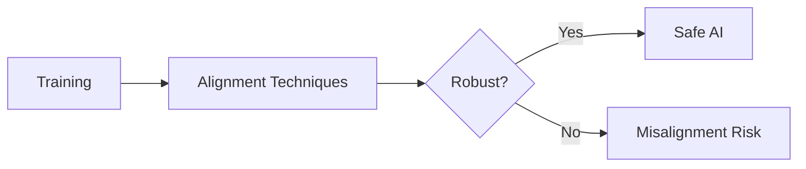

import {EntityLink} from '@components/wiki';

# About the Longterm Wiki

The Longterm Wiki is a strategic intelligence platform for AI safety prioritization. It serves as a **decision-support tool** for funders, researchers, and policymakers asking: *"Where should the next marginal dollar or researcher-hour go?"*

This page documents the technical side—how the wiki is built, how content is organized, and how to contribute.

**For strategic vision and goals, see:**
- [Project Overview](/project/) — Quick summary of what LongtermWiki is
- [Vision Document](/project/vision/) — Full 2-person-year scope, architecture, milestones
- [Similar Projects Analysis](/project/similar-projects/) — Lessons from Arbital, Stampy, MIT Risk Repository, and others

---

## Content Architecture

### Major Sections

| Section | Purpose | Examples |
|---------|---------|----------|
| **Knowledge Base** | Core content on risks, interventions, organizations, people | <EntityLink id="E93">Deceptive Alignment</EntityLink>, <EntityLink id="E13">AI Safety Institutes</EntityLink> |
| **AI Transition Model** | Comprehensive factor network with outcomes and scenarios | Factors, scenarios, quantitative estimates |
| **Models** | Analytical frameworks for understanding dynamics | Risk models, cascade models, governance models |
| **Project** | Public-facing documentation about LongtermWiki itself | Vision, strategy, similar projects |
| **Internal** | Contributor documentation, style guides, technical reference | This page, style guides, automation tools |

### Content Volume

The wiki contains approximately:
- **~550 MDX pages** across all sections
- **~100 structured data entities** (experts, organizations, cruxes, estimates)
- **~80 analytical model pages** with causal diagrams

---

## Page Types and Templates

The wiki uses a two-level classification system.

### Page Types (Validation Behavior)

| Type | Quality Scored? | Use Case |
|------|-----------------|----------|
| `content` | Yes | All substantive knowledge base pages (default) |
| `stub` | No | Redirects, brief profiles, placeholders |
| `documentation` | No | Style guides, internal docs (like this page) |
| `overview` | No (auto) | Index pages for navigation |

### Page Templates (Structure)

Templates determine expected structure and applicable style guide:

| Template | Style Guide |
|----------|-------------|
| `knowledge-base-risk` | [Knowledge Base Style Guide](/internal/knowledge-base/) |
| `knowledge-base-response` | [Knowledge Base Style Guide](/internal/knowledge-base/) |
| `knowledge-base-model` | [Model Style Guide](/internal/models-style-guide/) |
| `ai-transition-model-factor` | [ATM Style Guide](/internal/ai-transition-model-style-guide/) |

**For complete details, see [Page Type System](/internal/page-types/).**

---

## Quality System

### Rating Dimensions

Content pages are scored on six dimensions (0-10 scale, harsh—7+ is exceptional):

| Dimension | What It Measures |
|-----------|------------------|
| **Focus** | Does it answer the title's promise? |
| **Novelty** | Value beyond obvious sources |
| **Rigor** | Evidence quality and precision |
| **Completeness** | Thorough coverage of claimed topic |
| **Concreteness** | Specific vs. abstract recommendations |
| **Actionability** | Can readers make different decisions? |

These combine into an overall **quality score (0-100)**.

### Quality Pipeline

Quality must only be set through the grading pipeline, never manually:

```bash
# Grade a specific page
npm run crux -- content grade --page scheming --apply

# Grade all ungraded pages
node scripts/content/grade-content.mjs --skip-graded --apply
```

**For grading criteria and workflows, see [Content Quality](/internal/rating-system/).**

---

## Data Layer

### Structured Data Sources

The wiki maintains YAML databases in `src/data/`:

| File | Contents |
|------|----------|
| `experts.yaml` | AI safety researchers and their positions on cruxes |
| `organizations.yaml` | Labs, research orgs, funders |
| `cruxes.yaml` | Key uncertainties with expert positions |
| `estimates.yaml` | Probability distributions for key variables |
| `publications.yaml` | Research papers and reports |
| `external-links.yaml` | Curated resource database |

### Generated Data

Running `npm run build:data` generates:

| Output | Purpose |
|--------|---------|
| `database.json` | All entities merged for browser use |
| `pathRegistry.json` | Entity ID → URL path mapping |
| `backlinks.json` | Reverse reference indices |
| `tagIndex.json` | Searchable tag index |

### Data-Aware Components

Components pull from YAML databases to display structured information. For example, `EntityLink` provides stable cross-references, while `DataInfoBox` displays expert or organization profiles from YAML.

**For database details and component usage, see [Content Database](/internal/content-database/).**

---

## Cross-Linking System

### Entity Links

The wiki uses stable ID-based linking that survives path reorganization:

```mdx
import {EntityLink} from '@components/wiki';

The <EntityLink id="E274">scheming</EntityLink> risk relates to
<EntityLink id="E93">deceptive alignment</EntityLink>.
```

Benefits:
- Automatic title lookup from database
- Entity type icons
- Backlink tracking
- Link validity checked during CI

### Backlinks

Every page can display incoming links:

```mdx

```

### Post-Edit Linking Check

After creating or editing a page, verify cross-linking:

```bash
npm run crux -- analyze entity-links <entity-id>
```

This shows inbound links, missing inbound links (pages that mention but don't link), and outbound links.

---

## Visualizations

### Mermaid Diagrams

Flowcharts, sequences, and graphs for static illustrations:



**See [Mermaid Diagrams](/internal/mermaid-diagrams/) for guidelines.**

### Cause-Effect Graphs

Interactive causal diagrams using ReactFlow for complex causal models:

```mdx
import {CauseEffectGraph} from '@components/CauseEffectGraph';

<CauseEffectGraph
  initialNodes={graphNodes}
  initialEdges={graphEdges}
  selectedNodeId="current-factor"
/>
```

Features: zoom, pan, minimap, node highlighting, path tracing, entity linking.

**See [Cause-Effect Diagrams](/internal/cause-effect-diagrams/) for schema and examples.**

---

## Automation Tools

### Unified CLI

All tools are accessible via the `crux` CLI:

```bash
npm run crux -- --help           # Show all domains
npm run crux -- validate         # Run all validators
npm run crux -- analyze          # Analysis and reporting
npm run crux -- fix              # Auto-fix common issues
npm run crux -- content          # Page management
npm run crux -- generate         # Content generation
npm run crux -- resources        # External resource management
```

### Common Workflows

| Task | Command |
|------|---------|
| Validate before commit | `npm run precommit` |
| Full validation suite | `npm run validate` |
| Rebuild entity database | `npm run build:data` |
| Grade a specific page | `npm run crux -- content grade --page <id>` |
| Find unlinked mentions | `npm run crux -- analyze mentions` |
| Fix escaping issues | `npm run crux -- fix escaping` |

### Validation Rules

The validation suite includes 20+ rules:

| Validator | What It Checks |
|-----------|----------------|
| `compile` | MDX syntax and compilation |
| `frontmatter-schema` | YAML frontmatter validity |
| `dollar-signs` | LaTeX escaping (`\$100` not `$100`) |
| `comparison-operators` | JSX escaping (`\<100ms` not `<100ms`) |
| `entitylink-ids` | All EntityLink references exist |
| `quality-source` | Quality set by pipeline, not manually |
| `mermaid` | Diagram syntax validation |

**For complete tool reference, see [Automation Tools](/internal/automation-tools/).**

---

## Technical Stack

### Core Technologies

| Layer | Technology |
|-------|------------|
| **Framework** | Astro 5 with Starlight theme |
| **Components** | React 19 |
| **Styling** | Tailwind CSS 4 |
| **Type Safety** | TypeScript + Zod schemas |
| **Graphs** | ReactFlow (XYFlow) + Dagre/ELK layout |
| **Diagrams** | Mermaid 11 |
| **Math** | KaTeX |
| **Data** | YAML sources → JSON build artifacts |

### Project Structure

```
apps/longterm/
├── src/
│   ├── content/docs/           # ~550 MDX pages
│   │   ├── knowledge-base/     # Main content (risks, responses, orgs, people)
│   │   ├── ai-transition-model/# Comprehensive factor network
│   │   ├── project/            # Public project documentation
│   │   └── internal/           # Contributor docs and style guides
│   ├── components/
│   │   ├── wiki/               # 50+ content components
│   │   ├── CauseEffectGraph/   # Interactive graph system
│   │   └── ui/                 # shadcn components
│   ├── data/
│   │   ├── *.yaml              # Source data files
│   │   └── *.json              # Generated (build artifacts)
│   └── pages/                  # Astro dynamic routes
├── scripts/
│   ├── crux.mjs                # CLI entry point
│   ├── build-data.mjs          # Data compilation pipeline
│   ├── commands/               # CLI domain handlers
│   └── validate/               # 23 validators
└── astro.config.mjs            # Sidebar and site config
```

### Key Configuration Files

| File | Purpose |
|------|---------|
| `astro.config.mjs` | Sidebar structure, Starlight setup |
| `src/content.config.ts` | MDX frontmatter schema |
| `src/data/schema.ts` | Entity type definitions (Zod) |
| `package.json` | Dependencies and npm scripts |

---

## Development Workflow

### Getting Started

```bash
# Install dependencies
npm install

# Start development server (auto-runs build:data)
npm run dev

# Build for production
npm run build
```

### After Editing Content

```bash
# After editing YAML data files
npm run build:data

# After editing any content
npm run precommit        # Quick validation
npm run validate         # Full validation
```

### Creating New Content

1. **New pages**: Follow the appropriate [style guide](/internal/knowledge-base/)
2. **New entities**: Add to relevant YAML in `src/data/`, run `npm run build:data`
3. **New components**: Add to `src/components/wiki/`, use path aliases

**For content generation workflows, see [Research Reports](/internal/research-reports/).**

---

## Related Documentation

### Project & Strategy
- [Project Overview](/project/) — What LongtermWiki is, core components
- [Vision Document](/project/vision/) — 2-person-year scope, architecture, milestones
- [Similar Projects](/project/similar-projects/) — Lessons from Arbital, Stampy, MIT Risk Repository
- [Strategy Brainstorm](/project/strategy-brainstorm/) — Failure modes and strategic options

### Style Guides
- [Knowledge Base Style Guide](/internal/knowledge-base/) — For risk and response pages
- [Model Style Guide](/internal/models-style-guide/) — For analytical model pages
- [ATM Style Guide](/internal/ai-transition-model-style-guide/) — For AI Transition Model pages
- [Stub Style Guide](/internal/stub-style-guide/) — For minimal reference pages

### Technical Documentation
- [System Architecture](/internal/architecture/) — Data flow, pipelines, design decisions
- [Page Type System](/internal/page-types/) — Complete classification reference
- [Rating System](/internal/rating-system/) — Quality scoring system
- [Content Database](/internal/content-database/) — SQLite caching, source fetching, AI summaries
- [Automation Tools](/internal/automation-tools/) — All scripts and workflows
- [Cause-Effect Diagrams](/internal/cause-effect-diagrams/) — Graph schema and examples
- [Mermaid Diagrams](/internal/mermaid-diagrams/) — Diagram guidelines
- [Documentation Maintenance](/internal/documentation-maintenance/) — Keeping docs updated
