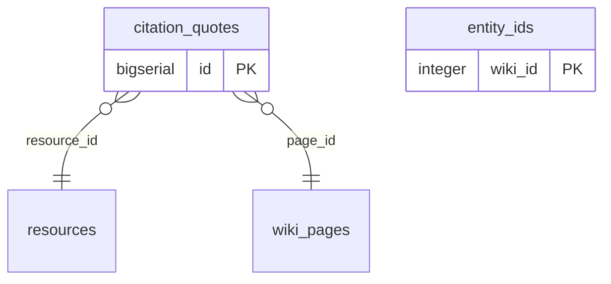
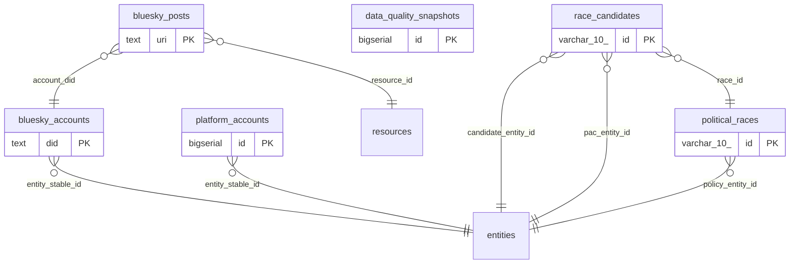
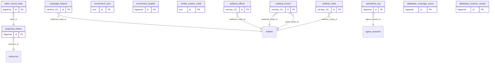
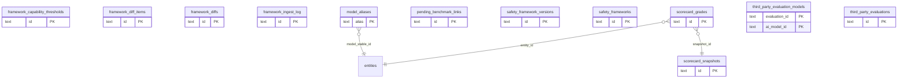
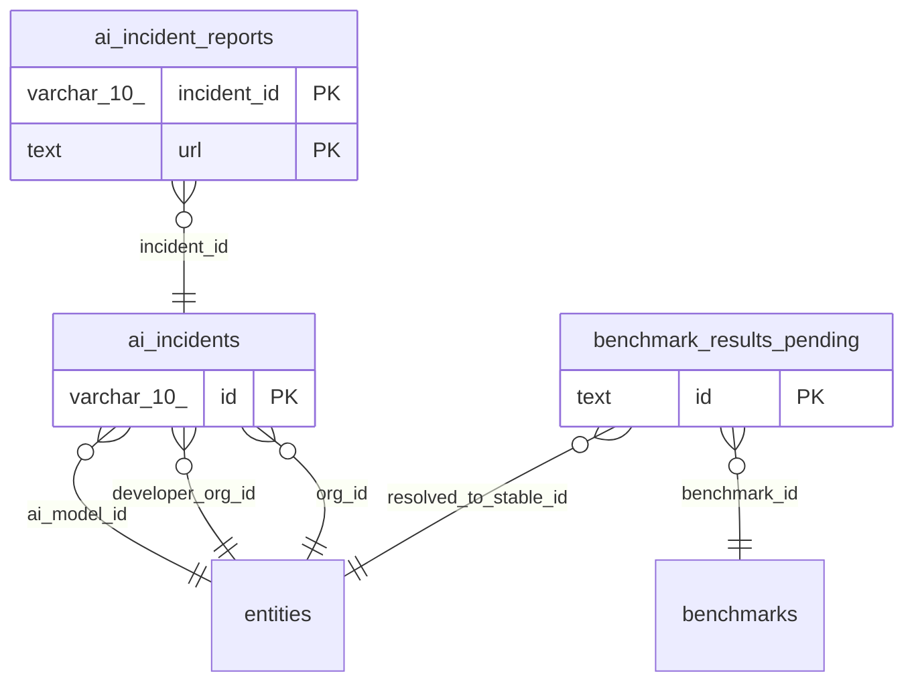

{/* Auto-generated by: pnpm crux generate db-schema-docs */}
{/* Do not edit manually — regenerate with the command above. The gate fails if this drifts from schema.ts. */}

This page is generated directly from the Drizzle schema in `apps/wiki-server/src/schema.ts`. It is the **complete** inventory of the wiki-server database — every table, column, and foreign key. For curated narrative (table purposes, migration history, the three-bases mental model) see [Database Schema Overview](/internal/db-schema-overview). Run `pnpm crux generate db-schema-docs` to regenerate; the validation gate fails if this page falls out of sync with the schema.

## Summary

| Metric | Count |
|--------|-------|
| Tables | 115 |
| Columns | 1665 |
| Foreign keys | 118 |
| Materialized views / views | 1 |
| Sections | 8 |

## Entity-Relationship Diagrams

One diagram per schema section. Boxes show primary keys only (full columns are in the Table Reference below); edges are foreign keys, drawn from the referencing table (many) to the referenced table (one). A referenced table may appear in a section it does not belong to when crossed by a foreign key.

### TableBase — Entity catalog tables

2 tables.

### WikiBase — Prose content tables

1 table.

### Operational — Citation & sourcing tables

35 tables.

```mermaid
erDiagram
  "_archived_claim_page_references" {
    bigserial id PK
  }
  "_archived_claim_sources" {
    bigserial id PK
  }
  "_archived_claims" {
    bigserial id PK
  }
  "active_agents" {
    bigserial id PK
  }
  "agent_session_entities" {
    bigint agent_session_id PK
    text entity_stable_id PK
  }
  "agent_session_events" {
    bigserial id PK
  }
  "agent_session_pages" {
    bigint agent_session_id PK
    integer page_id PK
  }
  "agent_sessions" {
    bigserial id PK
  }
  "auto_update_news_items" {
    bigserial id PK
  }
  "auto_update_results" {
    bigserial id PK
  }
  "auto_update_runs" {
    bigserial id PK
  }
  "citation_accuracy_snapshots" {
    bigserial id PK
  }
  "citation_content" {
    text url PK
  }
  "edit_logs" {
    bigserial id PK
  }
  "entities" {
    text stable_id PK
  }
  "facts" {
    bigserial id PK
  }
  "groundskeeper_runs" {
    bigserial id PK
  }
  "hallucination_risk_snapshots" {
    bigserial id PK
  }
  "jobs" {
    bigserial id PK
  }
  "page_improve_runs" {
    bigserial id PK
  }
  "page_links" {
    bigserial id PK
  }
  "pipeline_runs" {
    text run_id PK
  }
  "resource_citations" {
    text resource_id PK
    integer page_id PK
  }
  "resource_content_versions" {
    bigserial id PK
  }
  "resource_forum_posts" {
    text resource_id PK
  }
  "resource_papers" {
    text resource_id PK
  }
  "resource_policy_docs" {
    text resource_id PK
  }
  "resource_tabular_sources" {
    text resource_id PK
  }
  "resources" {
    text id PK
  }
  "service_health_incidents" {
    bigserial id PK
  }
  "session_pages" {
    bigint session_id PK
    integer page_id PK
  }
  "sessions" {
    bigserial id PK
  }
  "source_snapshots" {
    bigserial id PK
  }
  "sourcing_attempts" {
    text table_name PK
    text record_id PK
  }
  "summaries" {
    text entity_id PK
  }
  "_archived_claim_page_references" }o--|| "_archived_claims" : "claim_id"
  "_archived_claim_page_references" }o--|| "wiki_pages" : "page_id"
  "_archived_claim_sources" }o--|| "_archived_claims" : "claim_id"
  "_archived_claim_sources" }o--|| "resources" : "resource_id"
  "_archived_claims" }o--|| "entities" : "entity_id"
  "agent_session_entities" }o--|| "agent_sessions" : "agent_session_id"
  "agent_session_events" }o--|| "active_agents" : "agent_id"
  "agent_session_pages" }o--|| "agent_sessions" : "agent_session_id"
  "agent_session_pages" }o--|| "wiki_pages" : "page_id"
  "auto_update_news_items" }o--|| "auto_update_runs" : "run_id"
  "auto_update_news_items" }o--|| "wiki_pages" : "routed_to_page_id"
  "auto_update_results" }o--|| "auto_update_runs" : "run_id"
  "auto_update_results" }o--|| "wiki_pages" : "page_id"
  "citation_accuracy_snapshots" }o--|| "wiki_pages" : "page_id"
  "edit_logs" }o--|| "wiki_pages" : "page_id"
  "facts" }o--|| "entities" : "entity_id"
  "facts" }o--|| "entities" : "subject"
  "hallucination_risk_snapshots" }o--|| "wiki_pages" : "page_id"
  "page_improve_runs" }o--|| "wiki_pages" : "page_id"
  "page_links" }o--|| "wiki_pages" : "source_id"
  "page_links" }o--|| "wiki_pages" : "target_id"
  "pipeline_runs" }o--|| "agent_sessions" : "agent_session_id"
  "resource_citations" }o--|| "resources" : "resource_id"
  "resource_citations" }o--|| "wiki_pages" : "page_id"
  "resource_content_versions" }o--|| "resources" : "resource_id"
  "resource_forum_posts" }o--|| "resources" : "resource_id"
  "resource_papers" }o--|| "resources" : "resource_id"
  "resource_policy_docs" }o--|| "resources" : "resource_id"
  "resource_tabular_sources" }o--|| "resources" : "resource_id"
  "session_pages" }o--|| "sessions" : "session_id"
  "session_pages" }o--|| "wiki_pages" : "page_id"
  "source_snapshots" }o--|| "resource_tabular_sources" : "source_slug"
  "source_snapshots" }o--|| "resources" : "resource_id"
  "summaries" }o--|| "entities" : "entity_id"
```

### STATEMENTS SYSTEM — Phase 1 (#1540)

44 tables.

```mermaid
erDiagram
  "_archived_entity_coverage_scores" {
    bigserial id PK
  }
  "_archived_statement_citations" {
    bigserial id PK
  }
  "_archived_statement_page_references" {
    bigserial id PK
  }
  "_archived_statements" {
    bigserial id PK
  }
  "benchmark_results" {
    varchar_10_ id PK
  }
  "benchmarks" {
    text id PK
  }
  "division_personnel" {
    varchar_10_ id PK
  }
  "divisions" {
    varchar_10_ id PK
  }
  "entity_assessments" {
    varchar_10_ id PK
  }
  "entity_events" {
    varchar_10_ id PK
  }
  "entity_resources" {
    bigserial id PK
  }
  "equity_positions" {
    varchar_10_ id PK
  }
  "evaluation_dimensions" {
    text id PK
  }
  "full_audit_log" {
    bigserial id PK
  }
  "funding_programs" {
    varchar_10_ id PK
  }
  "funding_rounds" {
    varchar_10_ id PK
  }
  "grant_research_areas" {
    varchar_10_ grant_id PK
    text research_area_id PK
  }
  "grants" {
    varchar_10_ id PK
  }
  "investments" {
    varchar_10_ id PK
  }
  "page_citations" {
    bigserial id PK
  }
  "page_snapshots" {
    varchar_10_ id PK
  }
  "personnel" {
    varchar_10_ id PK
  }
  "policy_stakeholders" {
    varchar_10_ id PK
  }
  "prediction_market_questions" {
    varchar_10_ id PK
  }
  "prediction_market_snapshots" {
    varchar_10_ id PK
  }
  "properties" {
    text id PK
  }
  "publications" {
    varchar_10_ id PK
  }
  "qa_page_checks" {
    bigserial id PK
  }
  "research_area_evaluations" {
    bigserial id PK
  }
  "research_area_organizations" {
    text research_area_id PK
    text organization_id PK
  }
  "research_area_papers" {
    bigserial id PK
  }
  "research_area_risks" {
    text research_area_id PK
    text risk_id PK
  }
  "research_area_scores" {
    text research_area_id PK
    text dimension PK
  }
  "research_areas" {
    text id PK
  }
  "secondary_market_prices" {
    varchar_10_ id PK
  }
  "source_check_evidence" {
    bigserial id PK
  }
  "source_check_verdicts" {
  }
  "sourcing_url_suggestions" {
    bigserial id PK
  }
  "tablebase_audit_log" {
    bigserial id PK
  }
  "things" {
    text id PK
  }
  "website_source_pages" {
    varchar_10_ id PK
  }
  "website_sources" {
    varchar_10_ id PK
  }
  "wikibase_page_assessments" {
    bigserial id PK
  }
  "wikibase_page_similarity" {
    bigserial id PK
  }
  "_archived_statement_citations" }o--|| "_archived_statements" : "statement_id"
  "_archived_statement_citations" }o--|| "resources" : "resource_id"
  "_archived_statement_page_references" }o--|| "_archived_statements" : "statement_id"
  "_archived_statement_page_references" }o--|| "wiki_pages" : "page_id"
  "_archived_statements" }o--|| "entities" : "attributed_to"
  "_archived_statements" }o--|| "entities" : "subject_entity_id"
  "_archived_statements" }o--|| "entities" : "value_entity_id"
  "_archived_statements" }o--|| "properties" : "property_id"
  "benchmark_results" }o--|| "benchmarks" : "benchmark_id"
  "benchmark_results" }o--|| "entities" : "model_id"
  "benchmark_results" }o--|| "entities" : "tested_by_org_id"
  "division_personnel" }o--|| "divisions" : "division_id"
  "division_personnel" }o--|| "entities" : "person_id"
  "divisions" }o--|| "entities" : "parent_org_id"
  "entity_assessments" }o--|| "entities" : "entity_id"
  "entity_events" }o--|| "entities" : "entity_id"
  "entity_resources" }o--|| "entities" : "entity_id"
  "entity_resources" }o--|| "resources" : "resource_id"
  "equity_positions" }o--|| "entities" : "company_entity_id"
  "equity_positions" }o--|| "entities" : "holder_entity_id"
  "funding_rounds" }o--|| "entities" : "company_entity_id"
  "funding_rounds" }o--|| "entities" : "lead_investor_entity_id"
  "grant_research_areas" }o--|| "grants" : "grant_id"
  "grant_research_areas" }o--|| "research_areas" : "research_area_id"
  "grants" }o--|| "entities" : "grantee_entity_id"
  "grants" }o--|| "entities" : "org_entity_id"
  "grants" }o--|| "funding_programs" : "program_id"
  "grants" }o--|| "resource_tabular_sources" : "data_source_id"
  "investments" }o--|| "entities" : "company_entity_id"
  "investments" }o--|| "entities" : "investor_entity_id"
  "page_citations" }o--|| "resources" : "resource_id"
  "page_citations" }o--|| "wiki_pages" : "page_id"
  "page_snapshots" }o--|| "website_source_pages" : "website_source_page_id"
  "personnel" }o--|| "entities" : "org_entity_id"
  "personnel" }o--|| "entities" : "person_entity_id"
  "policy_stakeholders" }o--|| "entities" : "policy_entity_id"
  "policy_stakeholders" }o--|| "entities" : "stakeholder_entity_id"
  "prediction_market_questions" }o--|| "entities" : "entity_id"
  "prediction_market_snapshots" }o--|| "prediction_market_questions" : "question_id"
  "publications" }o--|| "entities" : "entity_id"
  "publications" }o--|| "resources" : "resource_id"
  "qa_page_checks" }o--|| "things" : "thing_id"
  "research_area_evaluations" }o--|| "research_areas" : "research_area_id"
  "research_area_organizations" }o--|| "research_areas" : "research_area_id"
  "research_area_papers" }o--|| "research_areas" : "research_area_id"
  "research_area_papers" }o--|| "resources" : "resource_id"
  "research_area_risks" }o--|| "research_areas" : "research_area_id"
  "research_area_scores" }o--|| "research_areas" : "research_area_id"
  "research_areas" }o--|| "research_areas" : "parent_area_id"
  "secondary_market_prices" }o--|| "entities" : "company_entity_id"
  "source_check_evidence" }o--|| "resources" : "resource_id"
  "things" }o--|| "things" : "parent_thing_id"
  "website_source_pages" }o--|| "website_sources" : "source_id"
  "website_sources" }o--|| "entities" : "entity_id"
  "wikibase_page_assessments" }o--|| "wiki_pages" : "page_id"
  "wikibase_page_similarity" }o--|| "wiki_pages" : "page_id"
  "wikibase_page_similarity" }o--|| "wiki_pages" : "similar_page_id"
```

### Operational — Data Quality Snapshots

6 tables.

### Claims-first sourcing — proposed_claims + claim_record_links

12 tables.

### QUA-691 / Phase 4 — Frontier safety framework tracker

12 tables.

### AI Incidents — Phase 6 of QUA-687 (QUA-693)

3 tables.

## Table Reference

Every table, alphabetically, with all columns and foreign keys.

### `_archived_claim_page_references`

Export: `claimPageReferences` · Section: Operational — Citation & sourcing tables · 8 columns

| Column | Type | Null | Key | Default |
|--------|------|------|-----|---------|
| id | `bigserial` | NOT NULL | PK | yes |
| claim_id | `bigint` | NOT NULL | FK |  |
| page_id | `integer` | null | FK |  |
| footnote | `integer` | null |  |  |
| section | `text` | null |  |  |
| quote_text | `text` | null |  |  |
| reference_id | `varchar` | null |  |  |
| created_at | `timestamp with time zone` | NOT NULL |  | yes |

**Foreign keys:** `claim_id` → `_archived_claims(id)` *(on delete cascade)*; `page_id` → `wiki_pages(id)` *(on delete cascade)*

### `_archived_claim_sources`

Export: `claimSources` · Section: Operational — Citation & sourcing tables · 14 columns

| Column | Type | Null | Key | Default |
|--------|------|------|-----|---------|
| id | `bigserial` | NOT NULL | PK | yes |
| claim_id | `bigint` | NOT NULL | FK |  |
| resource_id | `text` | null | FK |  |
| url | `text` | null |  |  |
| source_quote | `text` | null |  |  |
| is_primary | `boolean` | NOT NULL |  | yes |
| added_at | `timestamp with time zone` | NOT NULL |  | yes |
| source_verdict | `text` | null |  |  |
| source_verdict_score | `real` | null |  |  |
| source_verdict_issues | `text` | null |  |  |
| source_checked_at | `timestamp with time zone` | null |  |  |
| source_title | `text` | null |  |  |
| source_type | `text` | null |  |  |
| source_location | `text` | null |  |  |

**Foreign keys:** `claim_id` → `_archived_claims(id)` *(on delete cascade)*; `resource_id` → `resources(id)` *(on delete set null)*

### `_archived_claims`

Export: `claims` · Section: Operational — Citation & sourcing tables · 39 columns

| Column | Type | Null | Key | Default |
|--------|------|------|-----|---------|
| id | `bigserial` | NOT NULL | PK | yes |
| entity_id | `text` | NOT NULL | FK |  |
| entity_type | `text` | NOT NULL |  |  |
| claim_type | `text` | NOT NULL |  |  |
| claim_text | `text` | NOT NULL |  |  |
| value | `text` | null |  |  |
| unit | `text` | null |  |  |
| confidence | `text` | null |  |  |
| source_quote | `text` | null |  |  |
| claim_category | `text` | null |  |  |
| related_entities | `jsonb` | null |  |  |
| fact_id | `text` | null |  |  |
| resource_ids | `jsonb` | null |  |  |
| section | `text` | null |  |  |
| footnote_refs | `text` | null |  |  |
| claim_mode | `text` | NOT NULL |  | yes |
| attributed_to | `text` | null |  |  |
| as_of | `text` | null |  |  |
| measure | `text` | null |  |  |
| value_numeric | `double precision` | null |  |  |
| value_low | `double precision` | null |  |  |
| value_high | `double precision` | null |  |  |
| claim_verdict | `text` | null |  |  |
| claim_verdict_score | `real` | null |  |  |
| claim_verdict_issues | `text` | null |  |  |
| claim_verdict_quotes | `text` | null |  |  |
| claim_verdict_difficulty | `text` | null |  |  |
| claim_verified_at | `timestamp with time zone` | null |  |  |
| claim_verdict_model | `text` | null |  |  |
| subject_entity | `text` | null |  |  |
| property | `text` | null |  |  |
| structured_value | `text` | null |  |  |
| value_unit | `text` | null |  |  |
| value_date | `date` | null |  |  |
| qualifiers | `jsonb` | null |  |  |
| inference_type | `text` | null |  |  |
| is_pinned | `boolean` | NOT NULL |  | yes |
| created_at | `timestamp with time zone` | NOT NULL |  | yes |
| updated_at | `timestamp with time zone` | NOT NULL |  | yes |

**Foreign keys:** `entity_id` → `entities(id)` *(on delete cascade)*

### `_archived_entity_coverage_scores`

Export: `entityCoverageScores` · Section: STATEMENTS SYSTEM — Phase 1 (#1540) · 7 columns

| Column | Type | Null | Key | Default |
|--------|------|------|-----|---------|
| id | `bigserial` | NOT NULL | PK | yes |
| entity_id | `text` | NOT NULL |  |  |
| coverage_score | `real` | NOT NULL |  |  |
| category_scores | `jsonb` | NOT NULL |  |  |
| statement_count | `integer` | NOT NULL |  |  |
| quality_avg | `real` | null |  |  |
| scored_at | `timestamp with time zone` | NOT NULL |  | yes |

### `_archived_statement_citations`

Export: `statementCitations` · Section: STATEMENTS SYSTEM — Phase 1 (#1540) · 8 columns

| Column | Type | Null | Key | Default |
|--------|------|------|-----|---------|
| id | `bigserial` | NOT NULL | PK | yes |
| statement_id | `bigint` | NOT NULL | FK |  |
| resource_id | `text` | null | FK |  |
| url | `text` | null |  |  |
| source_quote | `text` | null |  |  |
| location_note | `text` | null |  |  |
| is_primary | `boolean` | NOT NULL |  | yes |
| created_at | `timestamp with time zone` | NOT NULL |  | yes |

**Foreign keys:** `resource_id` → `resources(id)` *(on delete set null)*; `statement_id` → `_archived_statements(id)` *(on delete cascade)*

### `_archived_statement_page_references`

Export: `statementPageReferences` · Section: STATEMENTS SYSTEM — Phase 1 (#1540) · 6 columns

| Column | Type | Null | Key | Default |
|--------|------|------|-----|---------|
| id | `bigserial` | NOT NULL | PK | yes |
| statement_id | `bigint` | NOT NULL | FK |  |
| page_id | `integer` | NOT NULL | FK |  |
| footnote_resource_id | `varchar` | null |  |  |
| section | `text` | null |  |  |
| created_at | `timestamp with time zone` | NOT NULL |  | yes |

**Foreign keys:** `page_id` → `wiki_pages(id)` *(on delete cascade)*; `statement_id` → `_archived_statements(id)` *(on delete cascade)*

### `_archived_statements`

Export: `statements` · Section: STATEMENTS SYSTEM — Phase 1 (#1540) · 31 columns

| Column | Type | Null | Key | Default |
|--------|------|------|-----|---------|
| id | `bigserial` | NOT NULL | PK | yes |
| variety | `text` | NOT NULL |  |  |
| statement_text | `text` | null |  |  |
| subject_entity_id | `text` | NOT NULL | FK |  |
| property_id | `text` | null | FK |  |
| value_numeric | `double precision` | null |  |  |
| value_unit | `text` | null |  |  |
| value_text | `text` | null |  |  |
| value_entity_id | `text` | null | FK |  |
| value_date | `date` | null |  |  |
| value_series | `jsonb` | null |  |  |
| qualifier_key | `text` | null |  |  |
| valid_start | `text` | null |  |  |
| valid_end | `text` | null |  |  |
| temporal_granularity | `text` | null |  |  |
| attributed_to | `text` | null | FK |  |
| verdict | `text` | null |  |  |
| verdict_score | `real` | null |  |  |
| verdict_quotes | `text` | null |  |  |
| verdict_model | `text` | null |  |  |
| verified_at | `timestamp with time zone` | null |  |  |
| claim_category | `text` | null |  |  |
| status | `text` | NOT NULL |  | yes |
| archive_reason | `text` | null |  |  |
| source_fact_key | `text` | null |  |  |
| note | `text` | null |  |  |
| quality_score | `real` | null |  |  |
| quality_dimensions | `jsonb` | null |  |  |
| scored_at | `timestamp with time zone` | null |  |  |
| created_at | `timestamp with time zone` | NOT NULL |  | yes |
| updated_at | `timestamp with time zone` | NOT NULL |  | yes |

**Foreign keys:** `attributed_to` → `entities(id)` *(on delete set null)*; `property_id` → `properties(id)` *(on delete set null)*; `subject_entity_id` → `entities(id)` *(on delete cascade)*; `value_entity_id` → `entities(id)` *(on delete set null)*

### `active_agents`

Export: `activeAgents` · Section: Operational — Citation & sourcing tables · 18 columns

| Column | Type | Null | Key | Default |
|--------|------|------|-----|---------|
| id | `bigserial` | NOT NULL | PK | yes |
| session_id | `text` | NOT NULL |  |  |
| session_name | `text` | null |  |  |
| branch | `text` | null |  |  |
| task | `text` | NOT NULL |  |  |
| status | `text` | NOT NULL |  | yes |
| current_step | `text` | null |  |  |
| issue_number | `integer` | null |  |  |
| pr_number | `integer` | null |  |  |
| files_touched | `jsonb` | null |  |  |
| model | `text` | null |  |  |
| worktree | `text` | null |  |  |
| heartbeat_at | `timestamp with time zone` | NOT NULL |  | yes |
| started_at | `timestamp with time zone` | NOT NULL |  | yes |
| completed_at | `timestamp with time zone` | null |  |  |
| metadata | `jsonb` | null |  |  |
| created_at | `timestamp with time zone` | NOT NULL |  | yes |
| updated_at | `timestamp with time zone` | NOT NULL |  | yes |

### `agent_session_entities`

Export: `agentSessionEntities` · Section: Operational — Citation & sourcing tables · 2 columns

| Column | Type | Null | Key | Default |
|--------|------|------|-----|---------|
| agent_session_id | `bigint` | NOT NULL | PK |  |
| entity_stable_id | `text` | NOT NULL | PK |  |

**Foreign keys:** `agent_session_id` → `agent_sessions(id)` *(on delete cascade)*

### `agent_session_events`

Export: `agentSessionEvents` · Section: Operational — Citation & sourcing tables · 6 columns

| Column | Type | Null | Key | Default |
|--------|------|------|-----|---------|
| id | `bigserial` | NOT NULL | PK | yes |
| agent_id | `bigint` | NOT NULL | FK |  |
| event_type | `text` | NOT NULL |  |  |
| message | `text` | NOT NULL |  |  |
| metadata | `jsonb` | null |  |  |
| timestamp | `timestamp with time zone` | NOT NULL |  | yes |

**Foreign keys:** `agent_id` → `active_agents(id)` *(on delete cascade)*

### `agent_session_pages`

Export: `agentSessionPages` · Section: Operational — Citation & sourcing tables · 2 columns

| Column | Type | Null | Key | Default |
|--------|------|------|-----|---------|
| agent_session_id | `bigint` | NOT NULL | PK |  |
| page_id | `integer` | NOT NULL | PK |  |

**Foreign keys:** `agent_session_id` → `agent_sessions(id)` *(on delete cascade)*; `page_id` → `wiki_pages(id)` *(on delete cascade)*

### `agent_sessions`

Export: `agentSessions` · Section: Operational — Citation & sourcing tables · 31 columns

| Column | Type | Null | Key | Default |
|--------|------|------|-----|---------|
| id | `bigserial` | NOT NULL | PK | yes |
| branch | `text` | NOT NULL |  |  |
| task | `text` | NOT NULL |  |  |
| session_type | `text` | NOT NULL |  |  |
| issue_number | `integer` | null |  |  |
| linear_id | `text` | null |  |  |
| slot_number | `integer` | null |  |  |
| checklist_md | `text` | NOT NULL |  |  |
| worktree | `text` | null |  |  |
| pr_url | `text` | null |  |  |
| pr_outcome | `text` | null |  |  |
| fixes_pr_url | `text` | null |  |  |
| date | `date` | null |  |  |
| title | `text` | null |  |  |
| summary | `text` | null |  |  |
| model | `text` | null |  |  |
| duration | `text` | null |  |  |
| duration_minutes | `real` | null |  |  |
| cost | `text` | null |  |  |
| cost_cents | `integer` | null |  |  |
| checks_yaml | `text` | null |  |  |
| issues_json | `jsonb` | null |  |  |
| learnings_json | `jsonb` | null |  |  |
| recommendations_json | `jsonb` | null |  |  |
| reviewed | `boolean` | null |  |  |
| status | `text` | NOT NULL |  | yes |
| started_at | `timestamp with time zone` | NOT NULL |  | yes |
| completed_at | `timestamp with time zone` | null |  |  |
| created_at | `timestamp with time zone` | NOT NULL |  | yes |
| updated_at | `timestamp with time zone` | NOT NULL |  | yes |
| heartbeat_at | `timestamp with time zone` | null |  |  |

### `ai_incident_reports`

Export: `aiIncidentReports` · Section: AI Incidents — Phase 6 of QUA-687 (QUA-693) · 7 columns

| Column | Type | Null | Key | Default |
|--------|------|------|-----|---------|
| incident_id | `varchar(10)` | NOT NULL | PK |  |
| url | `text` | NOT NULL | PK |  |
| title | `text` | null |  |  |
| publisher | `text` | null |  |  |
| published_at | `date` | null |  |  |
| language | `varchar(8)` | null |  |  |
| created_at | `timestamp with time zone` | NOT NULL |  | yes |

**Foreign keys:** `incident_id` → `ai_incidents(id)` *(on delete cascade)*

### `ai_incidents`

Export: `aiIncidents` · Section: AI Incidents — Phase 6 of QUA-687 (QUA-693) · 20 columns

| Column | Type | Null | Key | Default |
|--------|------|------|-----|---------|
| id | `varchar(10)` | NOT NULL | PK |  |
| source | `varchar(16)` | NOT NULL |  |  |
| source_incident_id | `varchar(128)` | NOT NULL |  |  |
| reported_date | `date` | null |  |  |
| incident_date | `date` | null |  |  |
| severity | `varchar(32)` | null |  |  |
| upstream_severity | `varchar(64)` | null |  |  |
| title | `text` | NOT NULL |  |  |
| summary | `text` | NOT NULL |  |  |
| full_report_url | `text` | null |  |  |
| ai_model_id | `text` | null | FK |  |
| org_id | `text` | null | FK |  |
| developer_org_id | `text` | null | FK |  |
| attribution_confidence | `numeric(3, 2)` | null |  |  |
| tags | `text[]` | NOT NULL |  | yes |
| raw | `jsonb` | NOT NULL |  |  |
| upstream_fetched_at | `timestamp with time zone` | NOT NULL |  |  |
| synced_at | `timestamp with time zone` | NOT NULL |  | yes |
| created_at | `timestamp with time zone` | NOT NULL |  | yes |
| updated_at | `timestamp with time zone` | NOT NULL |  | yes |

**Foreign keys:** `ai_model_id` → `entities(stable_id)` *(on delete set null)*; `developer_org_id` → `entities(stable_id)` *(on delete set null)*; `org_id` → `entities(stable_id)` *(on delete set null)*

### `auto_update_news_items`

Export: `autoUpdateNewsItems` · Section: Operational — Citation & sourcing tables · 14 columns

| Column | Type | Null | Key | Default |
|--------|------|------|-----|---------|
| id | `bigserial` | NOT NULL | PK | yes |
| run_id | `bigint` | NOT NULL | FK |  |
| title | `text` | NOT NULL |  |  |
| url | `text` | NOT NULL |  |  |
| source_id | `text` | NOT NULL |  |  |
| published_at | `text` | null |  |  |
| summary | `text` | null |  |  |
| relevance_score | `integer` | null |  |  |
| topics_json | `jsonb` | null |  |  |
| entities_json | `jsonb` | null |  |  |
| routed_to_page_id | `integer` | null | FK |  |
| routed_to_page_title | `text` | null |  |  |
| routed_tier | `text` | null |  |  |
| created_at | `timestamp with time zone` | NOT NULL |  | yes |

**Foreign keys:** `routed_to_page_id` → `wiki_pages(id)` *(on delete set null)*; `run_id` → `auto_update_runs(id)` *(on delete cascade)*

### `auto_update_results`

Export: `autoUpdateResults` · Section: Operational — Citation & sourcing tables · 7 columns

| Column | Type | Null | Key | Default |
|--------|------|------|-----|---------|
| id | `bigserial` | NOT NULL | PK | yes |
| run_id | `bigint` | NOT NULL | FK |  |
| page_id | `integer` | null | FK |  |
| status | `text` | NOT NULL |  |  |
| tier | `text` | null |  |  |
| duration_ms | `integer` | null |  |  |
| error_message | `text` | null |  |  |

**Foreign keys:** `page_id` → `wiki_pages(id)`; `run_id` → `auto_update_runs(id)` *(on delete cascade)*

### `auto_update_runs`

Export: `autoUpdateRuns` · Section: Operational — Citation & sourcing tables · 18 columns

| Column | Type | Null | Key | Default |
|--------|------|------|-----|---------|
| id | `bigserial` | NOT NULL | PK | yes |
| date | `date` | NOT NULL |  |  |
| started_at | `timestamp with time zone` | NOT NULL |  |  |
| completed_at | `timestamp with time zone` | null |  |  |
| trigger | `text` | NOT NULL |  |  |
| budget_limit | `real` | null |  |  |
| budget_spent | `real` | null |  |  |
| sources_checked | `integer` | null |  |  |
| sources_failed | `integer` | null |  |  |
| items_fetched | `integer` | null |  |  |
| items_relevant | `integer` | null |  |  |
| pages_planned | `integer` | null |  |  |
| pages_updated | `integer` | null |  |  |
| pages_failed | `integer` | null |  |  |
| pages_skipped | `integer` | null |  |  |
| new_pages_created | `text` | null |  |  |
| details_json | `jsonb` | null |  |  |
| created_at | `timestamp with time zone` | NOT NULL |  | yes |

### `benchmark_results`

Export: `benchmarkResults` · Section: STATEMENTS SYSTEM — Phase 1 (#1540) · 15 columns

| Column | Type | Null | Key | Default |
|--------|------|------|-----|---------|
| id | `varchar(10)` | NOT NULL | PK |  |
| benchmark_id | `text` | NOT NULL | FK |  |
| model_id | `text` | NOT NULL | FK |  |
| score | `double precision` | NOT NULL |  |  |
| unit | `text` | null |  |  |
| date | `text` | null |  |  |
| source_url | `text` | null |  |  |
| notes | `text` | null |  |  |
| tested_by | `text` | NOT NULL |  | yes |
| tested_by_org_id | `text` | null | FK |  |
| evaluation_date | `text` | null |  |  |
| methodology_notes | `text` | null |  |  |
| synced_at | `timestamp with time zone` | NOT NULL |  | yes |
| created_at | `timestamp with time zone` | NOT NULL |  | yes |
| updated_at | `timestamp with time zone` | NOT NULL |  | yes |

**Foreign keys:** `benchmark_id` → `benchmarks(id)`; `model_id` → `entities(stable_id)` *(on delete cascade)*; `tested_by_org_id` → `entities(stable_id)` *(on delete set null)*

### `benchmark_results_pending`

Export: `benchmarkResultsPending` · Section: AI Incidents — Phase 6 of QUA-687 (QUA-693) · 20 columns

| Column | Type | Null | Key | Default |
|--------|------|------|-----|---------|
| id | `text` | NOT NULL | PK |  |
| benchmark_id | `text` | NOT NULL | FK |  |
| raw_model_name | `text` | NOT NULL |  |  |
| score | `double precision` | null |  |  |
| score_text | `text` | null |  |  |
| unit | `text` | null |  |  |
| evaluation_date | `text` | null |  |  |
| tested_by | `text` | NOT NULL |  | yes |
| source_url | `text` | null |  |  |
| methodology_notes | `text` | null |  |  |
| raw_payload | `jsonb` | null |  |  |
| status | `text` | NOT NULL |  | yes |
| ingester_source | `text` | NOT NULL |  |  |
| resolved_to_stable_id | `text` | null | FK |  |
| resolved_at | `timestamp with time zone` | null |  |  |
| resolved_by | `text` | null |  |  |
| rejected_reason | `text` | null |  |  |
| synced_at | `timestamp with time zone` | NOT NULL |  | yes |
| created_at | `timestamp with time zone` | NOT NULL |  | yes |
| updated_at | `timestamp with time zone` | NOT NULL |  | yes |

**Foreign keys:** `benchmark_id` → `benchmarks(id)` *(on delete cascade)*; `resolved_to_stable_id` → `entities(stable_id)` *(on delete set null)*

### `benchmarks`

Export: `benchmarks` · Section: STATEMENTS SYSTEM — Phase 1 (#1540) · 15 columns

| Column | Type | Null | Key | Default |
|--------|------|------|-----|---------|
| id | `text` | NOT NULL | PK |  |
| slug | `text` | NOT NULL |  |  |
| name | `text` | NOT NULL |  |  |
| category | `text` | null |  |  |
| sub_category | `text` | null |  |  |
| description | `text` | null |  |  |
| website | `text` | null |  |  |
| scoring_method | `text` | null |  |  |
| higher_is_better | `boolean` | NOT NULL |  | yes |
| introduced_date | `text` | null |  |  |
| maintainer | `text` | null |  |  |
| source | `text` | null |  |  |
| synced_at | `timestamp with time zone` | NOT NULL |  | yes |
| created_at | `timestamp with time zone` | NOT NULL |  | yes |
| updated_at | `timestamp with time zone` | NOT NULL |  | yes |

### `bluesky_accounts`

Export: `blueskyAccounts` · Section: Operational — Data Quality Snapshots · 11 columns

| Column | Type | Null | Key | Default |
|--------|------|------|-----|---------|
| did | `text` | NOT NULL | PK |  |
| handle | `text` | NOT NULL |  |  |
| display_name | `text` | null |  |  |
| description | `text` | null |  |  |
| follower_count | `integer` | null |  |  |
| post_count | `integer` | null |  |  |
| entity_stable_id | `text` | null | FK |  |
| relevance_tags | `jsonb` | null |  |  |
| last_fetched_at | `timestamp with time zone` | null |  |  |
| created_at | `timestamp with time zone` | NOT NULL |  | yes |
| updated_at | `timestamp with time zone` | NOT NULL |  | yes |

**Foreign keys:** `entity_stable_id` → `entities(stable_id)` *(on delete set null)*

### `bluesky_posts`

Export: `blueskyPosts` · Section: Operational — Data Quality Snapshots · 15 columns

| Column | Type | Null | Key | Default |
|--------|------|------|-----|---------|
| uri | `text` | NOT NULL | PK |  |
| cid | `text` | null |  |  |
| account_did | `text` | NOT NULL | FK |  |
| text | `text` | null |  |  |
| posted_at | `timestamp with time zone` | NOT NULL |  |  |
| like_count | `integer` | null |  |  |
| repost_count | `integer` | null |  |  |
| reply_count | `integer` | null |  |  |
| quote_count | `integer` | null |  |  |
| embedded_url | `text` | null |  |  |
| embedded_title | `text` | null |  |  |
| reply_to_uri | `text` | null |  |  |
| resource_id | `text` | null | FK |  |
| entity_stable_ids | `jsonb` | null |  |  |
| fetched_at | `timestamp with time zone` | NOT NULL |  |  |

**Foreign keys:** `account_did` → `bluesky_accounts(did)` *(on delete cascade)*; `resource_id` → `resources(stable_id)` *(on delete set null)*

### `campaign_finance`

Export: `campaignFinance` · Section: Claims-first sourcing — proposed_claims + claim_record_links · 21 columns

| Column | Type | Null | Key | Default |
|--------|------|------|-----|---------|
| id | `varchar(10)` | NOT NULL | PK |  |
| politician_entity_id | `varchar(40)` | null | FK |  |
| politician_display_name | `varchar(200)` | null |  |  |
| cycle | `integer` | NOT NULL |  |  |
| total_raised | `numeric(14, 2)` | null |  |  |
| total_spent | `numeric(14, 2)` | null |  |  |
| cash_on_hand | `numeric(14, 2)` | null |  |  |
| individual_contributions | `numeric(14, 2)` | null |  |  |
| pac_contributions | `numeric(14, 2)` | null |  |  |
| small_donor_contributions | `numeric(14, 2)` | null |  |  |
| self_funding | `numeric(14, 2)` | null |  |  |
| party | `varchar(20)` | null |  |  |
| office_type | `varchar(30)` | null |  |  |
| state | `varchar(5)` | null |  |  |
| district | `varchar(10)` | null |  |  |
| fec_candidate_id | `varchar(20)` | null |  |  |
| source_url | `text` | null |  |  |
| data_as_of | `date` | null |  |  |
| notes | `text` | null |  |  |
| created_at | `timestamp with time zone` | NOT NULL |  | yes |
| updated_at | `timestamp with time zone` | NOT NULL |  | yes |

**Foreign keys:** `politician_entity_id` → `entities(stable_id)` *(on delete set null)*

### `citation_accuracy_snapshots`

Export: `citationAccuracySnapshots` · Section: Operational — Citation & sourcing tables · 11 columns

| Column | Type | Null | Key | Default |
|--------|------|------|-----|---------|
| id | `bigserial` | NOT NULL | PK | yes |
| page_id | `integer` | null | FK |  |
| total_citations | `integer` | NOT NULL |  |  |
| checked_citations | `integer` | NOT NULL |  |  |
| accurate_count | `integer` | NOT NULL |  | yes |
| minor_issues_count | `integer` | NOT NULL |  | yes |
| inaccurate_count | `integer` | NOT NULL |  | yes |
| unsupported_count | `integer` | NOT NULL |  | yes |
| not_verifiable_count | `integer` | NOT NULL |  | yes |
| average_score | `real` | null |  |  |
| snapshot_at | `timestamp with time zone` | NOT NULL |  | yes |

**Foreign keys:** `page_id` → `wiki_pages(id)`

### `citation_content`

Export: `citationContent` · Section: Operational — Citation & sourcing tables · 13 columns

| Column | Type | Null | Key | Default |
|--------|------|------|-----|---------|
| url | `text` | NOT NULL | PK |  |
| resource_id | `text` | null |  |  |
| fetched_at | `timestamp with time zone` | NOT NULL |  |  |
| http_status | `integer` | null |  |  |
| content_type | `text` | null |  |  |
| page_title | `text` | null |  |  |
| full_text_preview | `text` | null |  |  |
| full_text | `text` | null |  |  |
| content_length | `integer` | null |  |  |
| content_hash | `text` | null |  |  |
| fetch_method | `text` | null |  |  |
| created_at | `timestamp with time zone` | NOT NULL |  | yes |
| updated_at | `timestamp with time zone` | NOT NULL |  | yes |

### `citation_quotes`

Export: `citationQuotes` · Section: TableBase — Entity catalog tables · 25 columns

| Column | Type | Null | Key | Default |
|--------|------|------|-----|---------|
| id | `bigserial` | NOT NULL | PK | yes |
| page_id | `integer` | NOT NULL | FK |  |
| footnote | `integer` | NOT NULL |  |  |
| url | `text` | null |  |  |
| resource_id | `text` | null | FK |  |
| claim_text | `text` | NOT NULL |  |  |
| claim_context | `text` | null |  |  |
| source_quote | `text` | null |  |  |
| source_location | `text` | null |  |  |
| quote_verified | `boolean` | NOT NULL |  | yes |
| verification_method | `text` | null |  |  |
| verification_score | `real` | null |  |  |
| verified_at | `timestamp with time zone` | null |  |  |
| source_title | `text` | null |  |  |
| source_type | `text` | null |  |  |
| extraction_model | `text` | null |  |  |
| claim_id | `bigint` | null |  |  |
| accuracy_verdict | `text` | null |  |  |
| accuracy_issues | `text` | null |  |  |
| accuracy_score | `real` | null |  |  |
| accuracy_checked_at | `timestamp with time zone` | null |  |  |
| accuracy_supporting_quotes | `text` | null |  |  |
| verification_difficulty | `text` | null |  |  |
| created_at | `timestamp with time zone` | NOT NULL |  | yes |
| updated_at | `timestamp with time zone` | NOT NULL |  | yes |

**Foreign keys:** `page_id` → `wiki_pages(id)`; `resource_id` → `resources(stable_id)` *(on delete set null)*

### `claim_record_links`

Export: `claimRecordLinks` · Section: Claims-first sourcing — proposed_claims + claim_record_links · 7 columns

| Column | Type | Null | Key | Default |
|--------|------|------|-----|---------|
| id | `bigserial` | NOT NULL | PK | yes |
| claim_id | `bigint` | NOT NULL | FK |  |
| record_type | `text` | NOT NULL |  |  |
| record_id | `text` | NOT NULL |  |  |
| match_verdict | `text` | null |  |  |
| match_confidence | `real` | null |  |  |
| created_at | `timestamp with time zone` | NOT NULL |  | yes |

**Foreign keys:** `claim_id` → `proposed_claims(id)` *(on delete cascade)*

### `data_quality_snapshots`

Export: `dataQualitySnapshots` · Section: Operational — Data Quality Snapshots · 23 columns

| Column | Type | Null | Key | Default |
|--------|------|------|-----|---------|
| id | `bigserial` | NOT NULL | PK | yes |
| captured_at | `timestamp with time zone` | NOT NULL |  | yes |
| verdicts_total | `integer` | NOT NULL |  | yes |
| verdicts_confirmed | `integer` | NOT NULL |  | yes |
| verdicts_contradicted | `integer` | NOT NULL |  | yes |
| verdicts_partial | `integer` | NOT NULL |  | yes |
| verdicts_unverifiable | `integer` | NOT NULL |  | yes |
| verdicts_outdated | `integer` | NOT NULL |  | yes |
| verdicts_needs_recheck | `integer` | NOT NULL |  | yes |
| personnel_total | `integer` | NOT NULL |  | yes |
| personnel_with_source | `integer` | NOT NULL |  | yes |
| personnel_with_start_date | `integer` | NOT NULL |  | yes |
| grants_total | `integer` | NOT NULL |  | yes |
| grants_with_source | `integer` | NOT NULL |  | yes |
| investments_total | `integer` | NOT NULL |  | yes |
| investments_with_source | `integer` | NOT NULL |  | yes |
| funding_rounds_total | `integer` | NOT NULL |  | yes |
| entities_total | `integer` | NOT NULL |  | yes |
| entities_with_wiki_page | `integer` | NOT NULL |  | yes |
| factbase_entities | `integer` | NOT NULL |  | yes |
| factbase_facts | `integer` | NOT NULL |  | yes |
| pages_total | `integer` | NOT NULL |  | yes |
| extra | `jsonb` | null |  | yes |

### `division_personnel`

Export: `divisionPersonnel` · Section: STATEMENTS SYSTEM — Phase 1 (#1540) · 12 columns

| Column | Type | Null | Key | Default |
|--------|------|------|-----|---------|
| id | `varchar(10)` | NOT NULL | PK |  |
| division_id | `text` | NOT NULL | FK |  |
| person_id | `text` | null | FK |  |
| person_display_name | `text` | null |  |  |
| role | `text` | NOT NULL |  |  |
| start_date | `text` | null |  |  |
| end_date | `text` | null |  |  |
| source | `text` | null |  |  |
| notes | `text` | null |  |  |
| synced_at | `timestamp with time zone` | NOT NULL |  | yes |
| created_at | `timestamp with time zone` | NOT NULL |  | yes |
| updated_at | `timestamp with time zone` | NOT NULL |  | yes |

**Foreign keys:** `division_id` → `divisions(id)` *(on delete cascade)*; `person_id` → `entities(stable_id)` *(on delete set null)*

### `divisions`

Export: `divisions` · Section: STATEMENTS SYSTEM — Phase 1 (#1540) · 15 columns

| Column | Type | Null | Key | Default |
|--------|------|------|-----|---------|
| id | `varchar(10)` | NOT NULL | PK |  |
| slug | `text` | null |  |  |
| parent_org_id | `text` | null | FK |  |
| name | `text` | NOT NULL |  |  |
| division_type | `text` | NOT NULL |  |  |
| lead | `text` | null |  |  |
| status | `text` | null |  |  |
| start_date | `text` | null |  |  |
| end_date | `text` | null |  |  |
| website | `text` | null |  |  |
| source | `text` | null |  |  |
| notes | `text` | null |  |  |
| synced_at | `timestamp with time zone` | NOT NULL |  | yes |
| created_at | `timestamp with time zone` | NOT NULL |  | yes |
| updated_at | `timestamp with time zone` | NOT NULL |  | yes |

**Foreign keys:** `parent_org_id` → `entities(stable_id)` *(on delete set null)*

### `edit_logs`

Export: `editLogs` · Section: Operational — Citation & sourcing tables · 8 columns

| Column | Type | Null | Key | Default |
|--------|------|------|-----|---------|
| id | `bigserial` | NOT NULL | PK | yes |
| page_id | `integer` | null | FK |  |
| date | `date` | NOT NULL |  |  |
| tool | `text` | NOT NULL |  |  |
| agency | `text` | NOT NULL |  |  |
| requested_by | `text` | null |  |  |
| note | `text` | null |  |  |
| created_at | `timestamp with time zone` | NOT NULL |  | yes |

**Foreign keys:** `page_id` → `wiki_pages(id)`

### `enrichment_runs`

Export: `enrichmentRuns` · Section: Claims-first sourcing — proposed_claims + claim_record_links · 22 columns

| Column | Type | Null | Key | Default |
|--------|------|------|-----|---------|
| id | `text` | NOT NULL | PK |  |
| label | `text` | null |  |  |
| record_type | `text` | null |  |  |
| entity_id | `text` | null |  |  |
| tier | `text` | null |  |  |
| started_at | `timestamp with time zone` | NOT NULL |  | yes |
| finished_at | `timestamp with time zone` | null |  |  |
| proposes_total | `integer` | NOT NULL |  | yes |
| proposes_accepted | `integer` | NOT NULL |  | yes |
| proposes_rejected | `integer` | NOT NULL |  | yes |
| accepted_t1 | `integer` | NOT NULL |  | yes |
| accepted_t2 | `integer` | NOT NULL |  | yes |
| accepted_t3 | `integer` | NOT NULL |  | yes |
| verdict_confirmed | `integer` | NOT NULL |  | yes |
| verdict_contradicted | `integer` | NOT NULL |  | yes |
| verdict_outdated | `integer` | NOT NULL |  | yes |
| verdict_partial | `integer` | NOT NULL |  | yes |
| verdict_unverifiable | `integer` | NOT NULL |  | yes |
| cost_usd | `real` | NOT NULL |  | yes |
| notes | `text` | null |  |  |
| created_at | `timestamp with time zone` | NOT NULL |  | yes |
| updated_at | `timestamp with time zone` | NOT NULL |  | yes |

### `enrichment_targets`

Export: `enrichmentTargets` · Section: Claims-first sourcing — proposed_claims + claim_record_links · 10 columns

| Column | Type | Null | Key | Default |
|--------|------|------|-----|---------|
| id | `bigserial` | NOT NULL | PK | yes |
| entity_id | `text` | NOT NULL |  |  |
| record_type | `text` | NOT NULL |  |  |
| estimated_total | `integer` | NOT NULL |  |  |
| target_pct | `real` | NOT NULL |  | yes |
| estimated_at | `timestamp with time zone` | NOT NULL |  | yes |
| basis | `text` | null |  |  |
| confidence | `text` | null |  |  |
| created_at | `timestamp with time zone` | NOT NULL |  | yes |
| updated_at | `timestamp with time zone` | NOT NULL |  | yes |

### `entities`

Export: `entities` · Section: Operational — Citation & sourcing tables · 17 columns

| Column | Type | Null | Key | Default |
|--------|------|------|-----|---------|
| id | `text` | NOT NULL |  |  |
| wiki_id | `text` | null |  |  |
| stable_id | `text` | NOT NULL | PK |  |
| entity_type | `text` | NOT NULL |  |  |
| title | `text` | NOT NULL |  |  |
| description | `text` | null |  |  |
| website | `text` | null |  |  |
| tags | `jsonb` | null |  |  |
| clusters | `jsonb` | null |  |  |
| status | `text` | null |  |  |
| last_updated | `text` | null |  |  |
| custom_fields | `jsonb` | null |  |  |
| related_entries | `jsonb` | null |  |  |
| metadata | `jsonb` | null |  |  |
| synced_at | `timestamp with time zone` | NOT NULL |  | yes |
| created_at | `timestamp with time zone` | NOT NULL |  | yes |
| updated_at | `timestamp with time zone` | NOT NULL |  | yes |

### `entity_assessments`

Export: `entityAssessments` · Section: STATEMENTS SYSTEM — Phase 1 (#1540) · 12 columns

| Column | Type | Null | Key | Default |
|--------|------|------|-----|---------|
| id | `varchar(10)` | NOT NULL | PK |  |
| entity_id | `text` | NOT NULL | FK |  |
| dimension | `text` | NOT NULL |  |  |
| rating | `text` | NOT NULL |  |  |
| evidence | `text` | null |  |  |
| assessor | `text` | NOT NULL |  | yes |
| assessed_at | `text` | null |  |  |
| source | `text` | null |  |  |
| notes | `text` | null |  |  |
| synced_at | `timestamp with time zone` | NOT NULL |  | yes |
| created_at | `timestamp with time zone` | NOT NULL |  | yes |
| updated_at | `timestamp with time zone` | NOT NULL |  | yes |

**Foreign keys:** `entity_id` → `entities(stable_id)` *(on delete cascade)*

### `entity_events`

Export: `entityEvents` · Section: STATEMENTS SYSTEM — Phase 1 (#1540) · 13 columns

| Column | Type | Null | Key | Default |
|--------|------|------|-----|---------|
| id | `varchar(10)` | NOT NULL | PK |  |
| entity_id | `text` | NOT NULL | FK |  |
| entity_display_name | `text` | null |  |  |
| date | `text` | NOT NULL |  |  |
| title | `text` | NOT NULL |  |  |
| description | `text` | null |  |  |
| event_type | `text` | NOT NULL |  |  |
| significance | `text` | null |  |  |
| source | `text` | null |  |  |
| notes | `text` | null |  |  |
| synced_at | `timestamp with time zone` | NOT NULL |  | yes |
| created_at | `timestamp with time zone` | NOT NULL |  | yes |
| updated_at | `timestamp with time zone` | NOT NULL |  | yes |

**Foreign keys:** `entity_id` → `entities(stable_id)` *(on delete cascade)*

### `entity_ids`

Export: `entityIds` · Section: TableBase — Entity catalog tables · 5 columns

| Column | Type | Null | Key | Default |
|--------|------|------|-----|---------|
| wiki_id | `integer` | NOT NULL | PK |  |
| slug | `text` | NOT NULL |  |  |
| stable_id | `text` | null |  |  |
| description | `text` | null |  |  |
| created_at | `timestamp with time zone` | NOT NULL |  | yes |

### `entity_resources`

Export: `entityResources` · Section: STATEMENTS SYSTEM — Phase 1 (#1540) · 7 columns

| Column | Type | Null | Key | Default |
|--------|------|------|-----|---------|
| id | `bigserial` | NOT NULL | PK | yes |
| entity_id | `text` | NOT NULL | FK |  |
| resource_id | `text` | NOT NULL | FK |  |
| authored_by_entity | `boolean` | NOT NULL |  | yes |
| is_subject | `boolean` | NOT NULL |  | yes |
| inference_source | `text` | null |  |  |
| created_at | `timestamp with time zone` | NOT NULL |  | yes |

**Foreign keys:** `entity_id` → `entities(stable_id)` *(on delete cascade)*; `resource_id` → `resources(stable_id)` *(on delete cascade)*

### `equity_positions`

Export: `equityPositions` · Section: STATEMENTS SYSTEM — Phase 1 (#1540) · 17 columns

| Column | Type | Null | Key | Default |
|--------|------|------|-----|---------|
| id | `varchar(10)` | NOT NULL | PK |  |
| company_id | `text` | NOT NULL |  |  |
| holder_id | `text` | NOT NULL |  |  |
| company_entity_id | `text` | null | FK |  |
| company_display_name | `text` | null |  |  |
| holder_entity_id | `text` | null | FK |  |
| holder_display_name | `text` | null |  |  |
| stake | `text` | null |  |  |
| stake_low | `numeric` | null |  |  |
| stake_high | `numeric` | null |  |  |
| source | `text` | null |  |  |
| notes | `text` | null |  |  |
| as_of | `text` | null |  |  |
| valid_end | `text` | null |  |  |
| synced_at | `timestamp with time zone` | NOT NULL |  | yes |
| created_at | `timestamp with time zone` | NOT NULL |  | yes |
| updated_at | `timestamp with time zone` | NOT NULL |  | yes |

**Foreign keys:** `company_entity_id` → `entities(stable_id)` *(on delete set null)*; `holder_entity_id` → `entities(stable_id)` *(on delete set null)*

### `evaluation_dimensions`

Export: `evaluationDimensions` · Section: STATEMENTS SYSTEM — Phase 1 (#1540) · 9 columns

| Column | Type | Null | Key | Default |
|--------|------|------|-----|---------|
| id | `text` | NOT NULL | PK |  |
| label | `text` | NOT NULL |  |  |
| description | `text` | null |  |  |
| category | `text` | null |  |  |
| scale_min | `double precision` | NOT NULL |  | yes |
| scale_max | `double precision` | NOT NULL |  | yes |
| higher_is_better | `boolean` | NOT NULL |  | yes |
| sort_order | `integer` | NOT NULL |  | yes |
| created_at | `timestamp with time zone` | NOT NULL |  | yes |

### `facts`

Export: `facts` · Section: Operational — Citation & sourcing tables · 25 columns

| Column | Type | Null | Key | Default |
|--------|------|------|-----|---------|
| id | `bigserial` | NOT NULL | PK | yes |
| entity_id | `text` | NOT NULL | FK |  |
| fact_id | `text` | NOT NULL |  |  |
| label | `text` | null |  |  |
| value | `text` | null |  |  |
| numeric | `real` | null |  |  |
| low | `real` | null |  |  |
| high | `real` | null |  |  |
| as_of | `text` | null |  |  |
| valid_end | `text` | null |  |  |
| currency | `text` | null |  |  |
| measure | `text` | null |  |  |
| subject | `text` | null | FK |  |
| note | `text` | null |  |  |
| source | `text` | null |  |  |
| format | `text` | null |  |  |
| format_divisor | `real` | null |  |  |
| source_quote | `text` | null |  |  |
| usd_equivalent | `real` | null |  |  |
| exchange_rate | `real` | null |  |  |
| exchange_rate_date | `text` | null |  |  |
| dollar_year | `integer` | null |  |  |
| synced_at | `timestamp with time zone` | NOT NULL |  | yes |
| created_at | `timestamp with time zone` | NOT NULL |  | yes |
| updated_at | `timestamp with time zone` | NOT NULL |  | yes |

**Foreign keys:** `entity_id` → `entities(stable_id)` *(on delete cascade)*; `subject` → `entities(stable_id)` *(on delete set null)*

### `framework_capability_thresholds`

Export: `frameworkCapabilityThresholds` · Section: QUA-691 / Phase 4 — Frontier safety framework tracker · 19 columns

| Column | Type | Null | Key | Default |
|--------|------|------|-----|---------|
| id | `text` | NOT NULL | PK |  |
| version_id | `text` | NOT NULL |  |  |
| risk_domain_canonical | `text` | NOT NULL |  |  |
| risk_domain_label | `text` | NOT NULL |  |  |
| tier_label | `text` | NOT NULL |  |  |
| tier_sort_order | `integer` | NOT NULL |  |  |
| trigger_description | `text` | NOT NULL |  |  |
| source_quote | `text` | NOT NULL |  |  |
| source_page_hint | `text` | null |  |  |
| required_mitigations | `jsonb` | null |  |  |
| associated_evals | `jsonb` | null |  |  |
| commitment_language | `text` | null |  |  |
| extracted_by_model | `text` | null |  |  |
| extraction_confidence | `numeric` | null |  |  |
| human_reviewed | `boolean` | NOT NULL |  | yes |
| human_review_notes | `text` | null |  |  |
| synced_at | `timestamp with time zone` | NOT NULL |  | yes |
| created_at | `timestamp with time zone` | NOT NULL |  | yes |
| updated_at | `timestamp with time zone` | NOT NULL |  | yes |

### `framework_diff_items`

Export: `frameworkDiffItems` · Section: QUA-691 / Phase 4 — Frontier safety framework tracker · 12 columns

| Column | Type | Null | Key | Default |
|--------|------|------|-----|---------|
| id | `text` | NOT NULL | PK |  |
| diff_id | `text` | NOT NULL |  |  |
| change_type | `text` | NOT NULL |  |  |
| risk_domain_canonical | `text` | null |  |  |
| before_snapshot | `jsonb` | null |  |  |
| after_snapshot | `jsonb` | null |  |  |
| severity | `integer` | null |  |  |
| classifier_tag | `text` | null |  |  |
| rationale | `text` | null |  |  |
| synced_at | `timestamp with time zone` | NOT NULL |  | yes |
| created_at | `timestamp with time zone` | NOT NULL |  | yes |
| updated_at | `timestamp with time zone` | NOT NULL |  | yes |

### `framework_diffs`

Export: `frameworkDiffs` · Section: QUA-691 / Phase 4 — Frontier safety framework tracker · 16 columns

| Column | Type | Null | Key | Default |
|--------|------|------|-----|---------|
| id | `text` | NOT NULL | PK |  |
| from_version_id | `text` | NOT NULL |  |  |
| to_version_id | `text` | NOT NULL |  |  |
| change_summary | `text` | NOT NULL |  |  |
| weakening_flagged | `boolean` | NOT NULL |  | yes |
| strengthening_flagged | `boolean` | NOT NULL |  | yes |
| neutral_changes_count | `integer` | null |  |  |
| diff_details | `jsonb` | null |  |  |
| overall_direction | `text` | null |  |  |
| human_reviewed | `boolean` | NOT NULL |  | yes |
| review_verdict | `text` | NOT NULL |  | yes |
| review_notes | `text` | null |  |  |
| classified_by_model | `text` | null |  |  |
| synced_at | `timestamp with time zone` | NOT NULL |  | yes |
| created_at | `timestamp with time zone` | NOT NULL |  | yes |
| updated_at | `timestamp with time zone` | NOT NULL |  | yes |

### `framework_ingest_log`

Export: `frameworkIngestLog` · Section: QUA-691 / Phase 4 — Frontier safety framework tracker · 8 columns

| Column | Type | Null | Key | Default |
|--------|------|------|-----|---------|
| id | `text` | NOT NULL | PK |  |
| framework_id | `text` | NOT NULL |  |  |
| fetched_at | `timestamp with time zone` | NOT NULL |  | yes |
| source_url | `text` | NOT NULL |  |  |
| content_hash | `text` | null |  |  |
| status | `text` | NOT NULL |  |  |
| notes | `text` | null |  |  |
| created_at | `timestamp with time zone` | NOT NULL |  | yes |

### `full_audit_log`

Export: `fullAuditLog` · Section: STATEMENTS SYSTEM — Phase 1 (#1540) · 10 columns

| Column | Type | Null | Key | Default |
|--------|------|------|-----|---------|
| id | `bigserial` | NOT NULL | PK | yes |
| table_name | `text` | NOT NULL |  |  |
| operation | `text` | NOT NULL |  |  |
| old_row | `jsonb` | null |  |  |
| new_row | `jsonb` | null |  |  |
| txn_id | `bigint` | null |  |  |
| session_id | `text` | null |  |  |
| tool | `text` | null |  |  |
| application_name | `text` | null |  |  |
| changed_at | `timestamp with time zone` | NOT NULL |  | yes |

### `funding_programs`

Export: `fundingPrograms` · Section: STATEMENTS SYSTEM — Phase 1 (#1540) · 17 columns

| Column | Type | Null | Key | Default |
|--------|------|------|-----|---------|
| id | `varchar(10)` | NOT NULL | PK |  |
| org_id | `text` | NOT NULL |  |  |
| division_id | `text` | null |  |  |
| name | `text` | NOT NULL |  |  |
| description | `text` | null |  |  |
| program_type | `text` | NOT NULL |  |  |
| total_budget | `numeric` | null |  |  |
| currency | `text` | null |  | yes |
| application_url | `text` | null |  |  |
| open_date | `text` | null |  |  |
| deadline | `text` | null |  |  |
| status | `text` | null |  |  |
| source | `text` | null |  |  |
| notes | `text` | null |  |  |
| synced_at | `timestamp with time zone` | NOT NULL |  | yes |
| created_at | `timestamp with time zone` | NOT NULL |  | yes |
| updated_at | `timestamp with time zone` | NOT NULL |  | yes |

### `funding_rounds`

Export: `fundingRounds` · Section: STATEMENTS SYSTEM — Phase 1 (#1540) · 21 columns

| Column | Type | Null | Key | Default |
|--------|------|------|-----|---------|
| id | `varchar(10)` | NOT NULL | PK |  |
| company_id | `text` | NOT NULL |  |  |
| company_entity_id | `text` | null | FK |  |
| company_display_name | `text` | null |  |  |
| name | `text` | NOT NULL |  |  |
| date | `text` | null |  |  |
| raised | `numeric` | null |  |  |
| raised_low | `numeric` | null |  |  |
| raised_high | `numeric` | null |  |  |
| valuation | `numeric` | null |  |  |
| valuation_low | `numeric` | null |  |  |
| valuation_high | `numeric` | null |  |  |
| instrument | `text` | null |  |  |
| lead_investor | `text` | null |  |  |
| lead_investor_entity_id | `text` | null | FK |  |
| lead_investor_display_name | `text` | null |  |  |
| source | `text` | null |  |  |
| notes | `text` | null |  |  |
| synced_at | `timestamp with time zone` | NOT NULL |  | yes |
| created_at | `timestamp with time zone` | NOT NULL |  | yes |
| updated_at | `timestamp with time zone` | NOT NULL |  | yes |

**Foreign keys:** `company_entity_id` → `entities(stable_id)` *(on delete set null)*; `lead_investor_entity_id` → `entities(stable_id)` *(on delete set null)*

### `grant_research_areas`

Export: `grantResearchAreas` · Section: STATEMENTS SYSTEM — Phase 1 (#1540) · 4 columns

| Column | Type | Null | Key | Default |
|--------|------|------|-----|---------|
| grant_id | `varchar(10)` | NOT NULL | PK |  |
| research_area_id | `text` | NOT NULL | PK |  |
| confidence | `real` | null |  |  |
| created_at | `timestamp with time zone` | NOT NULL |  | yes |

**Foreign keys:** `grant_id` → `grants(id)` *(on delete cascade)*; `research_area_id` → `research_areas(id)` *(on delete cascade)*

### `grants`

Export: `grants` · Section: STATEMENTS SYSTEM — Phase 1 (#1540) · 20 columns

| Column | Type | Null | Key | Default |
|--------|------|------|-----|---------|
| id | `varchar(10)` | NOT NULL | PK |  |
| organization_id | `text` | NOT NULL |  |  |
| grantee_id | `text` | null |  |  |
| org_entity_id | `text` | null | FK |  |
| org_display_name | `text` | null |  |  |
| grantee_entity_id | `text` | null | FK |  |
| grantee_display_name | `text` | null |  |  |
| name | `text` | NOT NULL |  |  |
| amount | `numeric` | null |  |  |
| currency | `text` | NOT NULL |  | yes |
| period | `text` | null |  |  |
| date | `text` | null |  |  |
| status | `text` | null |  |  |
| source | `text` | null |  |  |
| notes | `text` | null |  |  |
| program_id | `text` | null | FK |  |
| data_source_id | `text` | null | FK |  |
| synced_at | `timestamp with time zone` | NOT NULL |  | yes |
| created_at | `timestamp with time zone` | NOT NULL |  | yes |
| updated_at | `timestamp with time zone` | NOT NULL |  | yes |

**Foreign keys:** `data_source_id` → `resource_tabular_sources(source_slug)` *(on delete set null)*; `grantee_entity_id` → `entities(stable_id)` *(on delete restrict)*; `org_entity_id` → `entities(stable_id)` *(on delete restrict)*; `program_id` → `funding_programs(id)` *(on delete set null)*

### `groundskeeper_runs`

Export: `groundskeeperRuns` · Section: Operational — Citation & sourcing tables · 12 columns

| Column | Type | Null | Key | Default |
|--------|------|------|-----|---------|
| id | `bigserial` | NOT NULL | PK | yes |
| task_name | `text` | NOT NULL |  |  |
| event | `text` | NOT NULL |  |  |
| success | `boolean` | NOT NULL |  |  |
| duration_ms | `integer` | null |  |  |
| summary | `text` | null |  |  |
| error_message | `text` | null |  |  |
| consecutive_failures | `integer` | null |  |  |
| circuit_breaker_active | `boolean` | NOT NULL |  | yes |
| metadata | `jsonb` | null |  |  |
| timestamp | `timestamp with time zone` | NOT NULL |  | yes |
| created_at | `timestamp with time zone` | NOT NULL |  | yes |

### `hallucination_risk_snapshots`

Export: `hallucinationRiskSnapshots` · Section: Operational — Citation & sourcing tables · 7 columns

| Column | Type | Null | Key | Default |
|--------|------|------|-----|---------|
| id | `bigserial` | NOT NULL | PK | yes |
| page_id | `integer` | null | FK |  |
| score | `integer` | NOT NULL |  |  |
| level | `text` | NOT NULL |  |  |
| factors | `jsonb` | null |  |  |
| integrity_issues | `jsonb` | null |  |  |
| computed_at | `timestamp with time zone` | NOT NULL |  | yes |

**Foreign keys:** `page_id` → `wiki_pages(id)` *(on delete cascade)*

### `investments`

Export: `investments` · Section: STATEMENTS SYSTEM — Phase 1 (#1540) · 23 columns

| Column | Type | Null | Key | Default |
|--------|------|------|-----|---------|
| id | `varchar(10)` | NOT NULL | PK |  |
| company_id | `text` | NOT NULL |  |  |
| investor_id | `text` | NOT NULL |  |  |
| company_entity_id | `text` | null | FK |  |
| company_display_name | `text` | null |  |  |
| investor_entity_id | `text` | null | FK |  |
| investor_display_name | `text` | null |  |  |
| round_name | `text` | null |  |  |
| date | `text` | null |  |  |
| amount | `numeric` | null |  |  |
| amount_low | `numeric` | null |  |  |
| amount_high | `numeric` | null |  |  |
| stake_acquired | `text` | null |  |  |
| stake_low | `numeric` | null |  |  |
| stake_high | `numeric` | null |  |  |
| instrument | `text` | null |  |  |
| role | `text` | null |  |  |
| conditions | `text` | null |  |  |
| source | `text` | null |  |  |
| notes | `text` | null |  |  |
| synced_at | `timestamp with time zone` | NOT NULL |  | yes |
| created_at | `timestamp with time zone` | NOT NULL |  | yes |
| updated_at | `timestamp with time zone` | NOT NULL |  | yes |

**Foreign keys:** `company_entity_id` → `entities(stable_id)` *(on delete set null)*; `investor_entity_id` → `entities(stable_id)` *(on delete set null)*

### `jobs`

Export: `jobs` · Section: Operational — Citation & sourcing tables · 18 columns

| Column | Type | Null | Key | Default |
|--------|------|------|-----|---------|
| id | `bigserial` | NOT NULL | PK | yes |
| type | `text` | NOT NULL |  |  |
| status | `text` | NOT NULL |  | yes |
| params | `jsonb` | null |  |  |
| result | `jsonb` | null |  |  |
| error | `text` | null |  |  |
| priority | `integer` | NOT NULL |  | yes |
| retries | `integer` | NOT NULL |  | yes |
| max_retries | `integer` | NOT NULL |  | yes |
| created_at | `timestamp with time zone` | NOT NULL |  | yes |
| claimed_at | `timestamp with time zone` | null |  |  |
| started_at | `timestamp with time zone` | null |  |  |
| completed_at | `timestamp with time zone` | null |  |  |
| worker_id | `text` | null |  |  |
| run_after | `timestamp with time zone` | null |  |  |
| dedup_key | `text` | null |  |  |
| parent_job_id | `bigint` | null |  |  |
| cost_usd | `numeric(10, 4)` | null |  |  |

### `model_aliases`

Export: `modelAliases` · Section: QUA-691 / Phase 4 — Frontier safety framework tracker · 7 columns

| Column | Type | Null | Key | Default |
|--------|------|------|-----|---------|
| alias | `text` | NOT NULL | PK |  |
| model_stable_id | `text` | NOT NULL | FK |  |
| source | `text` | NOT NULL |  | yes |
| confidence | `text` | NOT NULL |  | yes |
| synced_at | `timestamp with time zone` | NOT NULL |  | yes |
| created_at | `timestamp with time zone` | NOT NULL |  | yes |
| updated_at | `timestamp with time zone` | NOT NULL |  | yes |

**Foreign keys:** `model_stable_id` → `entities(stable_id)` *(on delete cascade)*

### `model_system_cards`

Export: `modelSystemCards` · Section: Claims-first sourcing — proposed_claims + claim_record_links · 43 columns

| Column | Type | Null | Key | Default |
|--------|------|------|-----|---------|
| id | `text` | NOT NULL | PK |  |
| ai_model_id | `text` | NOT NULL |  |  |
| ai_model_display_name | `text` | null |  |  |
| version | `text` | null |  |  |
| release_date | `date` | null |  |  |
| deprecation_date | `date` | null |  |  |
| training_cutoff | `date` | null |  |  |
| training_compute_flops | `numeric` | null |  |  |
| training_gpu_hours | `numeric` | null |  |  |
| training_hardware | `text` | null |  |  |
| parameters_total | `bigint` | null |  |  |
| parameters_active | `bigint` | null |  |  |
| architecture | `text` | null |  |  |
| modalities_in | `text[]` | null |  |  |
| modalities_out | `text[]` | null |  |  |
| context_window_tokens | `integer` | null |  |  |
| output_window_tokens | `integer` | null |  |  |
| languages_supported | `text[]` | null |  |  |
| safety_framework | `text` | null |  |  |
| safety_tier | `text` | null |  |  |
| safety_tier_domains | `jsonb` | null |  |  |
| safeguards_summary | `text` | null |  |  |
| classifier_details | `jsonb` | null |  |  |
| fine_tuning_policy | `text` | null |  |  |
| deployment_channels | `text[]` | null |  |  |
| eval_scores_cited | `jsonb` | null |  |  |
| third_party_evals | `jsonb` | null |  |  |
| red_team_summary | `text` | null |  |  |
| incident_disclosures | `text` | null |  |  |
| source_url | `text` | NOT NULL |  |  |
| source_format | `text` | null |  |  |
| source_hash | `text` | null |  |  |
| wayback_snapshot_url | `text` | null |  |  |
| system_prompt_url | `text` | null |  |  |
| usage_policy_url | `text` | null |  |  |
| extracted_at | `timestamp with time zone` | null |  |  |
| extractor_version | `text` | null |  |  |
| extraction_model | `text` | null |  |  |
| extraction_confidence | `jsonb` | null |  |  |
| notes | `text` | null |  |  |
| synced_at | `timestamp with time zone` | NOT NULL |  | yes |
| created_at | `timestamp with time zone` | NOT NULL |  | yes |
| updated_at | `timestamp with time zone` | NOT NULL |  | yes |

### `operations_log`

Export: `operationsLog` · Section: Claims-first sourcing — proposed_claims + claim_record_links · 7 columns

| Column | Type | Null | Key | Default |
|--------|------|------|-----|---------|
| id | `bigserial` | NOT NULL | PK | yes |
| description | `text` | NOT NULL |  |  |
| pr_number | `integer` | null |  |  |
| agent_session_id | `bigint` | null | FK |  |
| operator | `text` | NOT NULL |  | yes |
| metadata | `jsonb` | null |  |  |
| created_at | `timestamp with time zone` | NOT NULL |  | yes |

**Foreign keys:** `agent_session_id` → `agent_sessions(id)` *(on delete set null)*

### `page_citations`

Export: `pageCitations` · Section: STATEMENTS SYSTEM — Phase 1 (#1540) · 8 columns

| Column | Type | Null | Key | Default |
|--------|------|------|-----|---------|
| id | `bigserial` | NOT NULL | PK | yes |
| reference_id | `varchar` | NOT NULL |  |  |
| page_id | `integer` | null | FK |  |
| title | `varchar` | null |  |  |
| url | `varchar` | null |  |  |
| note | `text` | null |  |  |
| resource_id | `text` | null | FK |  |
| created_at | `timestamp with time zone` | null |  | yes |

**Foreign keys:** `page_id` → `wiki_pages(id)`; `resource_id` → `resources(stable_id)` *(on delete set null)*

### `page_improve_runs`

Export: `pageImproveRuns` · Section: Operational — Citation & sourcing tables · 22 columns

| Column | Type | Null | Key | Default |
|--------|------|------|-----|---------|
| id | `bigserial` | NOT NULL | PK | yes |
| page_id | `integer` | null | FK |  |
| engine | `text` | NOT NULL |  |  |
| tier | `text` | NOT NULL |  |  |
| directions | `text` | null |  |  |
| started_at | `timestamp with time zone` | NOT NULL |  |  |
| completed_at | `timestamp with time zone` | null |  |  |
| duration_s | `real` | null |  |  |
| total_cost | `real` | null |  |  |
| source_cache | `jsonb` | null |  |  |
| research_summary | `text` | null |  |  |
| citation_audit | `jsonb` | null |  |  |
| cost_entries | `jsonb` | null |  |  |
| cost_breakdown | `jsonb` | null |  |  |
| section_diffs | `jsonb` | null |  |  |
| quality_metrics | `jsonb` | null |  |  |
| quality_gate_passed | `boolean` | null |  |  |
| quality_gaps | `jsonb` | null |  |  |
| tool_call_count | `integer` | null |  |  |
| refinement_cycles | `integer` | null |  |  |
| phases_run | `jsonb` | null |  |  |
| created_at | `timestamp with time zone` | NOT NULL |  | yes |

**Foreign keys:** `page_id` → `wiki_pages(id)`

### `page_links`

Export: `pageLinks` · Section: Operational — Citation & sourcing tables · 7 columns

| Column | Type | Null | Key | Default |
|--------|------|------|-----|---------|
| id | `bigserial` | NOT NULL | PK | yes |
| source_id | `integer` | null | FK |  |
| target_id | `integer` | null | FK |  |
| link_type | `text` | NOT NULL |  |  |
| relationship | `text` | null |  |  |
| weight | `real` | NOT NULL |  | yes |
| created_at | `timestamp with time zone` | NOT NULL |  | yes |

**Foreign keys:** `source_id` → `wiki_pages(id)`; `target_id` → `wiki_pages(id)`

### `page_snapshots`

Export: `pageSnapshots` · Section: STATEMENTS SYSTEM — Phase 1 (#1540) · 13 columns

| Column | Type | Null | Key | Default |
|--------|------|------|-----|---------|
| id | `varchar(10)` | NOT NULL | PK |  |
| website_source_page_id | `varchar(10)` | NOT NULL | FK |  |
| url | `text` | NOT NULL |  |  |
| fetched_at | `timestamp with time zone` | NOT NULL |  | yes |
| content_hash | `text` | NOT NULL |  |  |
| full_text | `text` | NOT NULL |  |  |
| title_at_time | `text` | null |  |  |
| http_status | `integer` | NOT NULL |  | yes |
| content_length | `integer` | NOT NULL |  | yes |
| extraction_status | `text` | NOT NULL |  | yes |
| extracted_at | `timestamp with time zone` | null |  |  |
| extracted_facts | `jsonb` | null |  |  |
| created_at | `timestamp with time zone` | NOT NULL |  | yes |

**Foreign keys:** `website_source_page_id` → `website_source_pages(id)` *(on delete cascade)*

### `pending_benchmark_links`

Export: `pendingBenchmarkLinks` · Section: QUA-691 / Phase 4 — Frontier safety framework tracker · 16 columns

| Column | Type | Null | Key | Default |
|--------|------|------|-----|---------|
| id | `text` | NOT NULL | PK |  |
| model_system_card_id | `text` | NOT NULL |  |  |
| ai_model_id | `text` | NOT NULL |  |  |
| cited_name | `text` | NOT NULL |  |  |
| cited_name_normalized | `text` | null |  |  |
| cited_score | `double precision` | null |  |  |
| cited_metric | `text` | null |  |  |
| cited_setup | `text` | null |  |  |
| cited_excerpt | `text` | null |  |  |
| resolved_benchmark_id | `text` | null |  |  |
| status | `text` | NOT NULL |  | yes |
| resolution_notes | `text` | null |  |  |
| resolved_at | `timestamp with time zone` | null |  |  |
| synced_at | `timestamp with time zone` | NOT NULL |  | yes |
| created_at | `timestamp with time zone` | NOT NULL |  | yes |
| updated_at | `timestamp with time zone` | NOT NULL |  | yes |

### `personnel`

Export: `personnel` · Section: STATEMENTS SYSTEM — Phase 1 (#1540) · 19 columns

| Column | Type | Null | Key | Default |
|--------|------|------|-----|---------|
| id | `varchar(10)` | NOT NULL | PK |  |
| person_id | `text` | NOT NULL |  |  |
| organization_id | `text` | NOT NULL |  |  |
| person_entity_id | `text` | null | FK |  |
| person_display_name | `text` | null |  |  |
| org_entity_id | `text` | null | FK |  |
| org_display_name | `text` | null |  |  |
| role | `text` | NOT NULL |  |  |
| role_type | `text` | NOT NULL |  |  |
| start_date | `text` | null |  |  |
| end_date | `text` | null |  |  |
| is_founder | `boolean` | NOT NULL |  | yes |
| appointed_by | `text` | null |  |  |
| background | `text` | null |  |  |
| source | `text` | null |  |  |
| notes | `text` | null |  |  |
| synced_at | `timestamp with time zone` | NOT NULL |  | yes |
| created_at | `timestamp with time zone` | NOT NULL |  | yes |
| updated_at | `timestamp with time zone` | NOT NULL |  | yes |

**Foreign keys:** `org_entity_id` → `entities(stable_id)` *(on delete restrict)*; `person_entity_id` → `entities(stable_id)` *(on delete restrict)*

### `pipeline_runs`

Export: `pipelineRuns` · Section: Operational — Citation & sourcing tables · 21 columns

| Column | Type | Null | Key | Default |
|--------|------|------|-----|---------|
| run_id | `text` | NOT NULL | PK |  |
| agent_session_id | `bigint` | null | FK |  |
| pipeline_name | `text` | NOT NULL |  |  |
| entity_id | `text` | null |  |  |
| shape | `text` | null |  |  |
| status | `text` | NOT NULL |  |  |
| failure_reason | `text` | null |  |  |
| started_at | `timestamp with time zone` | NOT NULL |  | yes |
| heartbeat_at | `timestamp with time zone` | NOT NULL |  | yes |
| ended_at | `timestamp with time zone` | null |  |  |
| snapshot_path | `text` | null |  |  |
| error_code | `text` | null |  |  |
| error_payload | `jsonb` | null |  |  |
| followup_actions | `jsonb` | NOT NULL |  | yes |
| cost_usd | `numeric(10, 4)` | null |  |  |
| tokens_input | `integer` | null |  |  |
| tokens_output | `integer` | null |  |  |
| tokens_cache_read | `integer` | null |  |  |
| tokens_cache_write | `integer` | null |  |  |
| created_at | `timestamp with time zone` | NOT NULL |  | yes |
| updated_at | `timestamp with time zone` | NOT NULL |  | yes |

**Foreign keys:** `agent_session_id` → `agent_sessions(id)` *(on delete set null)*

### `platform_accounts`

Export: `platformAccounts` · Section: Operational — Data Quality Snapshots · 9 columns

| Column | Type | Null | Key | Default |
|--------|------|------|-----|---------|
| id | `bigserial` | NOT NULL | PK | yes |
| platform | `text` | NOT NULL |  |  |
| platform_username | `text` | NOT NULL |  |  |
| platform_user_id | `text` | null |  |  |
| entity_stable_id | `text` | null | FK |  |
| display_name | `text` | null |  |  |
| profile_url | `text` | null |  |  |
| created_at | `timestamp with time zone` | NOT NULL |  | yes |
| updated_at | `timestamp with time zone` | NOT NULL |  | yes |

**Foreign keys:** `entity_stable_id` → `entities(stable_id)` *(on delete set null)*

### `policy_stakeholders`

Export: `policyStakeholders` · Section: STATEMENTS SYSTEM — Phase 1 (#1540) · 12 columns

| Column | Type | Null | Key | Default |
|--------|------|------|-----|---------|
| id | `varchar(10)` | NOT NULL | PK |  |
| policy_entity_id | `text` | NOT NULL | FK |  |
| stakeholder_entity_id | `text` | null | FK |  |
| stakeholder_display_name | `text` | NOT NULL |  |  |
| position | `text` | NOT NULL |  |  |
| importance | `text` | null |  |  |
| reason | `text` | null |  |  |
| source | `text` | null |  |  |
| context | `jsonb` | null |  |  |
| synced_at | `timestamp with time zone` | NOT NULL |  | yes |
| created_at | `timestamp with time zone` | NOT NULL |  | yes |
| updated_at | `timestamp with time zone` | NOT NULL |  | yes |

**Foreign keys:** `policy_entity_id` → `entities(stable_id)` *(on delete cascade)*; `stakeholder_entity_id` → `entities(stable_id)` *(on delete set null)*

### `political_offices`

Export: `politicalOffices` · Section: Claims-first sourcing — proposed_claims + claim_record_links · 15 columns

| Column | Type | Null | Key | Default |
|--------|------|------|-----|---------|
| id | `varchar(10)` | NOT NULL | PK |  |
| politician_entity_id | `text` | NOT NULL | FK |  |
| politician_display_name | `text` | null |  |  |
| office_type | `text` | NOT NULL |  |  |
| jurisdiction | `text` | NOT NULL |  |  |
| district | `text` | null |  |  |
| party | `text` | null |  |  |
| status | `text` | NOT NULL |  | yes |
| term_start | `text` | null |  |  |
| term_end | `text` | null |  |  |
| source_url | `text` | null |  |  |
| notes | `text` | null |  |  |
| synced_at | `timestamp with time zone` | NOT NULL |  | yes |
| created_at | `timestamp with time zone` | NOT NULL |  | yes |
| updated_at | `timestamp with time zone` | NOT NULL |  | yes |

**Foreign keys:** `politician_entity_id` → `entities(stable_id)` *(on delete cascade)*

### `political_races`

Export: `politicalRaces` · Section: Operational — Data Quality Snapshots · 21 columns

| Column | Type | Null | Key | Default |
|--------|------|------|-----|---------|
| id | `varchar(10)` | NOT NULL | PK |  |
| name | `text` | NOT NULL |  |  |
| race_type | `text` | NOT NULL |  |  |
| party | `text` | null |  |  |
| level | `text` | NOT NULL |  |  |
| state | `text` | null |  |  |
| district | `text` | null |  |  |
| election_date | `text` | null |  |  |
| status | `text` | NOT NULL |  | yes |
| outcome | `text` | null |  |  |
| outcome_details | `text` | null |  |  |
| ai_angle | `text` | null |  |  |
| ai_angle_summary | `text` | null |  |  |
| policy_entity_id | `text` | null | FK |  |
| measure_title | `text` | null |  |  |
| measure_description | `text` | null |  |  |
| source | `text` | null |  |  |
| notes | `text` | null |  |  |
| synced_at | `timestamp with time zone` | NOT NULL |  | yes |
| created_at | `timestamp with time zone` | NOT NULL |  | yes |
| updated_at | `timestamp with time zone` | NOT NULL |  | yes |

**Foreign keys:** `policy_entity_id` → `entities(stable_id)` *(on delete set null)*

### `political_scores`

Export: `politicalScores` · Section: Claims-first sourcing — proposed_claims + claim_record_links · 14 columns

| Column | Type | Null | Key | Default |
|--------|------|------|-----|---------|
| id | `varchar(10)` | NOT NULL | PK |  |
| politician_entity_id | `text` | NOT NULL | FK |  |
| politician_display_name | `text` | null |  |  |
| scorer_org | `text` | NOT NULL |  |  |
| scorer_entity_id | `text` | null | FK |  |
| score | `numeric` | NOT NULL |  |  |
| max_score | `numeric` | NOT NULL |  | yes |
| year | `integer` | NOT NULL |  |  |
| score_type | `text` | null |  |  |
| source_url | `text` | null |  |  |
| notes | `text` | null |  |  |
| synced_at | `timestamp with time zone` | NOT NULL |  | yes |
| created_at | `timestamp with time zone` | NOT NULL |  | yes |
| updated_at | `timestamp with time zone` | NOT NULL |  | yes |

**Foreign keys:** `politician_entity_id` → `entities(stable_id)` *(on delete cascade)*; `scorer_entity_id` → `entities(stable_id)` *(on delete set null)*

### `political_votes`

Export: `politicalVotes` · Section: Claims-first sourcing — proposed_claims + claim_record_links · 15 columns

| Column | Type | Null | Key | Default |
|--------|------|------|-----|---------|
| id | `varchar(10)` | NOT NULL | PK |  |
| politician_entity_id | `varchar(40)` | null | FK |  |
| politician_display_name | `varchar(200)` | null |  |  |
| legislation_entity_id | `varchar(100)` | null |  |  |
| legislation_title | `varchar(500)` | null |  |  |
| vote | `varchar(20)` | NOT NULL |  |  |
| vote_date | `date` | null |  |  |
| chamber | `varchar(20)` | null |  |  |
| roll_call_number | `integer` | null |  |  |
| congress_number | `integer` | null |  |  |
| session | `integer` | null |  |  |
| source_url | `text` | null |  |  |
| notes | `text` | null |  |  |
| created_at | `timestamp with time zone` | NOT NULL |  | yes |
| updated_at | `timestamp with time zone` | NOT NULL |  | yes |

**Foreign keys:** `politician_entity_id` → `entities(stable_id)` *(on delete cascade)*

### `prediction_market_questions`

Export: `predictionMarketQuestions` · Section: STATEMENTS SYSTEM — Phase 1 (#1540) · 21 columns

| Column | Type | Null | Key | Default |
|--------|------|------|-----|---------|
| id | `varchar(10)` | NOT NULL | PK |  |
| platform | `text` | NOT NULL |  |  |
| platform_question_id | `text` | NOT NULL |  |  |
| entity_id | `text` | null | FK |  |
| entity_display_name | `text` | null |  |  |
| question_text | `text` | NOT NULL |  |  |
| question_url | `text` | null |  |  |
| resolution_date | `text` | null |  |  |
| resolution_criteria | `text` | null |  |  |
| question_type | `text` | NOT NULL |  | yes |
| category | `text` | null |  |  |
| is_resolved | `boolean` | NOT NULL |  | yes |
| resolution_value | `numeric` | null |  |  |
| resolution_notes | `text` | null |  |  |
| current_probability | `numeric` | null |  |  |
| discovery_method | `text` | null |  |  |
| source | `text` | null |  |  |
| notes | `text` | null |  |  |
| synced_at | `timestamp with time zone` | NOT NULL |  | yes |
| created_at | `timestamp with time zone` | NOT NULL |  | yes |
| updated_at | `timestamp with time zone` | NOT NULL |  | yes |

**Foreign keys:** `entity_id` → `entities(stable_id)` *(on delete set null)*

### `prediction_market_snapshots`

Export: `predictionMarketSnapshots` · Section: STATEMENTS SYSTEM — Phase 1 (#1540) · 14 columns

| Column | Type | Null | Key | Default |
|--------|------|------|-----|---------|
| id | `varchar(10)` | NOT NULL | PK |  |
| question_id | `varchar(10)` | NOT NULL | FK |  |
| date | `text` | NOT NULL |  |  |
| probability | `numeric` | null |  |  |
| probability_low | `numeric` | null |  |  |
| probability_high | `numeric` | null |  |  |
| num_forecasters | `integer` | null |  |  |
| volume | `numeric` | null |  |  |
| open_interest | `numeric` | null |  |  |
| community_prediction | `numeric` | null |  |  |
| source | `text` | null |  |  |
| synced_at | `timestamp with time zone` | NOT NULL |  | yes |
| created_at | `timestamp with time zone` | NOT NULL |  | yes |
| updated_at | `timestamp with time zone` | NOT NULL |  | yes |

**Foreign keys:** `question_id` → `prediction_market_questions(id)` *(on delete cascade)*

### `properties`

Export: `properties` · Section: STATEMENTS SYSTEM — Phase 1 (#1540) · 14 columns

| Column | Type | Null | Key | Default |
|--------|------|------|-----|---------|
| id | `text` | NOT NULL | PK |  |
| label | `text` | NOT NULL |  |  |
| category | `text` | NOT NULL |  |  |
| description | `text` | null |  |  |
| entity_types | `text[]` | NOT NULL |  | yes |
| value_type | `text` | NOT NULL |  |  |
| default_unit | `text` | null |  |  |
| staleness_cadence | `text` | null |  |  |
| unit_format_id | `text` | null |  |  |
| range_entity_types | `text[]` | null |  |  |
| inverse_property_id | `text` | null |  |  |
| is_symmetric | `boolean` | NOT NULL |  | yes |
| created_at | `timestamp with time zone` | NOT NULL |  | yes |
| updated_at | `timestamp with time zone` | NOT NULL |  | yes |

### `proposed_claims`

Export: `proposedClaims` · Section: Claims-first sourcing — proposed_claims + claim_record_links · 22 columns

| Column | Type | Null | Key | Default |
|--------|------|------|-----|---------|
| id | `bigserial` | NOT NULL | PK | yes |
| batch_id | `text` | NOT NULL |  |  |
| claim_text | `text` | NOT NULL |  |  |
| entity_id | `text` | null |  |  |
| target_table | `text` | NOT NULL |  |  |
| target_field | `text` | null |  |  |
| proposed_value | `text` | null |  |  |
| proposed_data | `jsonb` | null |  |  |
| resource_id | `text` | null | FK |  |
| source_url | `text` | NOT NULL |  |  |
| agent_evidence | `text` | null |  |  |
| status | `text` | NOT NULL |  | yes |
| verdict_confidence | `real` | null |  |  |
| verdict_reasoning | `text` | null |  |  |
| extracted_value | `text` | null |  |  |
| checker_model | `text` | null |  |  |
| verified_at | `timestamp with time zone` | null |  |  |
| evidence_id | `bigint` | null |  |  |
| verification_job_id | `bigint` | null |  |  |
| submitted_by | `text` | null |  |  |
| created_at | `timestamp with time zone` | NOT NULL |  | yes |
| updated_at | `timestamp with time zone` | NOT NULL |  | yes |

**Foreign keys:** `resource_id` → `resources(stable_id)` *(on delete set null)*

### `publications`

Export: `publications` · Section: STATEMENTS SYSTEM — Phase 1 (#1540) · 18 columns

| Column | Type | Null | Key | Default |
|--------|------|------|-----|---------|
| id | `varchar(10)` | NOT NULL | PK |  |
| entity_id | `text` | NOT NULL | FK |  |
| entity_display_name | `text` | null |  |  |
| resource_id | `text` | null | FK |  |
| title | `text` | NOT NULL |  |  |
| authors | `text` | null |  |  |
| url | `text` | null |  |  |
| venue | `text` | null |  |  |
| published_date | `text` | null |  |  |
| publication_type | `text` | NOT NULL |  | yes |
| citation_count | `integer` | null |  |  |
| is_flagship | `boolean` | NOT NULL |  | yes |
| abstract | `text` | null |  |  |
| source | `text` | null |  |  |
| notes | `text` | null |  |  |
| synced_at | `timestamp with time zone` | NOT NULL |  | yes |
| created_at | `timestamp with time zone` | NOT NULL |  | yes |
| updated_at | `timestamp with time zone` | NOT NULL |  | yes |

**Foreign keys:** `entity_id` → `entities(stable_id)` *(on delete cascade)*; `resource_id` → `resources(stable_id)` *(on delete set null)*

### `qa_page_checks`

Export: `qaPageChecks` · Section: STATEMENTS SYSTEM — Phase 1 (#1540) · 11 columns

| Column | Type | Null | Key | Default |
|--------|------|------|-----|---------|
| id | `bigserial` | NOT NULL | PK | yes |
| thing_id | `text` | null | FK |  |
| page_url | `text` | NOT NULL |  |  |
| directory | `text` | null |  |  |
| check_type | `text` | NOT NULL |  | yes |
| result | `text` | NOT NULL |  |  |
| findings | `jsonb` | null |  |  |
| depth | `text` | null |  |  |
| sweep_id | `text` | null |  |  |
| checked_at | `timestamp with time zone` | NOT NULL |  | yes |
| created_at | `timestamp with time zone` | NOT NULL |  | yes |

**Foreign keys:** `thing_id` → `things(id)` *(on delete set null)*

### `race_candidates`

Export: `raceCandidates` · Section: Operational — Data Quality Snapshots · 20 columns

| Column | Type | Null | Key | Default |
|--------|------|------|-----|---------|
| id | `varchar(10)` | NOT NULL | PK |  |
| race_id | `varchar(10)` | NOT NULL | FK |  |
| candidate_entity_id | `text` | null | FK |  |
| candidate_display_name | `text` | NOT NULL |  |  |
| is_incumbent | `boolean` | NOT NULL |  | yes |
| is_winner | `boolean` | NOT NULL |  | yes |
| vote_share | `numeric` | null |  |  |
| status | `text` | NOT NULL |  | yes |
| pac_entity_id | `text` | null | FK |  |
| pac_display_name | `text` | null |  |  |
| pac_amount | `numeric` | null |  |  |
| pac_position | `text` | null |  |  |
| party | `text` | null |  |  |
| endorsements | `text` | null |  |  |
| ai_stance | `text` | null |  |  |
| source | `text` | null |  |  |
| notes | `text` | null |  |  |
| synced_at | `timestamp with time zone` | NOT NULL |  | yes |
| created_at | `timestamp with time zone` | NOT NULL |  | yes |
| updated_at | `timestamp with time zone` | NOT NULL |  | yes |

**Foreign keys:** `candidate_entity_id` → `entities(stable_id)` *(on delete set null)*; `pac_entity_id` → `entities(stable_id)` *(on delete set null)*; `race_id` → `political_races(id)` *(on delete cascade)*

### `research_area_evaluations`

Export: `researchAreaEvaluations` · Section: STATEMENTS SYSTEM — Phase 1 (#1540) · 11 columns

| Column | Type | Null | Key | Default |
|--------|------|------|-----|---------|
| id | `bigserial` | NOT NULL | PK | yes |
| research_area_id | `text` | NOT NULL | FK |  |
| dimension | `text` | NOT NULL |  |  |
| score | `double precision` | NOT NULL |  |  |
| confidence | `double precision` | null |  |  |
| reasoning | `text` | null |  |  |
| evaluator_type | `text` | NOT NULL |  | yes |
| evaluator_id | `text` | NOT NULL |  |  |
| prompt_version | `text` | NOT NULL |  | yes |
| evaluated_at | `timestamp with time zone` | NOT NULL |  | yes |
| created_at | `timestamp with time zone` | NOT NULL |  | yes |

**Foreign keys:** `research_area_id` → `research_areas(id)` *(on delete cascade)*

### `research_area_organizations`

Export: `researchAreaOrganizations` · Section: STATEMENTS SYSTEM — Phase 1 (#1540) · 5 columns

| Column | Type | Null | Key | Default |
|--------|------|------|-----|---------|
| research_area_id | `text` | NOT NULL | PK |  |
| organization_id | `text` | NOT NULL | PK |  |
| role | `text` | NOT NULL |  | yes |
| notes | `text` | null |  |  |
| created_at | `timestamp with time zone` | NOT NULL |  | yes |

**Foreign keys:** `research_area_id` → `research_areas(id)` *(on delete cascade)*

### `research_area_papers`

Export: `researchAreaPapers` · Section: STATEMENTS SYSTEM — Phase 1 (#1540) · 12 columns

| Column | Type | Null | Key | Default |
|--------|------|------|-----|---------|
| id | `bigserial` | NOT NULL | PK | yes |
| research_area_id | `text` | NOT NULL | FK |  |
| resource_id | `text` | null | FK |  |
| title | `text` | NOT NULL |  |  |
| url | `text` | null |  |  |
| authors | `text` | null |  |  |
| published_date | `text` | null |  |  |
| citation_count | `integer` | null |  |  |
| is_seminal | `boolean` | NOT NULL |  | yes |
| sort_order | `integer` | NOT NULL |  | yes |
| notes | `text` | null |  |  |
| created_at | `timestamp with time zone` | NOT NULL |  | yes |

**Foreign keys:** `research_area_id` → `research_areas(id)` *(on delete cascade)*; `resource_id` → `resources(stable_id)` *(on delete set null)*

### `research_area_risks`

Export: `researchAreaRisks` · Section: STATEMENTS SYSTEM — Phase 1 (#1540) · 6 columns

| Column | Type | Null | Key | Default |
|--------|------|------|-----|---------|
| research_area_id | `text` | NOT NULL | PK |  |
| risk_id | `text` | NOT NULL | PK |  |
| relevance | `text` | NOT NULL |  | yes |
| effectiveness | `text` | null |  |  |
| notes | `text` | null |  |  |
| created_at | `timestamp with time zone` | NOT NULL |  | yes |

**Foreign keys:** `research_area_id` → `research_areas(id)` *(on delete cascade)*

### `research_area_scores`

Export: `researchAreaScores` · Section: STATEMENTS SYSTEM — Phase 1 (#1540) · 10 columns

| Column | Type | Null | Key | Default |
|--------|------|------|-----|---------|
| research_area_id | `text` | NOT NULL | PK |  |
| dimension | `text` | NOT NULL | PK |  |
| mean_score | `double precision` | NOT NULL |  |  |
| median_score | `double precision` | null |  |  |
| std_dev | `double precision` | null |  |  |
| min_score | `double precision` | null |  |  |
| max_score | `double precision` | null |  |  |
| num_evaluators | `integer` | NOT NULL |  | yes |
| model_agreement | `double precision` | null |  |  |
| last_computed | `timestamp with time zone` | NOT NULL |  | yes |

**Foreign keys:** `research_area_id` → `research_areas(id)` *(on delete cascade)*

### `research_areas`

Export: `researchAreas` · Section: STATEMENTS SYSTEM — Phase 1 (#1540) · 16 columns

| Column | Type | Null | Key | Default |
|--------|------|------|-----|---------|
| id | `text` | NOT NULL | PK |  |
| wiki_id | `text` | null |  |  |
| title | `text` | NOT NULL |  |  |
| description | `text` | null |  |  |
| status | `text` | NOT NULL |  | yes |
| cluster | `text` | null |  |  |
| parent_area_id | `text` | null | FK |  |
| first_proposed | `text` | null |  |  |
| first_proposed_year | `integer` | null |  |  |
| tags | `jsonb` | NOT NULL |  | yes |
| metadata | `jsonb` | NOT NULL |  | yes |
| source | `text` | null |  |  |
| notes | `text` | null |  |  |
| synced_at | `timestamp with time zone` | NOT NULL |  | yes |
| created_at | `timestamp with time zone` | NOT NULL |  | yes |
| updated_at | `timestamp with time zone` | NOT NULL |  | yes |

**Foreign keys:** `parent_area_id` → `research_areas(id)` *(on delete set null)*

### `resource_citations`

Export: `resourceCitations` · Section: Operational — Citation & sourcing tables · 3 columns

| Column | Type | Null | Key | Default |
|--------|------|------|-----|---------|
| resource_id | `text` | NOT NULL | PK |  |
| page_id | `integer` | NOT NULL | PK |  |
| created_at | `timestamp with time zone` | NOT NULL |  | yes |

**Foreign keys:** `page_id` → `wiki_pages(id)`; `resource_id` → `resources(stable_id)` *(on delete cascade)*

### `resource_content_versions`

Export: `resourceContentVersions` · Section: Operational — Citation & sourcing tables · 12 columns

| Column | Type | Null | Key | Default |
|--------|------|------|-----|---------|
| id | `bigserial` | NOT NULL | PK | yes |
| resource_id | `text` | null | FK |  |
| url | `text` | NOT NULL |  |  |
| content_hash | `text` | NOT NULL |  |  |
| fetched_at | `timestamp with time zone` | NOT NULL |  |  |
| content | `text` | null |  |  |
| content_length | `integer` | null |  |  |
| http_status | `integer` | null |  |  |
| content_type | `text` | null |  |  |
| fetch_method | `text` | null |  |  |
| metadata | `jsonb` | null |  |  |
| created_at | `timestamp with time zone` | NOT NULL |  | yes |

**Foreign keys:** `resource_id` → `resources(stable_id)` *(on delete set null)*

### `resource_forum_posts`

Export: `resourceForumPosts` · Section: Operational — Citation & sourcing tables · 14 columns

| Column | Type | Null | Key | Default |
|--------|------|------|-----|---------|
| resource_id | `text` | NOT NULL | PK |  |
| forum | `text` | NOT NULL |  |  |
| forum_post_id | `text` | null |  |  |
| forum_slug | `text` | null |  |  |
| karma | `integer` | null |  |  |
| comment_count | `integer` | null |  |  |
| author_username | `text` | null |  |  |
| forum_tags | `jsonb` | null |  |  |
| sequence_title | `text` | null |  |  |
| curated | `boolean` | null |  |  |
| cross_posted_from | `text` | null |  |  |
| canonical_forum | `text` | null |  |  |
| created_at | `timestamp with time zone` | NOT NULL |  | yes |
| updated_at | `timestamp with time zone` | NOT NULL |  | yes |

**Foreign keys:** `resource_id` → `resources(stable_id)` *(on delete cascade)*

### `resource_papers`

Export: `resourcePapers` · Section: Operational — Citation & sourcing tables · 12 columns

| Column | Type | Null | Key | Default |
|--------|------|------|-----|---------|
| resource_id | `text` | NOT NULL | PK |  |
| arxiv_id | `text` | null |  |  |
| doi | `text` | null |  |  |
| semantic_scholar_id | `text` | null |  |  |
| abstract | `text` | null |  |  |
| citation_count | `integer` | null |  |  |
| influential_citation_count | `integer` | null |  |  |
| categories | `jsonb` | null |  |  |
| methodology | `text` | null |  |  |
| year | `integer` | null |  |  |
| created_at | `timestamp with time zone` | NOT NULL |  | yes |
| updated_at | `timestamp with time zone` | NOT NULL |  | yes |

**Foreign keys:** `resource_id` → `resources(stable_id)` *(on delete cascade)*

### `resource_policy_docs`

Export: `resourcePolicyDocs` · Section: Operational — Citation & sourcing tables · 10 columns

| Column | Type | Null | Key | Default |
|--------|------|------|-----|---------|
| resource_id | `text` | NOT NULL | PK |  |
| document_type | `text` | null |  |  |
| jurisdiction_entity_id | `text` | null |  |  |
| agency_entity_id | `text` | null |  |  |
| policy_entity_id | `text` | null |  |  |
| effective_date | `text` | null |  |  |
| document_status | `text` | null |  |  |
| reference_number | `text` | null |  |  |
| created_at | `timestamp with time zone` | NOT NULL |  | yes |
| updated_at | `timestamp with time zone` | NOT NULL |  | yes |

**Foreign keys:** `resource_id` → `resources(stable_id)` *(on delete cascade)*

### `resource_tabular_sources`

Export: `resourceTabularSources` · Section: Operational — Citation & sourcing tables · 12 columns

| Column | Type | Null | Key | Default |
|--------|------|------|-----|---------|
| resource_id | `text` | NOT NULL | PK |  |
| source_slug | `text` | NOT NULL |  |  |
| data_format | `text` | NOT NULL |  |  |
| access_method | `text` | NOT NULL |  |  |
| record_type | `text` | NOT NULL |  |  |
| update_frequency | `text` | null |  |  |
| column_mapping | `jsonb` | null |  |  |
| source_schema | `jsonb` | null |  |  |
| verification_config | `jsonb` | null |  |  |
| source_status | `text` | NOT NULL |  | yes |
| created_at | `timestamp with time zone` | NOT NULL |  | yes |
| updated_at | `timestamp with time zone` | NOT NULL |  | yes |

**Foreign keys:** `resource_id` → `resources(stable_id)` *(on delete cascade)*

### `resources`

Export: `resources` · Section: Operational — Citation & sourcing tables · 34 columns

| Column | Type | Null | Key | Default |
|--------|------|------|-----|---------|
| id | `text` | NOT NULL | PK |  |
| url | `text` | NOT NULL |  |  |
| title | `text` | null |  |  |
| type | `text` | null |  |  |
| summary | `text` | null |  |  |
| review | `text` | null |  |  |
| abstract | `text` | null |  |  |
| key_points | `jsonb` | null |  |  |
| publication_id | `text` | null |  |  |
| authors | `jsonb` | null |  |  |
| author_entity_ids | `jsonb` | null |  |  |
| published_date | `date` | null |  |  |
| tags | `jsonb` | null |  |  |
| local_filename | `text` | null |  |  |
| credibility_override | `real` | null |  |  |
| fetched_at | `timestamp with time zone` | null |  |  |
| content_hash | `text` | null |  |  |
| stable_id | `text` | NOT NULL |  |  |
| fetch_status | `text` | null |  |  |
| last_fetched_at | `timestamp with time zone` | null |  |  |
| archive_url | `text` | null |  |  |
| stance | `text` | null |  |  |
| context_note | `text` | null |  |  |
| resource_purpose | `text` | null |  |  |
| resource_subtype | `text` | null |  |  |
| type_metadata | `jsonb` | null |  |  |
| publisher_entity_id | `text` | null |  |  |
| related_entity_ids | `jsonb` | null |  |  |
| enrichment_status | `text` | null |  |  |
| enrichment_date | `timestamp with time zone` | null |  |  |
| importance_score | `real` | null |  |  |
| content_lifecycle | `text` | null |  |  |
| created_at | `timestamp with time zone` | NOT NULL |  | yes |
| updated_at | `timestamp with time zone` | NOT NULL |  | yes |

### `safety_framework_versions`

Export: `safetyFrameworkVersions` · Section: QUA-691 / Phase 4 — Frontier safety framework tracker · 20 columns

| Column | Type | Null | Key | Default |
|--------|------|------|-----|---------|
| id | `text` | NOT NULL | PK |  |
| framework_id | `text` | NOT NULL |  |  |
| version_label | `text` | NOT NULL |  |  |
| version_sort_order | `integer` | NOT NULL |  |  |
| published_date | `date` | null |  |  |
| discovered_date | `date` | NOT NULL |  |  |
| source_url | `text` | NOT NULL |  |  |
| source_url_canonical | `text` | null |  |  |
| wayback_snapshot_url | `text` | null |  |  |
| pdf_archive_url | `text` | null |  |  |
| content_hash | `text` | NOT NULL |  |  |
| content_length_chars | `integer` | null |  |  |
| summary | `text` | null |  |  |
| notes | `text` | null |  |  |
| is_draft | `boolean` | NOT NULL |  | yes |
| superseded_by_version_id | `text` | null |  |  |
| ingest_status | `text` | NOT NULL |  | yes |
| synced_at | `timestamp with time zone` | NOT NULL |  | yes |
| created_at | `timestamp with time zone` | NOT NULL |  | yes |
| updated_at | `timestamp with time zone` | NOT NULL |  | yes |

### `safety_frameworks`

Export: `safetyFrameworks` · Section: QUA-691 / Phase 4 — Frontier safety framework tracker · 13 columns

| Column | Type | Null | Key | Default |
|--------|------|------|-----|---------|
| id | `text` | NOT NULL | PK |  |
| org_id | `text` | NOT NULL |  |  |
| org_display_name | `text` | null |  |  |
| name | `text` | NOT NULL |  |  |
| short_name | `text` | null |  |  |
| latest_version_id | `text` | null |  |  |
| first_published_date | `date` | null |  |  |
| current_status | `text` | null |  |  |
| framework_family | `text` | null |  |  |
| notes | `text` | null |  |  |
| synced_at | `timestamp with time zone` | NOT NULL |  | yes |
| created_at | `timestamp with time zone` | NOT NULL |  | yes |
| updated_at | `timestamp with time zone` | NOT NULL |  | yes |

### `scorecard_grades`

Export: `scorecardGrades` · Section: QUA-691 / Phase 4 — Frontier safety framework tracker · 16 columns

| Column | Type | Null | Key | Default |
|--------|------|------|-----|---------|
| id | `text` | NOT NULL | PK |  |
| snapshot_id | `text` | NOT NULL | FK |  |
| entity_id | `text` | NOT NULL | FK |  |
| entity_display_name | `text` | NOT NULL |  |  |
| dimension_slug | `text` | NOT NULL |  |  |
| dimension_label | `text` | NOT NULL |  |  |
| dimension_weight | `numeric` | null |  |  |
| dimension_parent_slug | `text` | null |  |  |
| score_numeric | `numeric` | null |  |  |
| score_letter | `text` | null |  |  |
| score_raw | `text` | NOT NULL |  |  |
| notes | `text` | null |  |  |
| source_url | `text` | null |  |  |
| synced_at | `timestamp with time zone` | NOT NULL |  | yes |
| created_at | `timestamp with time zone` | NOT NULL |  | yes |
| updated_at | `timestamp with time zone` | NOT NULL |  | yes |

**Foreign keys:** `entity_id` → `entities(stable_id)` *(on delete cascade)*; `snapshot_id` → `scorecard_snapshots(id)` *(on delete cascade)*

### `scorecard_snapshots`

Export: `scorecardSnapshots` · Section: QUA-691 / Phase 4 — Frontier safety framework tracker · 16 columns

| Column | Type | Null | Key | Default |
|--------|------|------|-----|---------|
| id | `text` | NOT NULL | PK |  |
| scorecard_source | `text` | NOT NULL |  |  |
| wave_label | `text` | null |  |  |
| published_at | `date` | NOT NULL |  |  |
| captured_at | `timestamp with time zone` | NOT NULL |  | yes |
| source_url | `text` | NOT NULL |  |  |
| methodology_url | `text` | null |  |  |
| license | `text` | null |  |  |
| org_count | `integer` | NOT NULL |  | yes |
| dimension_count | `integer` | NOT NULL |  | yes |
| notes | `text` | null |  |  |
| is_latest | `boolean` | NOT NULL |  | yes |
| source_active | `boolean` | NOT NULL |  | yes |
| synced_at | `timestamp with time zone` | NOT NULL |  | yes |
| created_at | `timestamp with time zone` | NOT NULL |  | yes |
| updated_at | `timestamp with time zone` | NOT NULL |  | yes |

### `secondary_market_prices`

Export: `secondaryMarketPrices` · Section: STATEMENTS SYSTEM — Phase 1 (#1540) · 21 columns

| Column | Type | Null | Key | Default |
|--------|------|------|-----|---------|
| id | `varchar(10)` | NOT NULL | PK |  |
| company_id | `text` | NOT NULL |  |  |
| company_entity_id | `text` | null | FK |  |
| company_display_name | `text` | null |  |  |
| platform | `text` | NOT NULL |  |  |
| date | `text` | NOT NULL |  |  |
| price_per_share | `numeric` | null |  |  |
| implied_valuation | `numeric` | null |  |  |
| implied_valuation_low | `numeric` | null |  |  |
| implied_valuation_high | `numeric` | null |  |  |
| volume | `numeric` | null |  |  |
| open_interest | `numeric` | null |  |  |
| bid_price | `numeric` | null |  |  |
| ask_price | `numeric` | null |  |  |
| spread_percent | `numeric` | null |  |  |
| price_type | `text` | NOT NULL |  | yes |
| source | `text` | null |  |  |
| notes | `text` | null |  |  |
| synced_at | `timestamp with time zone` | NOT NULL |  | yes |
| created_at | `timestamp with time zone` | NOT NULL |  | yes |
| updated_at | `timestamp with time zone` | NOT NULL |  | yes |

**Foreign keys:** `company_entity_id` → `entities(stable_id)` *(on delete set null)*

### `service_health_incidents`

Export: `serviceHealthIncidents` · Section: Operational — Citation & sourcing tables · 14 columns

| Column | Type | Null | Key | Default |
|--------|------|------|-----|---------|
| id | `bigserial` | NOT NULL | PK | yes |
| service | `text` | NOT NULL |  |  |
| severity | `text` | NOT NULL |  |  |
| status | `text` | NOT NULL |  | yes |
| title | `text` | NOT NULL |  |  |
| detail | `text` | null |  |  |
| detected_at | `timestamp with time zone` | NOT NULL |  | yes |
| resolved_at | `timestamp with time zone` | null |  |  |
| resolved_by | `text` | null |  |  |
| check_source | `text` | null |  |  |
| metadata | `jsonb` | null |  |  |
| github_issue_number | `integer` | null |  |  |
| created_at | `timestamp with time zone` | NOT NULL |  | yes |
| updated_at | `timestamp with time zone` | NOT NULL |  | yes |

### `session_pages`

Export: `sessionPages` · Section: Operational — Citation & sourcing tables · 2 columns

| Column | Type | Null | Key | Default |
|--------|------|------|-----|---------|
| session_id | `bigint` | NOT NULL | PK |  |
| page_id | `integer` | NOT NULL | PK |  |

**Foreign keys:** `page_id` → `wiki_pages(id)` *(on delete cascade)*; `session_id` → `sessions(id)` *(on delete cascade)*

### `sessions`

Export: `sessions` · Section: Operational — Citation & sourcing tables · 17 columns

| Column | Type | Null | Key | Default |
|--------|------|------|-----|---------|
| id | `bigserial` | NOT NULL | PK | yes |
| date | `date` | NOT NULL |  |  |
| branch | `text` | null |  |  |
| title | `text` | NOT NULL |  |  |
| summary | `text` | null |  |  |
| model | `text` | null |  |  |
| duration | `text` | null |  |  |
| cost | `text` | null |  |  |
| cost_cents | `integer` | null |  |  |
| duration_minutes | `real` | null |  |  |
| pr_url | `text` | null |  |  |
| checks_yaml | `text` | null |  |  |
| issues_json | `jsonb` | null |  |  |
| learnings_json | `jsonb` | null |  |  |
| recommendations_json | `jsonb` | null |  |  |
| reviewed | `boolean` | null |  |  |
| created_at | `timestamp with time zone` | NOT NULL |  | yes |

### `source_check_evidence`

Export: `recordSources` · Section: STATEMENTS SYSTEM — Phase 1 (#1540) · 19 columns

| Column | Type | Null | Key | Default |
|--------|------|------|-----|---------|
| id | `bigserial` | NOT NULL | PK | yes |
| record_type | `text` | NOT NULL |  |  |
| record_id | `text` | NOT NULL |  |  |
| field_name | `text` | null |  |  |
| entity_id | `text` | null |  |  |
| expected_value | `text` | null |  |  |
| resource_id | `text` | null | FK |  |
| source_url | `text` | null |  |  |
| extracted_value | `text` | null |  |  |
| extracted_quote | `text` | null |  |  |
| verdict | `text` | NOT NULL |  |  |
| confidence | `real` | null |  |  |
| relevance_score | `real` | null |  |  |
| is_primary_source | `boolean` | NOT NULL |  | yes |
| checker_model | `text` | null |  |  |
| notes | `text` | null |  |  |
| checked_at | `timestamp with time zone` | NOT NULL |  | yes |
| created_at | `timestamp with time zone` | NOT NULL |  | yes |
| updated_at | `timestamp with time zone` | NOT NULL |  | yes |

**Foreign keys:** `resource_id` → `resources(stable_id)` *(on delete set null)*

### `source_check_verdicts`

Export: `sourceVerdicts` · Section: STATEMENTS SYSTEM — Phase 1 (#1540) · 15 columns

| Column | Type | Null | Key | Default |
|--------|------|------|-----|---------|
| record_type | `text` | NOT NULL |  |  |
| record_id | `text` | NOT NULL |  |  |
| field_name | `text` | null |  |  |
| entity_id | `text` | null |  |  |
| display_name | `text` | null |  |  |
| entity_display_name | `text` | null |  |  |
| verdict | `text` | NOT NULL |  |  |
| confidence | `real` | null |  |  |
| reasoning | `text` | null |  |  |
| sources_checked | `integer` | NOT NULL |  | yes |
| needs_recheck | `boolean` | NOT NULL |  | yes |
| next_check_due | `timestamp with time zone` | null |  |  |
| last_computed_at | `timestamp with time zone` | NOT NULL |  | yes |
| created_at | `timestamp with time zone` | NOT NULL |  | yes |
| updated_at | `timestamp with time zone` | NOT NULL |  | yes |

### `source_snapshots`

Export: `sourceSnapshots` · Section: Operational — Citation & sourcing tables · 11 columns

| Column | Type | Null | Key | Default |
|--------|------|------|-----|---------|
| id | `bigserial` | NOT NULL | PK | yes |
| source_slug | `text` | NOT NULL | FK |  |
| resource_id | `text` | null | FK |  |
| snapshot_hash | `text` | NOT NULL |  |  |
| record_count | `integer` | null |  |  |
| raw_content | `text` | NOT NULL |  |  |
| fetched_at | `timestamp with time zone` | NOT NULL |  | yes |
| mapping_valid | `boolean` | NOT NULL |  | yes |
| parser_version | `text` | null |  |  |
| notes | `text` | null |  |  |
| created_at | `timestamp with time zone` | NOT NULL |  | yes |

**Foreign keys:** `resource_id` → `resources(stable_id)` *(on delete set null)*; `source_slug` → `resource_tabular_sources(source_slug)` *(on delete cascade)*

### `sourcing_attempts`

Export: `sourcingAttempts` · Section: Operational — Citation & sourcing tables · 5 columns

| Column | Type | Null | Key | Default |
|--------|------|------|-----|---------|
| table_name | `text` | NOT NULL | PK |  |
| record_id | `text` | NOT NULL | PK |  |
| last_attempt_at | `timestamp with time zone` | NOT NULL |  | yes |
| attempt_count | `integer` | NOT NULL |  | yes |
| last_outcome | `text` | null |  |  |

### `sourcing_url_suggestions`

Export: `sourcingUrlSuggestions` · Section: STATEMENTS SYSTEM — Phase 1 (#1540) · 17 columns

| Column | Type | Null | Key | Default |
|--------|------|------|-----|---------|
| id | `bigserial` | NOT NULL | PK | yes |
| record_type | `text` | NOT NULL |  |  |
| record_id | `text` | NOT NULL |  |  |
| field_name | `text` | null |  |  |
| entity_id | `text` | null |  |  |
| suggested_url | `text` | NOT NULL |  |  |
| title | `text` | null |  |  |
| snippet | `text` | null |  |  |
| relevance_score | `real` | null |  |  |
| source_provider | `text` | NOT NULL |  |  |
| generator_model | `text` | null |  |  |
| status | `text` | NOT NULL |  | yes |
| reviewed_at | `timestamp with time zone` | null |  |  |
| reviewed_by | `text` | null |  |  |
| notes | `text` | null |  |  |
| created_at | `timestamp with time zone` | NOT NULL |  | yes |
| updated_at | `timestamp with time zone` | NOT NULL |  | yes |

### `summaries`

Export: `summaries` · Section: Operational — Citation & sourcing tables · 12 columns

| Column | Type | Null | Key | Default |
|--------|------|------|-----|---------|
| entity_id | `text` | NOT NULL | PK |  |
| entity_type | `text` | NOT NULL |  |  |
| one_liner | `text` | null |  |  |
| summary | `text` | null |  |  |
| review | `text` | null |  |  |
| key_points | `jsonb` | null |  |  |
| key_claims | `jsonb` | null |  |  |
| model | `text` | null |  |  |
| tokens_used | `integer` | null |  |  |
| generated_at | `timestamp with time zone` | NOT NULL |  | yes |
| created_at | `timestamp with time zone` | NOT NULL |  | yes |
| updated_at | `timestamp with time zone` | NOT NULL |  | yes |

**Foreign keys:** `entity_id` → `entities(stable_id)` *(on delete cascade)*

### `tablebase_audit_log`

Export: `tablebaseAuditLog` · Section: STATEMENTS SYSTEM — Phase 1 (#1540) · 12 columns

| Column | Type | Null | Key | Default |
|--------|------|------|-----|---------|
| id | `bigserial` | NOT NULL | PK | yes |
| record_type | `text` | NOT NULL |  |  |
| record_id | `text` | NOT NULL |  |  |
| operation | `text` | NOT NULL |  |  |
| old_data | `jsonb` | null |  |  |
| new_data | `jsonb` | NOT NULL |  |  |
| source_url | `text` | null |  |  |
| verdict | `text` | null |  |  |
| evidence | `text` | null |  |  |
| agent_session_id | `text` | null |  |  |
| pr_number | `integer` | null |  |  |
| created_at | `timestamp with time zone` | NOT NULL |  | yes |

### `tablebase_coverage_scans`

Export: `tablebaseCoverageScans` · Section: Claims-first sourcing — proposed_claims + claim_record_links · 10 columns

| Column | Type | Null | Key | Default |
|--------|------|------|-----|---------|
| id | `bigserial` | NOT NULL | PK | yes |
| entity_type | `text` | NOT NULL |  |  |
| entity_id | `text` | NOT NULL |  |  |
| coverage_score | `integer` | NOT NULL |  |  |
| signals_filled | `integer` | NOT NULL |  | yes |
| signals_total | `integer` | NOT NULL |  | yes |
| signals | `jsonb` | NOT NULL |  | yes |
| scanned_at | `timestamp with time zone` | NOT NULL |  | yes |
| created_at | `timestamp with time zone` | NOT NULL |  | yes |
| updated_at | `timestamp with time zone` | NOT NULL |  | yes |

### `tablebase_scanner_results`

Export: `tablebaseScannerResults` · Section: Claims-first sourcing — proposed_claims + claim_record_links · 13 columns

| Column | Type | Null | Key | Default |
|--------|------|------|-----|---------|
| id | `bigserial` | NOT NULL | PK | yes |
| scan_run_id | `text` | NOT NULL |  |  |
| record_type | `text` | NOT NULL |  |  |
| entity_id | `text` | NOT NULL |  |  |
| entity_name | `text` | NOT NULL |  |  |
| entity_type | `text` | NOT NULL |  |  |
| total_records | `integer` | NOT NULL |  | yes |
| verified_records | `integer` | NOT NULL |  | yes |
| completeness_pct | `real` | NOT NULL |  | yes |
| missing_fields | `jsonb` | NOT NULL |  | yes |
| entity_importance | `real` | null |  |  |
| scanned_at | `timestamp with time zone` | NOT NULL |  | yes |
| created_at | `timestamp with time zone` | NOT NULL |  | yes |

### `things`

Export: `things` · Section: STATEMENTS SYSTEM — Phase 1 (#1540) · 11 columns

| Column | Type | Null | Key | Default |
|--------|------|------|-----|---------|
| id | `text` | NOT NULL | PK |  |
| thing_type | `text` | NOT NULL |  |  |
| parent_thing_id | `text` | null | FK |  |
| source_table | `text` | NOT NULL |  |  |
| source_id | `text` | NOT NULL |  |  |
| entity_type | `text` | null |  |  |
| source_url | `text` | null |  |  |
| wiki_id | `text` | null |  |  |
| created_at | `timestamp with time zone` | NOT NULL |  | yes |
| updated_at | `timestamp with time zone` | NOT NULL |  | yes |
| synced_at | `timestamp with time zone` | NOT NULL |  | yes |

**Foreign keys:** `parent_thing_id` → `things(id)` *(on delete set null)*

### `third_party_evaluation_models`

Export: `thirdPartyEvaluationModels` · Section: QUA-691 / Phase 4 — Frontier safety framework tracker · 6 columns

| Column | Type | Null | Key | Default |
|--------|------|------|-----|---------|
| evaluation_id | `text` | NOT NULL | PK |  |
| ai_model_id | `text` | NOT NULL | PK |  |
| ai_model_display_name | `text` | null |  |  |
| raw_name_in_report | `text` | null |  |  |
| match_confidence | `text` | NOT NULL |  |  |
| created_at | `timestamp with time zone` | NOT NULL |  | yes |

### `third_party_evaluations`

Export: `thirdPartyEvaluations` · Section: QUA-691 / Phase 4 — Frontier safety framework tracker · 24 columns

| Column | Type | Null | Key | Default |
|--------|------|------|-----|---------|
| id | `text` | NOT NULL | PK |  |
| evaluator_org_id | `text` | NOT NULL |  |  |
| evaluator_org_display_name | `text` | null |  |  |
| report_url | `text` | NOT NULL |  |  |
| report_pdf_url | `text` | null |  |  |
| title | `text` | NOT NULL |  |  |
| published_date | `date` | null |  |  |
| risk_domain | `text[]` | NOT NULL |  |  |
| pre_deployment | `boolean` | null |  |  |
| findings_summary | `text` | null |  |  |
| capability_levels_assessed | `jsonb` | null |  |  |
| methodology_url | `text` | null |  |  |
| source_format | `text` | null |  |  |
| source_hash | `text` | null |  |  |
| wayback_snapshot_url | `text` | null |  |  |
| source_system | `text` | NOT NULL |  |  |
| extracted_at | `timestamp with time zone` | null |  |  |
| extractor_version | `text` | null |  |  |
| extraction_model | `text` | null |  |  |
| extraction_confidence | `jsonb` | null |  |  |
| notes | `text` | null |  |  |
| synced_at | `timestamp with time zone` | NOT NULL |  | yes |
| created_at | `timestamp with time zone` | NOT NULL |  | yes |
| updated_at | `timestamp with time zone` | NOT NULL |  | yes |

### `website_source_pages`

Export: `websiteSourcePages` · Section: STATEMENTS SYSTEM — Phase 1 (#1540) · 12 columns

| Column | Type | Null | Key | Default |
|--------|------|------|-----|---------|
| id | `varchar(10)` | NOT NULL | PK |  |
| source_id | `varchar(10)` | NOT NULL | FK |  |
| path | `text` | NOT NULL |  |  |
| page_role | `text` | null |  |  |
| extract_targets | `jsonb` | null |  |  |
| refresh_interval_days | `integer` | null |  |  |
| enabled | `boolean` | NOT NULL |  | yes |
| last_fetched_at | `timestamp with time zone` | null |  |  |
| last_content_hash | `text` | null |  |  |
| last_snapshot_id | `varchar(10)` | null |  |  |
| created_at | `timestamp with time zone` | NOT NULL |  | yes |
| updated_at | `timestamp with time zone` | NOT NULL |  | yes |

**Foreign keys:** `source_id` → `website_sources(id)` *(on delete cascade)*

### `website_sources`

Export: `websiteSources` · Section: STATEMENTS SYSTEM — Phase 1 (#1540) · 13 columns

| Column | Type | Null | Key | Default |
|--------|------|------|-----|---------|
| id | `varchar(10)` | NOT NULL | PK |  |
| domain | `text` | NOT NULL |  |  |
| entity_id | `text` | null | FK |  |
| entity_display_name | `text` | null |  |  |
| reliability | `text` | NOT NULL |  | yes |
| refresh_interval_days | `integer` | NOT NULL |  | yes |
| enabled | `boolean` | NOT NULL |  | yes |
| notes | `text` | null |  |  |
| last_run_at | `timestamp with time zone` | null |  |  |
| last_error | `text` | null |  |  |
| consecutive_failures | `integer` | NOT NULL |  | yes |
| created_at | `timestamp with time zone` | NOT NULL |  | yes |
| updated_at | `timestamp with time zone` | NOT NULL |  | yes |

**Foreign keys:** `entity_id` → `entities(stable_id)` *(on delete set null)*

### `wiki_pages`

Export: `wikiPages` · Section: WikiBase — Prose content tables · 40 columns

| Column | Type | Null | Key | Default |
|--------|------|------|-----|---------|
| id | `integer` | NOT NULL | PK |  |
| wiki_id | `text` | null |  |  |
| slug | `text` | NOT NULL |  |  |
| title | `text` | NOT NULL |  |  |
| description | `text` | null |  |  |
| summary | `text` | null |  |  |
| category | `text` | null |  |  |
| subcategory | `text` | null |  |  |
| entity_type | `text` | null |  |  |
| tags | `text` | null |  |  |
| quality | `integer` | null |  |  |
| reader_importance | `integer` | null |  |  |
| research_importance | `integer` | null |  |  |
| tactical_value | `integer` | null |  |  |
| backlink_count | `integer` | null |  |  |
| risk_category | `text` | null |  |  |
| date_created | `text` | null |  |  |
| recommended_score | `real` | null |  |  |
| clusters | `jsonb` | null |  |  |
| hallucination_risk_level | `text` | null |  |  |
| hallucination_risk_score | `integer` | null |  |  |
| content_plaintext | `text` | null |  |  |
| word_count | `integer` | null |  |  |
| last_updated | `text` | null |  |  |
| content_format | `text` | null |  |  |
| coverage_passing | `integer` | null |  |  |
| coverage_total | `integer` | null |  |  |
| coverage_items | `jsonb` | null |  |  |
| update_frequency | `integer` | null |  |  |
| days_since_update | `integer` | null |  |  |
| days_until_due | `integer` | null |  |  |
| staleness | `real` | null |  |  |
| update_priority | `real` | null |  |  |
| reader_rank | `integer` | null |  |  |
| research_rank | `integer` | null |  |  |
| synced_at | `timestamp with time zone` | NOT NULL |  | yes |
| synced_from_branch | `text` | null |  |  |
| synced_from_commit | `text` | null |  |  |
| created_at | `timestamp with time zone` | NOT NULL |  | yes |
| updated_at | `timestamp with time zone` | NOT NULL |  | yes |

### `wikibase_page_assessments`

Export: `wikibasePageAssessments` · Section: STATEMENTS SYSTEM — Phase 1 (#1540) · 21 columns

| Column | Type | Null | Key | Default |
|--------|------|------|-----|---------|
| id | `bigserial` | NOT NULL | PK | yes |
| page_id | `integer` | null | FK |  |
| assessor | `text` | NOT NULL |  |  |
| method | `text` | null |  |  |
| model | `text` | null |  |  |
| quality | `integer` | null |  |  |
| reader_importance | `real` | null |  |  |
| research_importance | `real` | null |  |  |
| tactical_value | `real` | null |  |  |
| rating_focus | `real` | null |  |  |
| rating_novelty | `real` | null |  |  |
| rating_rigor | `real` | null |  |  |
| rating_completeness | `real` | null |  |  |
| rating_concreteness | `real` | null |  |  |
| rating_actionability | `real` | null |  |  |
| rating_objectivity | `real` | null |  |  |
| structural_score | `integer` | null |  |  |
| word_count | `integer` | null |  |  |
| note | `text` | null |  |  |
| assessed_at | `timestamp with time zone` | NOT NULL |  | yes |
| created_at | `timestamp with time zone` | NOT NULL |  | yes |

**Foreign keys:** `page_id` → `wiki_pages(id)`

### `wikibase_page_similarity`

Export: `wikibasePageSimilarity` · Section: STATEMENTS SYSTEM — Phase 1 (#1540) · 6 columns

| Column | Type | Null | Key | Default |
|--------|------|------|-----|---------|
| id | `bigserial` | NOT NULL | PK | yes |
| page_id | `integer` | null | FK |  |
| similar_page_id | `integer` | null | FK |  |
| similarity | `integer` | NOT NULL |  |  |
| rank | `integer` | NOT NULL |  |  |
| synced_at | `timestamp with time zone` | NOT NULL |  | yes |

**Foreign keys:** `page_id` → `wiki_pages(id)`; `similar_page_id` → `wiki_pages(id)`

## Materialized Views & Views

| Object | Export | Kind |
|--------|--------|------|
| `things_search` | `thingsSearch` | materialized-view |

