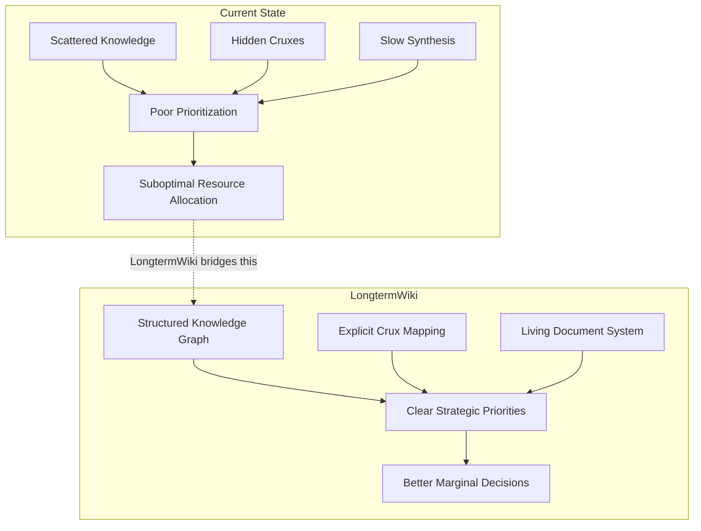
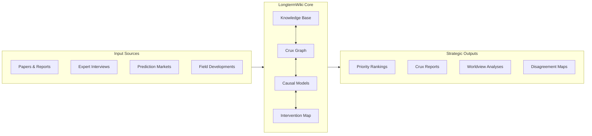
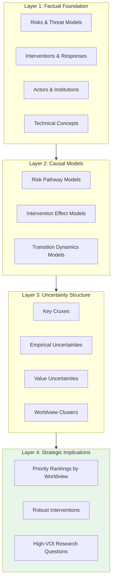
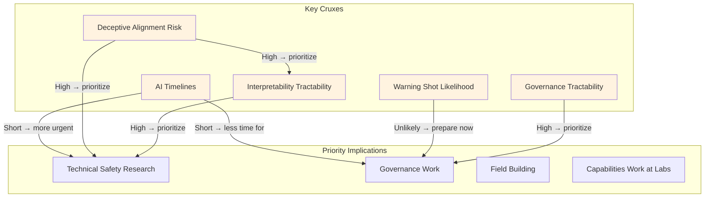
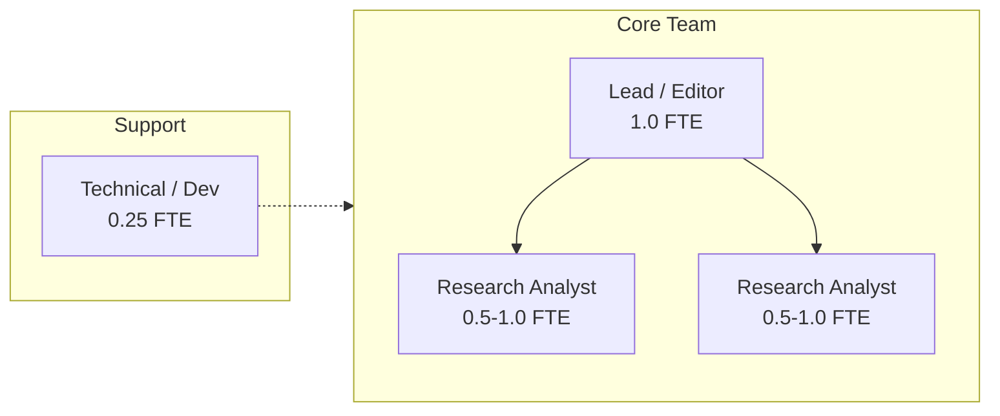

# LongtermWiki: Comprehensive AI Impact & Risk Navigator

## Vision Document (2-Person-Year Scope)

**Version:** 0.1 Draft
**Last Updated:** 2025-01-13
**Team Size:** 3-4 people over ~6-8 months

---

## Executive Summary

LongtermWiki is a strategic intelligence platform for AI safety prioritization. Its core purpose is to **surface the key uncertainties and cruxes that, if resolved, would most change how resources should be allocated across AI safety interventions**.

This is not an encyclopedia. It's a decision-support tool for funders, researchers, and policymakers asking: *"Where should the next marginal dollar or researcher-hour go?"*

---

## The Problem

The AI safety field suffers from:

1. **Fragmented knowledge** — Insights are scattered across papers, blog posts, forum threads, and institutional knowledge
2. **Unclear cruxes** — People disagree but often don't know *why* they disagree or what evidence would change their minds
3. **Poor prioritization legibility** — It's hard to see which interventions depend on which assumptions
4. **Slow information synthesis** — New developments take months to propagate into strategic thinking

---

## Core Value Proposition

LongtermWiki provides **strategic clarity** by answering:

| Question | How LongtermWiki Helps |
|----------|-----------------|
| "What are the key uncertainties in AI safety?" | Structured crux taxonomy with explicit dependencies |
| "If I believe X, what should I prioritize?" | Worldview → intervention mapping |
| "What would change my mind about Y?" | Explicit operationalization of cruxes |
| "Where do experts disagree and why?" | Disagreement decomposition into factual claims |
| "What's the current state of Z?" | Living knowledge base with staleness tracking |

---

## Architecture

### Information Flow

### Content Layers

The system has four interconnected layers:

---

## Core Components (2-Person-Year Scope)

### 1. Knowledge Base (~30% of effort)

**Goal:** Comprehensive, structured coverage of AI safety-relevant concepts, risks, and interventions.

**Scope:**
- ~50 risk pages (technical, misuse, structural, epistemic)
- ~80 intervention/response pages
- ~40 causal model pages
- Cross-linked, consistently formatted

**Quality bar:** Each page should have:
- Clear definition and scope
- Key claims with uncertainty estimates
- Links to primary sources
- Cross-references to related concepts
- Last-reviewed date and staleness tracking

### 2. Crux Graph (~25% of effort)

**Goal:** Explicit mapping of the key uncertainties that drive disagreement and prioritization.

**Scope:**
- ~30-50 major cruxes identified and operationalized
- Dependency structure (which cruxes affect which)
- Links to evidence and expert positions
- "What would change my mind" for each

**Example cruxes:**
- P(deceptive alignment) given current training approaches
- Timelines to transformative AI
- Tractability of interpretability research
- Likelihood of warning shots before catastrophe
- Value of current governance interventions

### 3. Worldview → Priority Mapping (~20% of effort)

**Goal:** Show how different assumptions lead to different prioritizations.

**Approach:**
1. Define 4-6 "worldview archetypes" based on crux positions
2. For each worldview, show implied priority rankings
3. Identify "robust" interventions that score well across worldviews
4. Identify "worldview-specific" bets

**Example worldviews:**
- **Short-timelines technical doomer:** P(doom) > 50%, TAI < 2030, deceptive alignment likely
- **Governance optimist:** Institutions can adapt, warning shots likely, coordination tractable
- **Slow takeoff pragmatist:** Long transition period, many opportunities to course-correct
- **Multipolar risk-focused:** Concentration of power is the main risk, not misalignment

### 4. Disagreement Decomposition (~15% of effort)

**Goal:** Turn fuzzy disagreements into structured, resolvable questions.

**Process:**
1. Identify high-stakes disagreements (e.g., "Is current safety research useful?")
2. Decompose into component claims
3. Identify which claims are cruxes vs. downstream disagreements
4. Link to evidence for each claim

### 5. Living Document Infrastructure (~10% of effort)

**Goal:** Keep content fresh and trustworthy.

**Features:**
- Staleness tracking (days since review, triggered updates)
- Source freshness (flag when cited papers are superseded)
- Confidence decay (uncertainties widen over time without review)
- Contributor attribution

---

## Non-Goals (Out of Scope for 2-Person-Year)

| Feature | Why Excluded |
|---------|--------------|
| Original research | We synthesize, not generate |
| Real-time monitoring | Quarterly update cadence is sufficient |
| Quantitative forecasting | Link to Metaculus/prediction markets instead |
| Community features | Focus on content, not social |
| Comprehensive AI news | Not a news aggregator |
| Deep technical tutorials | Link to AI Safety Fundamentals, etc. |

---

## Success Metrics

### Primary Metrics

| Metric | Target | Measurement |
|--------|--------|-------------|
| Crux coverage | 80% of major cruxes in discourse | Expert survey |
| User utility | "Changed my prioritization" | User survey |
| Citation rate | Referenced in 10+ strategy docs/year | Manual tracking |
| Expert endorsement | 5+ senior researchers recommend | Testimonials |

### Secondary Metrics

- Pages maintained at quality ≥4: >80%
- Average page staleness: under 60 days
- Cross-linking density: >5 links per page
- Coverage completeness: >90% of standard risk taxonomies

---

## Team Structure (3-4 People)

**Roles:**

- **Lead/Editor (1.0 FTE):** Overall vision, quality control, crux identification, stakeholder relationships
- **Research Analysts (1.0-1.5 FTE combined):** Page writing, source synthesis, model building
- **Technical (0.25 FTE):** Site maintenance, tooling improvements, data pipeline

---

## Milestones

### Phase 1: Foundation (Months 1-2)
- [ ] Core knowledge base structure complete
- [ ] 30 high-priority pages at quality ≥4
- [ ] Initial crux taxonomy (15-20 cruxes)
- [ ] Basic worldview mapping

### Phase 2: Depth (Months 3-4)
- [ ] 80+ pages at quality ≥4
- [ ] Full crux graph with dependencies
- [ ] 4-6 worldview archetypes defined
- [ ] First "disagreement decomposition" case studies

### Phase 3: Polish & Launch (Months 5-6)
- [ ] All core pages at quality ≥4
- [ ] Interactive worldview → priority tool
- [ ] Expert review and feedback incorporated
- [ ] Public launch

### Phase 4: Maintenance Mode (Months 7-8+)
- [ ] Quarterly review cycle established
- [ ] Community contribution guidelines
- [ ] Integration with other resources (AI Safety Fundamentals, etc.)

---

## Key Risks & Mitigations

| Risk | Likelihood | Impact | Mitigation |
|------|------------|--------|------------|
| Scope creep | High | Medium | Strict non-goals, regular pruning |
| Staleness | Medium | High | Automated tracking, review calendar |
| Low adoption | Medium | High | Early stakeholder involvement, utility focus |
| Quality inconsistency | Medium | Medium | Style guide, editor review |
| Key person dependency | Medium | High | Documentation, cross-training |

---

## Open Questions

1. **Governance structure:** Who has editorial authority? How are disagreements resolved?
2. **Funding model:** Grant-funded? Part of existing org? Independent?
3. **Expert involvement:** Advisory board? Paid reviewers? Community contribution?
4. **Update cadence:** Quarterly? Event-driven? Continuous?
5. **Quantitative integration:** How tightly to integrate with forecasting platforms?

---

## Appendix: Comparison to Existing Resources

| Resource | LongtermWiki Differentiator |
|----------|---------------------|
| AI Safety Fundamentals | LongtermWiki is strategic, not educational |
| LessWrong/AF | LongtermWiki is curated synthesis, not discussion |
| 80K Problem Profiles | LongtermWiki goes deeper on cruxes and uncertainties |
| GovAI/CAIS research | LongtermWiki synthesizes across orgs, not original research |
| Wikipedia | LongtermWiki is opinionated about importance and uncertainty |

---

## Next Steps

1. [ ] Circulate this document for feedback
2. [ ] Identify potential funders and home organizations
3. [ ] Recruit initial team
4. [ ] Develop detailed Phase 1 workplan
