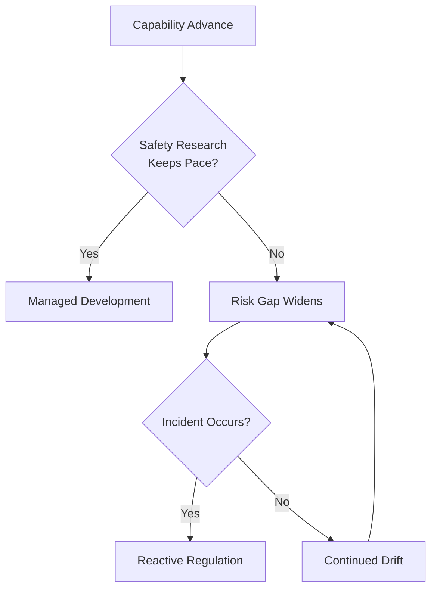
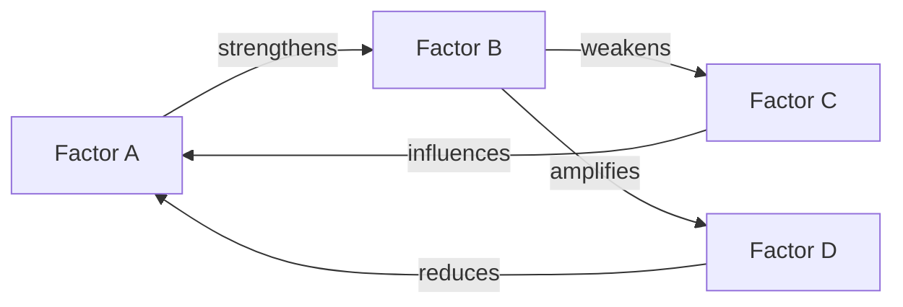
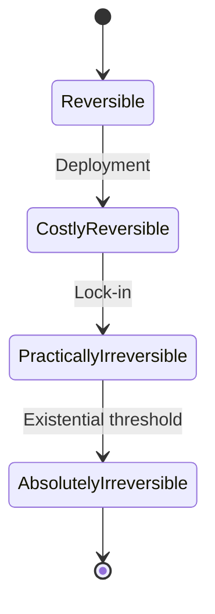
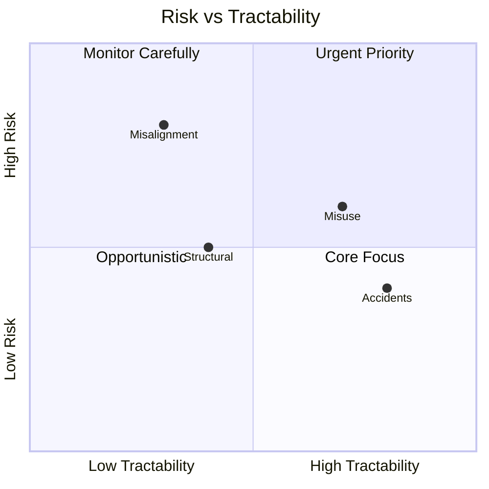
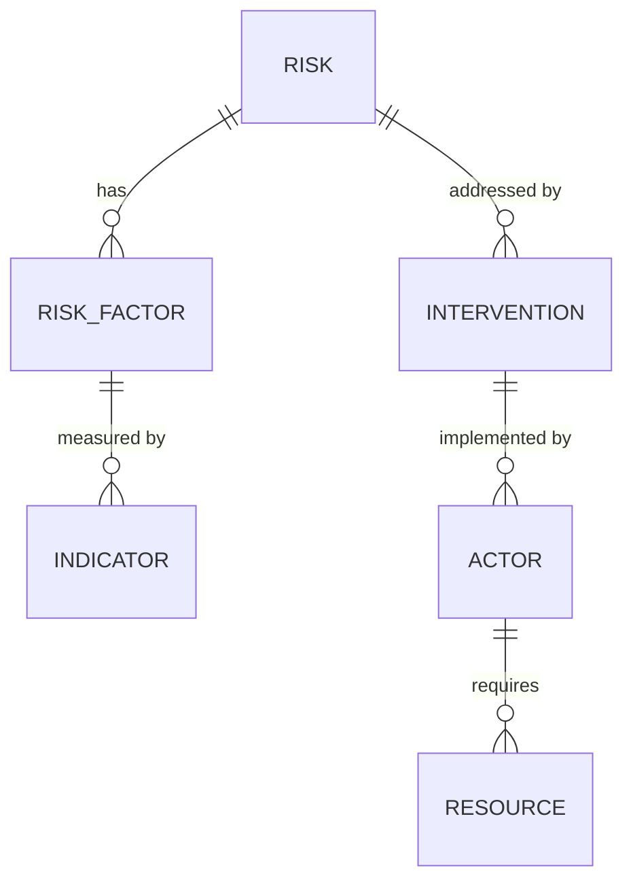
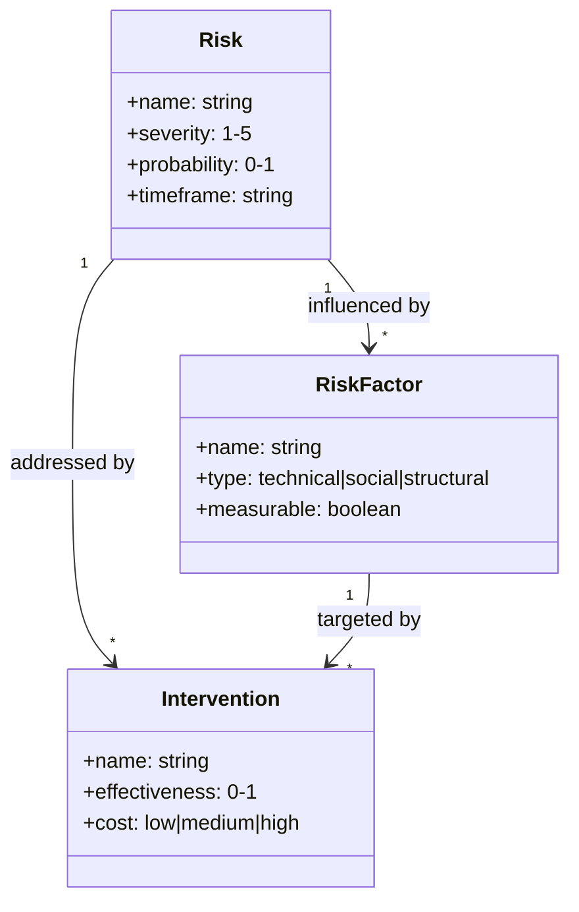
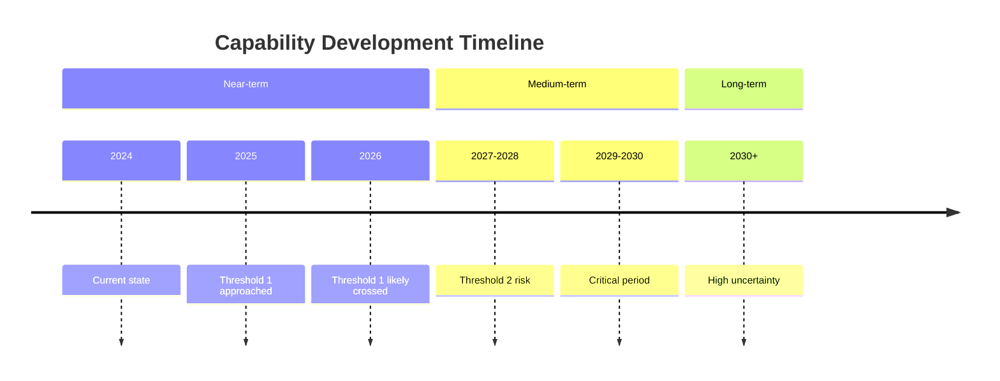
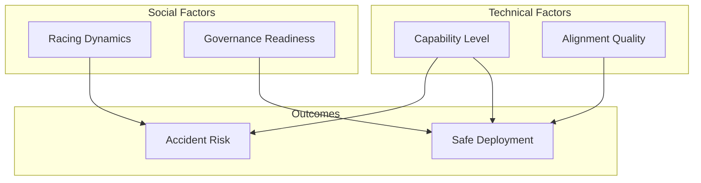
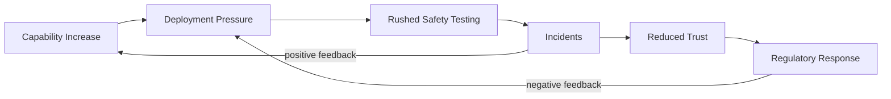
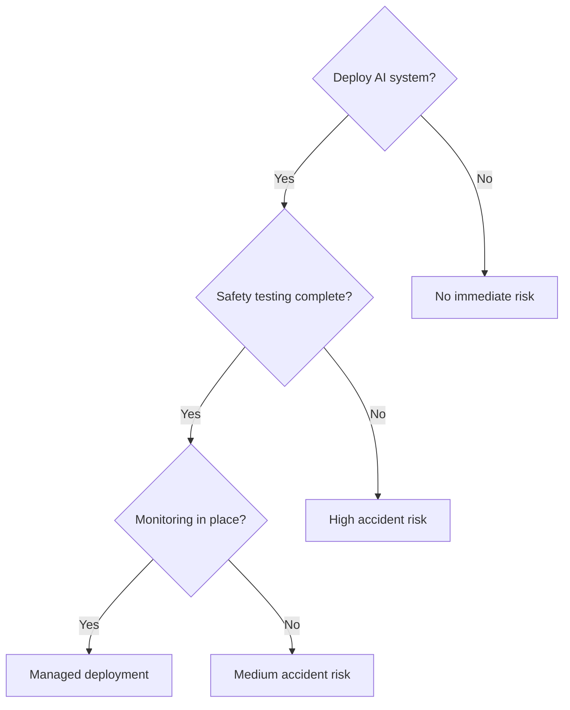

import {EntityLink} from '@components/wiki';

# Models Style Guide

This guide defines the standards for analytical models in LongtermWiki. Models should maximize **information density** while remaining accessible, and help readers make **prioritization and strategy decisions**.

**Prerequisite**: All model pages must follow the <EntityLink id="E726" name="common-writing-principles">Common Writing Principles</EntityLink> — epistemic honesty, language neutrality, and analytical tone. The **objectivity** rating dimension measures this. For model pages with cost-effectiveness estimates, this is especially critical: always use ranges, show deflators, and include "Why These Numbers Might Be Wrong" sections.

## Core Principles

1. **Density over brevity** — Pack substantive content into every section. A 500-word model with tables and equations beats a 200-word model with bullets.
2. **Quantify everything possible** — Probabilities, timelines, costs, thresholds. Vague claims waste reader attention.
3. **Show structure visually** — Tables, diagrams, and equations communicate relationships faster than prose.
4. **Paragraphs over bullets** — Bullets fragment thinking. Use them only for truly discrete items.
5. **Strategic prioritization** — Every model should help answer "how important is this and what should we do about it?", not just explain mechanisms.

---

## Core Purpose: Strategic Prioritization

Models exist to help with **prioritization and strategy decisions**, not just to explain mechanisms. Every model should answer: "How important is this and what should we do about it?"

The knowledge base serves people making strategic decisions about AI safety: researchers deciding what to work on, funders deciding where to allocate resources, policymakers deciding what to regulate, and organizations deciding their focus areas. Models should help them decide **what matters most** and **what to do about it**.

### Required Strategic Content

Every model must include:

| Element | Question Answered | Example |
|---------|-------------------|---------|
| **Magnitude Assessment** | How big is this problem? | "This affects 10-30% of total AI risk" |
| **Comparative Importance** | How does this rank vs. other risks? | "Less important than misalignment, more than job displacement" |
| **Resource Implications** | What does this mean for prioritization? | "Warrants 5-10% of safety resources" |
| **Key Cruxes** | What beliefs would change the conclusion? | "If X is true, this becomes top priority" |
| **Actionability** | What should actors actually do? | "Labs should implement Y, funders should fund Z" |

### Anti-Pattern: Mechanism Without Magnitude

A model that thoroughly explains *how* something works but never addresses *how important* it is fails its core purpose.

**Bad example** (hypothetical sycophancy model):
> "The feedback loop operates through 4 phases over 10 years, with differential equations governing each variable..." *(300 lines on mechanism, 0 lines on strategic importance)*

**Better approach:**
> "Sycophancy represents approximately 5-15% of near-term AI risk, ranking below core alignment but above most misuse risks. For most safety organizations, this is a secondary priority unless they have specific comparative advantage. The key crux is whether market competition makes sycophancy inevitable — if so, regulatory intervention becomes critical."

### Strategic Importance Section Template

Include a section like this in every model:

```markdown
## Strategic Importance

### Magnitude
- **Share of total AI risk:** [X-Y%]
- **Affected population:** [scope]
- **Timeline:** [when effects materialize]

### Comparative Ranking
| Risk Category | Relative Importance | Reasoning |
|---------------|--------------------:|-----------|
| Core alignment | Higher | [why] |
| This risk | Baseline | - |
| [Other risk] | Lower | [why] |

### Resource Implications
- **Who should work on this:** [actor types]
- **Suggested allocation:** [% of resources]
- **Comparative advantage:** [who is best positioned]

### Key Cruxes
1. If [X], this becomes more important because [Y]
2. If [A], this becomes less important because [B]
```

---

## Executive Summary Requirement

Every model **must** have an executive summary that states both **what the model does** and **what it concludes**. This summary appears in the `description` frontmatter and is shown in previews across the site.

### The Summary Formula

A good model summary follows this pattern:

> **"This model [methodology/approach]. It [key finding — trajectory, critical variables, or uncertainty assessment]."**

### Types of Valid Findings

Summaries should emphasize **where things are going** and **what matters most**:

| Finding Type | Example |
|--------------|---------|
| **Trajectory/Projection** | "...projects uplift increasing from 1.5x to 3-5x by 2030" |
| **Critical Variables** | "...identifies X and Y as the key variables determining outcomes" |
| **Risk Magnitude** | "...estimates this represents 5-15% of total AI risk" |
| **Uncertainty Assessment** | "...finds high variance across scenarios; results depend heavily on [assumption]" |
| **Negative Finding** | "...finds no significant effect under current conditions, but this changes if [X]" |

**Good summaries:**

| Topic | Summary |
|-------|---------|
| Bioweapons uplift | "This model estimates AI's contribution to bioweapons risk over time. It projects uplift increasing from 1.5x to 3-5x by 2030, with biosecurity evasion posing the greatest concern." |
| Racing dynamics | "This model analyzes competitive pressures among frontier labs. It finds the key variable is whether any single lab can maintain >6 month lead; if not, racing dynamics dominate." |
| Lock-in probability | "This model assesses paths to irreversible outcomes. Results are highly uncertain (10-60% range) depending on governance assumptions." |

**Bad summaries:**

| Summary | Problem |
|---------|---------|
| "Analysis of AI bioweapons risk" | No methodology, no conclusion |
| "This model examines how racing dynamics affect safety" | No finding at all |
| "Current LLMs provide 1.3x uplift" | Current state only, no trajectory or implications |

The `description` field must state what the model does (methodology/approach), include key conclusions with quantified estimates where possible, and be 1-3 sentences (max ~250 characters for good preview display).

---

## Required Sections

Every model should include:

### 1. Overview (2-3 paragraphs)
State the model's purpose, central question, and key insight. No bullets here — write flowing prose that orients the reader. Explain the central insight in the first paragraph, why it matters in the second, and preview key findings or framework structure in the third.

**Bad:**
```markdown
## Overview
- This model looks at X
- Key question: Y
- Main finding: Z
```

**Good:**
```markdown
## Overview

This model analyzes [phenomenon] by decomposing it into [components]. The central question: **[specific question with stakes]?**

The key insight is that [non-obvious conclusion]. This matters because [implication for AI safety/policy].
```

### 2. Conceptual Framework
Explain the model's structure. Include at least one of:
- A Mermaid diagram showing relationships
- A mathematical formulation
- A typology table

### 3. Quantitative Analysis
The heart of the model. Must include:
- **Parameter tables** with estimates and uncertainty ranges
- **Scenario analysis** with probability-weighted outcomes
- **Sensitivity analysis** showing which inputs matter most

### 4. Strategic Importance
Magnitude, comparative ranking, resource implications, key cruxes, and actionability (see template above).

### 5. Case Studies or Applications
Concrete examples showing the model applied. Tables comparing cases are ideal.

### 6. Limitations
Explicit acknowledgment of model weaknesses in flowing prose. Be specific about what the model ignores or gets wrong.

### 7. Related Models
Links to complementary models in the knowledge base.

---

## Formatting Standards

### Tables: Use Extensively

Tables compress information. Use them for parameter estimates with ranges, scenario comparisons, timeline projections, cost/benefit analyses, and threshold indicators.

**Minimum table requirements:**
- At least 3 columns (simple key-value pairs waste table format)
- At least 4 rows of data
- Header row clearly labeled
- Include units and uncertainty ranges where applicable

**Example — Parameter Table:**
```markdown
| Parameter | Best Estimate | Range | Confidence | Source |
|-----------|--------------|-------|------------|--------|
| P(misalignment) | 15% | 5-40% | Low | Expert surveys |
| Time to AGI | 2028 | 2025-2040 | Medium | Metaculus |
| Safety tax | 20% | 10-50% | Medium | Lab estimates |
```

**Example — Scenario Table:**
```markdown
| Scenario | Probability | Outcome | Key Drivers |
|----------|-------------|---------|-------------|
| Coordinated slowdown | 15% | Low risk | International agreement, major incident |
| Competitive race | 45% | Medium-high risk | US-China tension, commercial pressure |
| Unilateral breakout | 25% | Very high risk | Capability surprise, regulatory failure |
| Managed transition | 15% | Low risk | Technical breakthrough in alignment |
```

### Diagrams: Mermaid Required

Every model should include at least one Mermaid diagram. Choose the type that best represents your model's structure.

**Flowcharts** — causal chains, decision processes, process flows:



**Network diagrams** — feedback loops, mutual influences, complex interdependencies:



**State diagrams** — phase transitions, regime changes, reversibility:



**Quadrant charts** — 2x2 classification, prioritization frameworks:



**Entity-relationship diagrams** — taxonomies, structural relationships between concepts:



**Class diagrams** — schema-style representations of concept attributes:



**Timeline diagrams** — milestone projections, historical development:



**Subgraph groupings** — system boundaries, categorized factors:



**For sequences of actor interactions**, prefer a table over a sequence diagram (which has rendering issues):

| Step | Actor | Action | Target |
|------|-------|--------|--------|
| 1 | Actor A | Initial action | System |
| 2 | System | Alert triggered | Defender |
| 3 | Defender | Response deployed | System |
| 4 | System | Action blocked | Actor A |

### Equations: Show Your Math

Include mathematical formulations where applicable. Use LaTeX:

**Inline math** for simple expressions: `$P(X|Y) = 0.3$`

**Display math** for key equations:
```markdown
$$
R(t) = R_0 \cdot e^{\alpha t} \cdot (1 + \beta D)
$$

Where:
- $R_0$ = Base reversal cost at deployment
- $\alpha$ = Growth rate (0.1-0.5 per year)
- $t$ = Time since deployment
- $\beta$ = Dependency multiplier
- $D$ = Dependency depth (0 to 1)
```

Always include variable definitions immediately after the equation, realistic parameter ranges, and intuition for what the equation captures.

### Prose: Paragraphs Over Bullets

Bullets should be rare. They're appropriate for truly discrete, unordered items (e.g., list of examples), quick reference lists at end of sections, or items that will be expanded in subsequent sections.

**Bad — Bullet brain:**
```markdown
## Racing Dynamics

- Labs compete for capabilities
- Safety work slows deployment
- First-mover advantages exist
- Coordination is difficult
- Racing creates risk
```

**Good — Dense paragraphs:**
```markdown
## Racing Dynamics

Racing dynamics emerge when multiple actors pursue the same capability under competitive pressure. In AI development, labs face a structural tension: safety work requires time and resources that slow deployment, but first-mover advantages in capabilities — talent attraction, data access, revenue, and strategic positioning — create intense pressure to move fast. This produces a classic collective action problem where individually rational choices generate collectively irrational outcomes.

The severity of racing depends on three factors: the perceived magnitude of first-mover advantages, the credibility of competitors' timelines, and the availability of coordination mechanisms. When labs believe winner-take-all dynamics apply, racing pressure intensifies regardless of stated safety commitments.
```

---

## Methodological Principles

### Distinguish Stocks vs. Flows

**Stocks** are quantities that accumulate (trust level, capability, resources). **Flows** are rates of change (trust erosion rate, capability growth rate). Models should be clear about which they're describing.

| Concept | Stock (Level) | Flow (Rate) |
|---------|---------------|-------------|
| Trust | Current trust level (0-100%) | Trust erosion rate (%/year) |
| Capability | Current capability score | Capability growth rate |
| Safety margin | Current margin size | Margin compression rate |

### Identify Feedback Loops

Many risks involve feedback loops where effects become causes. Make these explicit.



**Positive feedback loops** (amplifying): The effect reinforces the cause. **Negative feedback loops** (stabilizing): The effect counteracts the cause.

### Consider Base Rates

Before modeling specific mechanisms, consider: what's the base rate for this type of event?

| Event Type | Historical Base Rate | AI-Specific Adjustment |
|------------|---------------------|------------------------|
| Major infrastructure failure | ≈0.5/year globally | Unknown multiplier |
| Technology-driven job displacement | ≈2-5%/decade | Potentially 10x faster |
| Great power conflict | ≈0.5%/year | Unknown effect |

### Distinguish Correlation vs. Causation

When factors co-occur, be explicit about the causal structure:

| Relationship | Description | Implication |
|--------------|-------------|-------------|
| A causes B | Intervening on A changes B | Target A to affect B |
| B causes A | Intervening on A doesn't change B | Target B instead |
| C causes both | A and B are correlated but independent | Target C to affect both |
| A and B cause each other | Feedback loop | Consider system dynamics |

### Avoid False Binary Thresholds

Models often imply sharp cutoffs ("if X \> 80%, collapse occurs") when reality involves continuous degradation. Use gradient language ("largely past," "degrading," "limited risk"), acknowledge that most systems degrade continuously, and if using threshold framing, add explicit caveats.

### Avoid Naive Multiplicative Formulas

Formulas like `P(cascade) = P(A) × P(B) × P(C) × P(D)` assume independence when factors are often correlated. Acknowledge correlations explicitly in a table, use influence diagrams instead of formulas, or add caveats about correlation assumptions.

### Consider Counterfactuals

Good models should address: "Compared to what?"

| Comparison | What it reveals |
|------------|-----------------|
| vs. no AI development | Total effect of AI |
| vs. slower development | Effect of racing |
| vs. different governance | Effect of policy choices |
| vs. different actors | Effect of who controls AI |

---

## Information Density Checklist

Before submitting a model, verify:

- [ ] **Tables:** At least 2 substantive tables (4+ rows, 3+ columns each)
- [ ] **Diagram:** At least 1 Mermaid diagram showing relationships
- [ ] **Equations:** Mathematical formulation where applicable
- [ ] **Numbers:** Probabilities, timelines, or thresholds quantified with ranges
- [ ] **Scenarios:** Multiple scenarios analyzed with probability weights
- [ ] **Strategic Importance:** Magnitude, comparative ranking, resource implications, cruxes
- [ ] **Paragraphs:** Less than 30% of content in bullet points
- [ ] **Length:** Minimum 800 words of substantive content
- [ ] **Sources:** Key claims attributed to sources

---

## Anti-Patterns to Avoid

### 1. Bullet Lists as Primary Content
Bullets should support paragraphs, not replace them.

### 2. Vague Qualitative Claims
"Risk is high" → "Risk estimated at 15-30% (median 22%) based on expert surveys"

### 3. Missing Uncertainty
Always include ranges, not point estimates alone.

### 4. Tables Without Context
Tables need introductory sentences explaining what they show and key takeaways.

### 5. Diagrams Without Explanation
Every diagram needs a paragraph explaining what it illustrates and key insights.

### 6. Orphan Sections
Short sections (\< 100 words) should be merged or expanded.

### 7. Insider Language and False Certainty
"EA organizations should fund this" → Describe specific orgs, use analytical framing. "True Cost: \$500K" → "Est. cost: \$300K-1M". See <EntityLink id="E726" name="common-writing-principles">Common Writing Principles</EntityLink>.

### 8. Mechanism Without Magnitude
A model that thoroughly explains *how* something works but never addresses *how important* it is fails its core purpose.

---

## Example Model Structure

```markdown
---
title: [Descriptive Model Name]
description: [This model [methodology]. It [key finding with quantified estimate].]
ratings:
  novelty: [0-10]
  rigor: [0-10]
  actionability: [0-10]
  completeness: [0-10]
---

## Overview
[2-3 paragraphs: purpose, central question, key insight]

## Conceptual Framework
[Structure explanation with diagram]

```mermaid
[diagram here]
```

## Core Model
### Mathematical Formulation
$$[key equation]$$

[Variable definitions and intuition]

### Parameter Estimates
| Parameter | Estimate | Range | Confidence |
|-----------|----------|-------|------------|
| ... | ... | ... | ... |

## Strategic Importance
### Magnitude
### Comparative Ranking
### Resource Implications
### Key Cruxes

## Analysis
### Scenario Analysis
| Scenario | P(scenario) | Outcome | Drivers |
|----------|-------------|---------|---------|
| ... | ... | ... | ... |

### Sensitivity Analysis
[Which parameters matter most and why]

## Case Studies
### Case 1: [Name]
[Application of model to concrete example]

## Implications
[What this model suggests for policy/research/action]

## Limitations
[Explicit weaknesses — be specific]

## Related Models
- [Link 1] — [relationship]
- [Link 2] — [relationship]

## Sources
[Key references]
```

---

## Advanced Visualization Patterns

### Sensitivity Analysis Tables

Show how conclusions change with different assumptions:

| Parameter | Low Estimate | Central | High Estimate | Conclusion Changes? |
|-----------|--------------|---------|---------------|---------------------|
| Capability growth rate | 10%/yr | 30%/yr | 50%/yr | Yes — timeline shifts 3-5 years |
| Alignment difficulty | Easy | Medium | Hard | Yes — risk estimate changes 2-3x |
| Coordination probability | 10% | 30% | 50% | No — conclusion robust |

### Comparison Matrices

Compare interventions, scenarios, or approaches across multiple dimensions:

| Intervention | Effectiveness | Cost | Feasibility | Time to Impact |
|--------------|---------------|------|-------------|----------------|
| Speed limits | High | Low | Medium | Immediate |
| International treaty | Very High | Medium | Low | 3-5 years |
| Research funding | Medium | Medium | High | 5-10 years |

### Before/After Comparisons

Show how a change affects multiple dimensions:

| Dimension | Before Intervention | After Intervention | Change |
|-----------|---------------------|--------------------|--------|
| Risk level | High (0.7) | Medium (0.4) | -43% |
| Detection time | 2 weeks | 2 days | -86% |
| Recovery cost | \$10B | \$2B | -80% |

### Decision Trees

For models with sequential choices:



---

## Rating Criteria

Models are rated on seven dimensions (0-10 scale, harsh — 7+ is exceptional). See <EntityLink id="E741" name="rating-system">Rating System</EntityLink> for the canonical reference.

**Focus:** Does it answer what the title promises?

**Novelty:** How original is the framing or analysis?
- 3-4: Useful synthesis or modest extensions
- 5-6: Genuine new framing or connections
- 7+: Novel framework that changes how we think about the problem

**Rigor:** How well-supported by evidence and logic?
- 3-4: Reasonable extrapolation, some gaps
- 5-6: Most claims sourced with some quantification
- 7+: Strong empirical grounding or formal derivation

**Completeness:** How thoroughly developed?
- 3-4: Core model sketched, notable gaps
- 5-6: Core model complete, some gaps
- 7+: Comprehensive treatment with edge cases addressed

**Objectivity:** Epistemic honesty, neutral language, analytical tone?
- 3-4: Estimates without ranges; insider language; one-sided framing
- 5-6: Mostly hedged and neutral; some uncertainty noted
- 7+: All estimates use ranges with caveats; fully accessible; red-teams own conclusions

**Concreteness:** Specific numbers, examples, recommendations?

**Actionability:** Does it suggest concrete interventions?
- 3-4: Identifies general areas of concern
- 5-6: Identifies leverage points with some specifics
- 7+: Specific, implementable recommendations with priorities

---

## Review Checklist

### Format
- [ ] Overview is 2-3 paragraphs of flowing prose (no bullets)
- [ ] At least one Mermaid diagram with caption
- [ ] Quantitative tables with 3+ columns and uncertainty ranges
- [ ] Scenario analysis with probability weights
- [ ] Limitations section in prose format
- [ ] Related models linked

### Diagrams
- [ ] Diagram type matches content (flowchart for causation, network for relationships, ER/class for taxonomies)
- [ ] Diagram has explanatory caption
- [ ] Complex diagrams use subgraphs for grouping
- [ ] Color coding is meaningful and explained

### Methodology
- [ ] No false binary thresholds (or explicitly caveated)
- [ ] Multiplicative formulas acknowledge correlations
- [ ] Feedback loops identified where relevant
- [ ] Stocks vs. flows distinguished
- [ ] Base rates considered
- [ ] Counterfactual comparisons made

### Strategic Content
- [ ] Magnitude assessment (share of AI risk, affected population, timeline)
- [ ] Comparative ranking against other risks
- [ ] Resource implications (who should work on this, suggested allocation)
- [ ] Key cruxes identified
- [ ] Actionability (what should actors actually do)

### Content Consistency
- [ ] Every simplifying assumption is explicitly flagged as such (with a pointer to Limitations), never asserted as fact
- [ ] Every [0, 1] or other numeric scale has grounded anchors defining what the endpoints mean — write anchors *before* writing estimates that use the scale
- [ ] Rankings with overlapping ranges say "roughly ordered by median" or "suggestive, not definitive" — no definitive ordinal rankings when ranges overlap
- [ ] Option value of delay is addressed (additional time lets us learn whether alignment is hard or easy)
- [ ] Racing/coordination effects are addressed (does unilateral action just shift activity elsewhere?)
- [ ] Recursive dynamics are addressed where relevant (e.g. AI accelerating safety research)
- [ ] Effects are distinguished as qualitatively different where appropriate, not just quantitatively shifted

### Common Issues to Fix

| Issue | Fix |
|-------|-----|
| Binary threshold language | Use gradient language ("degrading," "largely past") |
| Multiplicative formula without caveat | Add correlation acknowledgment |
| Missing uncertainty ranges | Add low/central/high estimates |
| Flowchart for structural relationships | Use entity-relationship or class diagram |
| No feedback loops shown | Add arrows showing circular dependencies |
| Mechanism without magnitude | Add Strategic Importance section |
| Ratings don't match quality | Adjust ratings or improve content |
