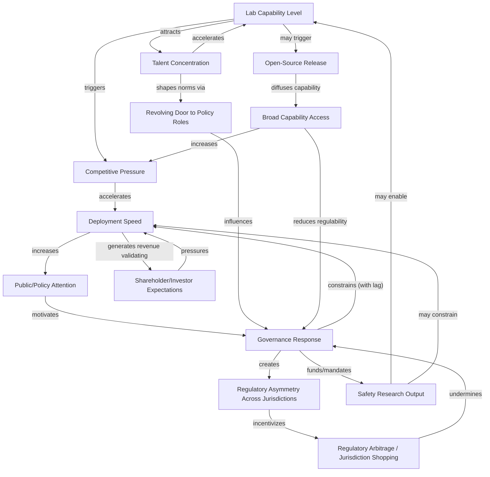

import {EntityLink, R, KBF, Calc, DataInfoBox, DataExternalLinks} from '@components/wiki';

## Quick Assessment

| Dimension | Assessment |
|-----------|-----------|
| **Type** | Analytical model / causal graph framework |
| **Scope** | Feedback dynamics between AI labs, governments, investors, talent, and open-source ecosystems |
| **Key Insight** | Racing dynamics, regulatory lag, and shareholder incentives create self-reinforcing loops that systematically outpace governance responses |
| **Primary Loops** | 7 identified: racing, regulatory arbitrage, talent revolving door, capability diffusion, shareholder incentive propagation, governance response lag, safety-capability coupling |
| **Relation to Other Models** | Extends <EntityLink id="E418">AI Safety Multi-Actor Strategic Landscape</EntityLink>; complements <EntityLink id="E417">AI Risk Feedback Loop & Cascade Model</EntityLink> |
| **Key Limitation** | Quantitative estimates are approximate; loop interactions are nonlinear and context-dependent |

## Key Links

| Source | Link |
|--------|------|
| Official Website | [zonkafeedback.com](https://www.zonkafeedback.com/blog/ai-feedback-loop) |
| Wikipedia | [en.wikipedia.org](https://en.wikipedia.org/wiki/Reinforcement_learning_from_human_feedback) |

## Overview

The AI Actor Feedback Loops model maps the causal relationships between the major actors in the AI safety ecosystem—frontier labs, governments, investors, talent pools, and open-source communities—and analyzes how their interactions create self-reinforcing dynamics that shape the trajectory of AI development and governance. Unlike models focused on a single feedback mechanism (such as the <EntityLink id="E296">Sycophancy Feedback Loop Model</EntityLink> or the <EntityLink id="E196">AI Media-Policy Feedback Loop Model</EntityLink>), this framework examines the full multi-actor system to identify where feedback loops accelerate risk and where intervention points might exist.

The core observation motivating this model is that AI governance operates within a system of interacting feedback loops, not a simple action-reaction chain. When <EntityLink id="E218">OpenAI</EntityLink> releases a frontier model, this does not simply prompt a regulatory response; it triggers cascading effects across competitor labs, open-source communities, investor expectations, talent markets, and multiple jurisdictions simultaneously. Each of these responses then feeds back into the system, often amplifying the original dynamic. Tom Davidson of the Forethought research institute estimated in March 2025 that AI progress feedback loops could compress three years of progress into one year, with a possibility of ten years of equivalent progress through algorithmic feedback loops in AI research. This acceleration makes understanding the multi-actor loop structure urgent for safety planning.

The model identifies seven primary feedback loops and maps their causal relationships. Some loops are stabilizing (negative feedback that dampens oscillations), but the majority identified in the current AI landscape are destabilizing (positive feedback that amplifies initial perturbations). The critical question for AI safety strategy is whether governance interventions can convert destabilizing loops into stabilizing ones before capability acceleration outpaces the system's ability to self-correct.

## Conceptual Framework

### Causal Graph Structure

The model represents AI ecosystem dynamics as a directed graph where nodes are measurable system states and edges are causal influences with associated direction (amplifying or dampening), estimated magnitude, and time delay. The seven primary loops are interconnected, meaning intervention at one node propagates through multiple loops simultaneously.

### The Seven Loops

**Loop 1: Racing Dynamics.** Lab competition accelerates capability deployment, which generates public attention and governance pressure, but governance response lags behind the frontier. This is the most widely discussed loop in the AI safety community. <EntityLink id="E220">Paul Christiano</EntityLink> has emphasized that alignment work requires tight feedback loops—evaluating AI behavior, selecting corrective actions, and intervening—and that disrupting these loops (through pauses or fast capability jumps) forces safety work to operate on outdated models. The racing loop is destabilizing because each lab's deployment pressures competitors to accelerate, compressing the time available for safety evaluation.

**Loop 2: Regulatory Arbitrage.** When stringent jurisdictions (such as the EU under the AI Act or California under proposed SB 1047-style legislation) impose compliance costs, development activity shifts toward more permissive jurisdictions (historically the UK, Singapore, or Gulf states). This shift undermines the stringent jurisdiction's regulatory leverage and can create a "race to the bottom" dynamic. The EU AI Act's phased implementation beginning in 2024-2025 provides a natural experiment: early evidence suggests some firms restructured operations to minimize EU regulatory exposure, though the magnitude remains debated.

**Loop 3: Talent Revolving Door.** Personnel circulate between frontier labs (<EntityLink id="E218">OpenAI</EntityLink>, <EntityLink id="E22">Anthropic</EntityLink>, <EntityLink id="E98">Google DeepMind</EntityLink>), government AI safety institutes (UK AISI, US AISI), think tanks, and policy roles. This circulation shapes which norms get encoded into both voluntary commitments and formal regulation. The loop can be stabilizing (safety-conscious researchers carrying norms into labs) or destabilizing (lab-aligned personnel shaping policy to favor industry preferences). The direction depends heavily on the specific individuals and institutional cultures involved.

**Loop 4: Capability Diffusion.** Open-source release by one lab—such as Meta's Llama series or the emergence of DeepSeek models—forces strategic responses from competitors and fundamentally changes what is regulable. Once capabilities are widely distributed, governance approaches that depend on controlling a small number of frontier labs become less effective. On the Chatbot Arena Leaderboard, the gap between top closed-weight and open-weight models narrowed from 8.0% in early January 2024 to 1.7% by February 2025, illustrating the speed of capability convergence. DeepSeek-R1's release in early 2025 demonstrated that frontier-adjacent reasoning capabilities could emerge from outside the Western lab ecosystem, complicating export control strategies that had assumed capability concentration.

**Loop 5: Shareholder Incentive Propagation.** Capital providers—Microsoft's multi-billion dollar investment in OpenAI, Amazon's investment in Anthropic, and the broader venture and public equity markets—create deployment pressure through expected returns. Lab deployment decisions shape their policy exposure (products in market create regulatory surface area), which feeds back into governance dynamics. Revenue from deployed products validates investor expectations, reinforcing the pressure cycle. This loop is particularly resistant to voluntary safety commitments because shareholder fiduciary obligations create legal and economic pressure independent of individual decision-makers' safety preferences.

**Loop 6: Governance Response Lag.** Regulation systematically addresses last-generation technology rather than the frontier. The typical lag between a capability demonstration and a substantive regulatory response can be estimated at 12-36 months for major jurisdictions. The UK AI Safety Summit at Bletchley Park in November 2023 was partly motivated by GPT-4's release in March 2023—an approximately 8-month response time for an agenda-setting event, with binding policy responses taking considerably longer. By the time governance frameworks are operational, the capability landscape has often shifted substantially.

**Loop 7: Safety-Capability Coupling.** This is the most contested loop in the framework. Safety research (interpretability, alignment techniques, evaluation methods) may either constrain or enable capability work. <EntityLink id="E174">Interpretability</EntityLink> research that reveals how models function can simultaneously improve safety and provide insights that accelerate capability development. The community debate centers on whether the net effect is positive (safety research creates tools that constrain dangerous deployment) or negative (safety research is dual-use and accelerates the very capabilities it aims to govern). In 2025, twelve companies published or updated Frontier AI Safety Frameworks, suggesting at least some institutional coupling of safety and deployment processes.

## Quantitative Analysis

### Estimated Loop Parameters

The following table presents rough quantitative estimates for each loop's key parameters. These estimates are derived from public events and should be treated as order-of-magnitude guides rather than precise measurements.

| Loop | Estimated Cycle Time | Direction | Strength (Relative) | Key Measurable Indicator |
|------|---------------------|-----------|---------------------|--------------------------|
| Racing Dynamics | 3-6 months (major model release cadence) | Destabilizing | High | Time between frontier model releases |
| Regulatory Arbitrage | 6-18 months (relocation/restructuring) | Destabilizing | Medium | Share of AI compute by jurisdiction |
| Talent Revolving Door | 1-3 years (career transitions) | Ambiguous | Medium | Lab-to-government personnel transfers per year |
| Capability Diffusion | 2-12 months (open-source replication lag) | Destabilizing | High | Closed-open capability gap (Chatbot Arena) |
| Shareholder Incentives | Quarterly (earnings cycles) | Destabilizing | High | AI revenue growth expectations in analyst reports |
| Governance Response Lag | 12-36 months (legislation cycle) | Destabilizing | High | Time from capability demo to binding regulation |
| Safety-Capability Coupling | Ongoing (research timescale) | Contested | Unknown | Ratio of safety to capability publications at top labs |

### Historical Examples and Timing Analysis

Several concrete episodes illustrate the loop dynamics:

**GPT-4 Release and UK AI Summit (Loop 1 + Loop 6).** GPT-4's March 2023 launch generated immediate competitive pressure (Loop 1), with <EntityLink id="E22">Anthropic</EntityLink> and <EntityLink id="E98">Google DeepMind</EntityLink> accelerating their own releases. The governance response materialized first as the UK AI Safety Summit in November 2023 (~8 months) and more substantively as the EU AI Act's final text in early 2024 (~12 months). By the time these frameworks became operationally relevant, the frontier had shifted to multi-modal and agentic systems.

**DeepSeek-R1 and Export Control Feedback (Loop 4 + Loop 2).** DeepSeek-R1's emergence demonstrated that reasoning capabilities could develop outside US-allied compute supply chains, challenging the assumption that export controls on advanced chips would durably concentrate frontier capabilities. This triggered reassessment of export control strategy—a Loop 4 (diffusion) event feeding back into Loop 2 (arbitrage) by revealing that regulatory approaches premised on capability concentration were less effective than assumed.

**Chatbot Arena Convergence (Loop 4).** The narrowing of the gap between the top and 10th-ranked model from 11.9% to 5.4%, and between the top two models from 4.9% to 0.7%, quantifies the speed of capability convergence and the diminishing window during which frontier governance can target a small number of actors.

**Voluntary Commitments as Ceiling or Floor.** The 2023 White House voluntary commitments by frontier labs illustrate the tension in Loop 1 and Loop 5: commitments function as a signal of responsibility (potentially raising the floor for industry behavior) while also potentially serving as a ceiling that preempts more stringent mandatory regulation. Whether voluntary commitments become mandatory floors depends on whether governance response (Loop 6) catches up before the commitments are rendered obsolete by capability changes.

### Loop Interaction Effects

The loops do not operate independently. Key interaction effects include:

**Racing × Governance Lag amplification.** Faster racing dynamics (shorter Loop 1 cycle time) widen the governance gap (Loop 6), making regulatory responses increasingly irrelevant to the current frontier. If model release cadence is 3-6 months and regulatory cycle time is 12-36 months, governance is systematically 2-6 cycles behind.

**Diffusion × Arbitrage reinforcement.** Open-source release (Loop 4) reduces the effectiveness of jurisdiction-specific regulation, strengthening the arbitrage dynamic (Loop 2). Once capabilities are globally distributed, the leverage of any single jurisdiction's regulatory framework diminishes.

**Shareholder × Racing compounding.** Investor expectations (Loop 5) feed directly into racing pressure (Loop 1), creating a compound loop where deployment generates revenue, revenue validates investor expectations, expectations increase deployment pressure, and accelerated deployment increases competitive pressure on other labs.

**Talent × Safety-Capability ambiguity.** The revolving door (Loop 3) interacts with safety-capability coupling (Loop 7) because researchers who move between labs and policy roles carry implicit assumptions about whether safety research enables or constrains capability work. Their framing of this question directly shapes institutional priorities.

## Strategic Importance

### For AI Safety Strategy

This framework suggests several implications for AI safety work:

**Intervention points are not equally leveraged.** Loops with shorter cycle times (racing, shareholder incentives) dominate over loops with longer cycle times (governance response, talent flows). Effective interventions must either shorten governance cycle times or lengthen racing cycle times. The <EntityLink id="E418">AI Safety Multi-Actor Strategic Landscape</EntityLink> analysis identifies coordination mechanisms that could, in principle, slow racing dynamics, but the shareholder incentive loop creates strong resistance to such coordination.

**Voluntary commitments are inherently unstable.** The intersection of Loop 1 (racing), Loop 5 (shareholder pressure), and Loop 6 (governance lag) means that voluntary commitments face continuous erosion pressure. When competitors defect from informal norms, the combination of competitive and financial pressure makes sustained voluntary restraint difficult. The relevant question is not whether any given commitment is sincere at the time it is made, but whether the loop structure supports its durability.

**Open-source dynamics create irreversibility.** Loop 4 (capability diffusion) introduces ratchet effects: once capabilities are released, they cannot be recalled. This means that governance strategies dependent on controlling a small number of frontier actors have a limited and shrinking window of applicability. The trend toward open-weight convergence with closed models suggests this window is narrowing.

**The safety-capability coupling question is decision-relevant.** If Loop 7 is net-positive for safety (safety research constrains more than it enables), then funding safety research is straightforwardly beneficial. If it is net-negative or ambiguous, then the strategic calculus for organizations like <EntityLink id="E552">Open Philanthropy</EntityLink> becomes considerably more complex. This question intersects with debates about <EntityLink id="E174">interpretability</EntityLink> research and whether understanding model internals primarily serves safety or capability advancement.

### For Governance Design

Effective governance must account for loop dynamics rather than treating regulation as a one-shot intervention. Specifically:

- **Adaptive regulation** that updates faster than the current 12-36 month cycle is necessary to close the governance lag (Loop 6). The UK AISI model of continuous evaluation represents one approach, though its binding authority remains limited.
- **International coordination** is essential to mitigate regulatory arbitrage (Loop 2), but coordination itself faces a collective action problem that mirrors the racing dynamic.
- **Transparency requirements** (such as mandatory incident reporting or pre-deployment evaluation) can help by creating information flows that shorten governance response times, though they also risk creating compliance theater.

## Limitations

This model has several important caveats:

**Quantitative estimates are rough.** The cycle times, lag estimates, and relative strengths assigned to loops are informed guesses based on public events, not rigorous measurements. Different analysts examining the same events might assign substantially different values.

**Loop identification is not exhaustive.** The seven loops selected are prominent in AI safety discourse, but additional loops exist—including public opinion dynamics, media feedback effects (see <EntityLink id="E196">AI Media-Policy Feedback Loop Model</EntityLink>), and intra-lab organizational dynamics—that are not modeled here.

**Nonlinear interactions are simplified.** The causal graph represents linear relationships, but real-world loop interactions involve thresholds, phase transitions, and nonlinear amplification that a directed graph cannot fully capture. For example, regulatory arbitrage may be negligible below some threshold of regulatory burden and then become dominant above it.

**Actor motivations are treated as stable.** The model assumes that labs want to race, investors want returns, and regulators want to govern. In practice, individual decision-makers have heterogeneous and evolving motivations. Leadership changes at a single frontier lab can materially alter loop dynamics in ways this framework does not predict.

**Historical analogies have limited applicability.** The AI ecosystem is sufficiently novel that historical regulatory episodes (telecommunications, nuclear energy, financial regulation) provide only rough guidance. The speed of capability diffusion (Loop 4) in particular has few historical parallels.

**The model does not predict outcomes.** It identifies structural tendencies—which loops are currently dominant, where intervention points exist—but does not generate specific forecasts about whether governance will succeed or fail. The outcome depends on contingent decisions by specific actors that the loop structure constrains but does not determine.

## Key Uncertainties

Several open questions determine which loops dominate and whether the overall system trajectory favors or undermines safety:

1. **Will governance response times compress?** If AI-specific regulatory bodies achieve cycle times closer to 6 months than 36 months, Loop 6 becomes less destabilizing. Early evidence from AI safety institutes is mixed.

2. **Does capability diffusion plateau?** If the open-closed gap stabilizes rather than continuing to narrow, governance strategies targeting frontier actors retain more leverage. The DeepSeek-R1 episode suggests the gap may be structurally difficult to maintain.

3. **How does the safety-capability coupling resolve?** The direction of Loop 7 is perhaps the most consequential uncertainty for AI safety strategy. Community discussions on <EntityLink id="E538">LessWrong</EntityLink> and the EA Forum reflect deep disagreement on this question.

4. **Can international coordination overcome arbitrage?** The success of Loop 2 mitigation depends on whether major AI-relevant jurisdictions can coordinate regulatory standards faster than firms can restructure to avoid them.

5. **Will shareholder pressure moderate or intensify?** If AI products underperform revenue expectations, Loop 5 could weaken. If they exceed expectations, the loop strengthens and racing dynamics intensify.

## Sources

[^1]: Glickman & Sharot (2025) - "Human–AI Feedback Loops Amplify Biases in Perceptual, Emotional, and Social Judgments," Nature Human Behaviour, vol. 9(2), pp. 345-359, DOI: 10.1038/s41562-024-02077-2
[^2]: Tom Davidson, Forethought research institute, March 2025 presentation - modeling AI progress feedback loops
[^3]: Yao et al. (2022) - ReAct framework paper, Princeton University and Google Research
[^4]: IBM article (2025) - discussion of AI agent evolution, multi-agent frameworks, and governance mechanisms
[^5]: Chatbot Arena Leaderboard data, January 2024 through February 2025
[^6]: Frontier AI Safety Frameworks - twelve companies published or updated frameworks in 2025