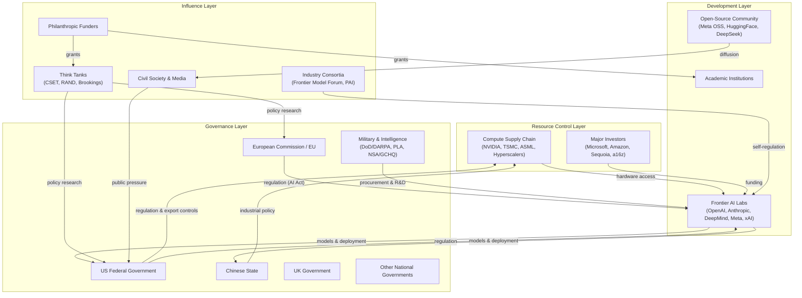

import {EntityLink, R, KBF, Calc, DataInfoBox, DataExternalLinks} from '@components/wiki';

## Quick Assessment

| Dimension | Rating |
|-----------|--------|
| **Type** | Multi-actor power-scoring framework |
| **Actors Covered** | ≈15 categories spanning governments, labs, investors, compute providers, military, civil society |
| **Primary Use** | Identifying where power concentration matters most for AI safety outcomes |
| **Key Insight** | Power over AI outcomes is heavily concentrated in a small number of frontier labs and their cloud/compute suppliers, with governments playing catch-up |
| **Limitations** | Power is dynamic, relational, and context-dependent; static scoring inherently simplifies |
| **Related Frameworks** | <EntityLink id="E418">AI Safety Multi-Actor Strategic Landscape</EntityLink>, <EntityLink id="E69">Concentration of Power Systems Model</EntityLink> |

## Overview

The AI Power and Influence Map is an analytical framework for systematically scoring the major actors who shape the trajectory of AI development and governance. Rather than mapping a single organization or tool, it synthesizes power-mapping methodologies — traditionally used in stakeholder analysis, advocacy, and organizational strategy — and applies them to the specific question of who controls the future of advanced AI systems.

Power mapping in its classical form involves identifying stakeholders, assessing their influence levels (formal and informal), mapping relationships between them, and translating the resulting picture into strategic action. When applied to AI, this approach reveals that formal authority (e.g., regulatory agencies) and actual influence (e.g., compute providers, frontier lab leadership) frequently diverge. The AI ecosystem's power dynamics are shaped by control over key resources — training compute, talent, data, capital, and deployment infrastructure — rather than by institutional mandates alone.

This framework is designed as a complement to the <EntityLink id="E418">AI Safety Multi-Actor Strategic Landscape</EntityLink>, which provides a risk-pathway framing but does not include explicit power-influence scoring. It also draws on the actor categories outlined in the <EntityLink id="E822">Governance Overview</EntityLink>, the <EntityLink id="E820">Labs Overview</EntityLink>, the <EntityLink id="E641">Funders Overview</EntityLink>, and the <EntityLink id="E815">Anthropic Stakeholders</EntityLink> analysis. The Knight Columbia AI Power Disparity Index (AI-PDI) represents one of the few academic attempts to measure shifting power distributions in the AI ecosystem, conceptualizing power across dimensions including its bases, means, scope, and degree.

## Conceptual Framework

### How Power Is Measured

The scoring methodology uses two primary dimensions for each actor category:

- **Likelihood of Exerting Meaningful Power (0–1)**: The probability that the actor will actively shape AI development or governance outcomes within the relevant time horizon. A score of 1.0 means the actor is virtually certain to exercise influence; 0.3 means influence is possible but contingent on specific conditions.

- **Magnitude If Exercised (1–5 scale)**: The scale of impact when the actor does exert power. A score of 5 represents the ability to fundamentally redirect the trajectory of AI development globally; 1 represents marginal or localized effects.

**Expected Total Impact** is the product of likelihood and magnitude, yielding a 0–5 scale that captures both probability and consequence. This follows standard expected-value reasoning used in risk assessment.

**Key Mechanisms** describe the specific channels through which power flows — regulation, capital allocation, compute access, talent pipelines, public narrative, military application, and so on.

**Time Horizon** indicates whether the actor's influence is primarily near-term (1–3 years), medium-term (3–7 years), or long-term (7+ years).

### Framework Diagram

### Scoring Rationale

Scores reflect a synthesis of observable indicators: budget and capital flows, regulatory output (the U.S. federal government issued 59 AI-specific regulations in 2024, double the 2023 count), market concentration data, compute infrastructure ownership, and documented instances of influence. The AI-PDI framework developed at Knight Columbia emphasizes measuring power across multiple dimensions — bases, means, scope, and degree — and this scoring approach attempts a simplified version of that multi-dimensional assessment.

## Quantitative Analysis

### Master Scorecard: AI Power and Influence by Actor Category

| Actor Category | Likelihood (0–1) | Magnitude (1–5) | Expected Impact (0–5) | Key Mechanisms | Time Horizon |
|---|---|---|---|---|---|
| **US Federal Government** | 0.95 | 4.5 | 4.28 | Export controls (BIS), executive orders, NIST frameworks, antitrust, procurement, defense spending | Near–Medium |
| **Chinese State** | 0.90 | 4.0 | 3.60 | Industrial policy (\$47.5B semiconductor fund), national AI champions, military-civil fusion, data governance | Near–Long |
| **European Commission / EU** | 0.85 | 3.0 | 2.55 | AI Act enforcement, GDPR precedent, market access leverage, standard-setting | Medium |
| **UK Government** | 0.70 | 2.0 | 1.40 | AI Safety Institute, regulatory sandboxes, talent attraction, \$4.5B private AI investment ecosystem | Near–Medium |
| **Other National Governments** | 0.50 | 1.5 | 0.75 | National AI strategies (Saudi Arabia's \$100B Project Transcendence, India's \$1.25B pledge, France's €109B commitment), adoption policy | Medium–Long |
| **Frontier AI Labs** (OpenAI, Anthropic, DeepMind, Meta, xAI) | 0.99 | 5.0 | 4.95 | Model development, deployment decisions, safety practices, talent concentration, lobbying, narrative control | Near |
| **Major Investors** (Microsoft, Amazon, Sequoia, a16z) | 0.90 | 4.0 | 3.60 | Capital allocation (\$109.1B US private AI investment in 2024), board seats, strategic partnerships, acquisition | Near–Medium |
| **Compute Supply Chain** (NVIDIA, TSMC, ASML, Hyperscalers) | 0.95 | 4.5 | 4.28 | Hardware bottlenecks, fab capacity, chip architecture, cloud infrastructure pricing, energy constraints | Near–Long |
| **Military & Intelligence** (DoD/DARPA, PLA, NSA/GCHQ) | 0.80 | 3.5 | 2.80 | Defense procurement, classified research, surveillance capabilities, export control enforcement | Medium–Long |
| **Industry Consortia** (Frontier Model Forum, Partnership on AI) | 0.60 | 2.0 | 1.20 | Voluntary standards, information sharing, pre-regulatory norm-setting, industry coordination | Medium |
| **Philanthropic Funders** (Open Philanthropy, SFF, Jaan Tallinn, Dustin Moskovitz) | 0.75 | 2.5 | 1.88 | Research grants, field-building, think tank funding, talent pipeline support | Medium–Long |
| **Think Tanks** (CSET, RAND, Brookings) | 0.70 | 2.0 | 1.40 | Policy analysis, government advisory, public framing, talent rotation into government | Medium |
| **Academic Institutions** | 0.65 | 2.0 | 1.30 | Talent training, fundamental research, benchmarking, safety research; declining share (90% of notable models now from industry) | Medium–Long |
| **Open-Source Community** | 0.70 | 3.0 | 2.10 | Model diffusion (DeepSeek gained traction across multiple countries), democratization, capability proliferation, safety tool development | Near–Medium |
| **Civil Society & Media** | 0.55 | 2.0 | 1.10 | Public opinion, investigative journalism, grassroots opposition (\$98B in data center projects blocked/delayed in Q2 2025), legal challenges | Near–Medium |

### Power Concentration Summary

The scorecard reveals a strikingly top-heavy distribution. The top three actor categories — frontier AI labs, US federal government, and compute supply chain — account for a combined expected impact of 13.51 out of a theoretical maximum of 75 across all 15 categories, but they represent the decisive locus of power. Frontier labs score highest because they combine near-certain exercise of influence (they are the entities actually building the systems) with maximum magnitude (their design and deployment decisions directly determine capability levels, safety properties, and access patterns).

The compute supply chain scores nearly as high as the US government because hardware bottlenecks create hard physical constraints on who can train frontier models. NVIDIA's dominance in AI accelerators, TSMC's monopoly on advanced chip fabrication, and ASML's unique position in EUV lithography equipment mean that a small number of companies effectively gate access to frontier AI capabilities.

US private AI investment reached \$109.1 billion in 2024 — nearly 12 times China's \$9.3 billion — underscoring the degree to which capital flows are concentrated in a single national ecosystem and a handful of corporate entities.

## Strategic Importance

### Where Power Matters Most for AI Safety Outcomes

Several cruxes emerge from this analysis — points where the distribution of power has outsized implications for whether AI development goes well or badly:

**Crux 1: Lab governance and safety culture.** Because frontier labs score 4.95 on expected impact — the highest of any category — the internal governance structures, safety commitments, and leadership decisions of perhaps five organizations matter enormously. Whether <EntityLink id="E218">OpenAI</EntityLink>, <EntityLink id="E22">Anthropic</EntityLink>, <EntityLink id="E98">Google DeepMind</EntityLink>, Meta AI, and xAI choose to race or to coordinate on safety standards may be the single most consequential variable for near-term AI safety outcomes. The <EntityLink id="E78">corporate influence on AI policy</EntityLink> dynamic amplifies this: these labs shape the regulatory environment through lobbying even as they are its nominal subjects.

**Crux 2: Compute chokepoints as governance levers.** The compute supply chain's high score (4.28) suggests that hardware-level interventions — export controls, chip licensing, know-your-customer requirements for cloud compute — may be among the most enforceable governance mechanisms available. The <EntityLink id="E2611">Bureau of Industry and Security</EntityLink>'s export controls on advanced chips to China represent one of the few cases where government power has demonstrably constrained AI capability development.

**Crux 3: The capital–safety tradeoff.** Major investors score 3.60 on expected impact, reflecting their ability to set incentives through funding conditions, board representation, and partnership structures. Microsoft's investment in <EntityLink id="E218">OpenAI</EntityLink> and Amazon's backing of <EntityLink id="E22">Anthropic</EntityLink> create complex principal-agent dynamics where commercial returns may conflict with safety commitments. The question of whether investor pressure accelerates or moderates frontier development timelines is a key uncertainty.

**Crux 4: The government capacity gap.** While the US federal government scores 4.28 on expected impact, this reflects its potential rather than current performance. Legislative mentions of AI rose 21.3% across 75 countries, and regulatory output doubled in the US, but the gap between regulatory ambition and <EntityLink id="E852">state capacity for AI governance</EntityLink> remains wide. The <EntityLink id="E68">AI-driven concentration of power</EntityLink> risk is most acute when government oversight cannot keep pace with private-sector capabilities.

**Crux 5: Open-source diffusion and proliferation.** The open-source community's moderate-high score (2.10) reflects a genuine tension: open models democratize access and enable safety research, but they also proliferate capabilities to actors who may lack safety culture or governance structures. DeepSeek's rapid adoption across multiple countries illustrates how quickly open-source models can shift the geopolitical landscape.

### Comparison with Related Frameworks

The <EntityLink id="E418">AI Safety Multi-Actor Strategic Landscape</EntityLink> frames these actors through risk pathways — how different actors contribute to or mitigate specific catastrophic risks — but does not assign quantitative power scores. This framework fills that gap by providing comparative scoring that allows direct comparison across actor categories. The <EntityLink id="E69">Concentration of Power Systems Model</EntityLink> focuses specifically on the mechanisms through which AI enables power concentration, which is one consequence of the power distribution mapped here rather than the distribution itself.

## Limitations

### Methodological Caveats

**Power is relational, not intrinsic.** A static scorecard necessarily simplifies. An actor's power depends on context: NVIDIA's leverage is enormous when demand exceeds supply but diminishes if alternative chip architectures emerge. Government regulatory power depends on political will that fluctuates with election cycles. The scores here represent a snapshot of structural position, not a prediction of how power will be exercised in any specific scenario.

**Informal influence is hard to quantify.** Power mapping research consistently emphasizes that informal influence — personal relationships, cultural authority, narrative framing — often matters more than formal authority. Think tanks and civil society score relatively low on this framework's magnitude dimension, but their influence on the intellectual climate within which decisions are made may be underweighted by a framework focused on direct causal mechanisms.

**The framework does not capture coalition dynamics.** Actors do not operate independently. The effective power of frontier labs is partly a function of their relationships with investors, governments, and the compute supply chain. A coalition of the US government plus compute providers could theoretically constrain any individual lab; whether such coalitions form depends on political dynamics this framework does not model.

**Scores reflect observable indicators and may lag reality.** Power shifts — such as a breakthrough by a previously minor actor, or a sudden regulatory crackdown — can rapidly change the landscape. The Q2 2025 grassroots backlash that blocked or delayed \$98 billion in data center projects illustrates how quickly civil society can mobilize around specific issues, even if its structural power is otherwise limited.

**AI-specific measurement tools remain nascent.** The Knight Columbia AI-PDI represents an early attempt to operationalize power measurement in the AI ecosystem, but acknowledges that while academic literature has explored AI power dynamics theoretically, concrete measurement tools to track who is involved, which dimensions are evolving, and to what extent are still in development.

### What This Framework Does Not Capture

This analysis does not address the <EntityLink id="E226">power-seeking</EntityLink> behavior of AI systems themselves — a distinct concern in AI safety that focuses on whether advanced AI agents might pursue strategies to acquire resources and influence beyond their intended scope. The framework maps power among human and institutional actors, not power dynamics between humans and AI systems. LessWrong and EA Forum community discussions highlight a "power-ethics gap" in which AI capabilities accelerate faster than ethical understanding, a dynamic that cuts across all actor categories rather than being attributable to any single one. <EntityLink id="E552">Open Philanthropy</EntityLink> has faced community criticism for underinvesting in foundational alignment theory relative to scalable techniques, illustrating how even well-intentioned actors within the philanthropic category may allocate power suboptimally.

## Key Uncertainties

- **Will frontier labs consolidate or fragment?** If the number of organizations capable of training frontier models shrinks further, the power concentration at the top of the scorecard intensifies. If open-source or state-backed alternatives proliferate, it diffuses.
- **Can governments develop sufficient technical capacity?** The US and EU regulatory ambitions depend on attracting AI-literate staff — a scarce resource that labs can outbid governments for.
- **How will compute constraints evolve?** Energy demands for AI are projected to reach 945 TWh by 2030, potentially exceeding Japan's total electricity consumption. Whether energy infrastructure becomes a binding constraint — and who controls that infrastructure — could reshape the entire power landscape.
- **Will military adoption accelerate?** Military and intelligence agencies score 2.80, but active conflict scenarios or arms-race dynamics could rapidly elevate their influence over development priorities.
- **Does civil society backlash scale?** The data center opposition movement demonstrates potential, but whether grassroots pressure can meaningfully alter the trajectory of AI development — rather than just its physical infrastructure — remains uncertain.

## Sources

