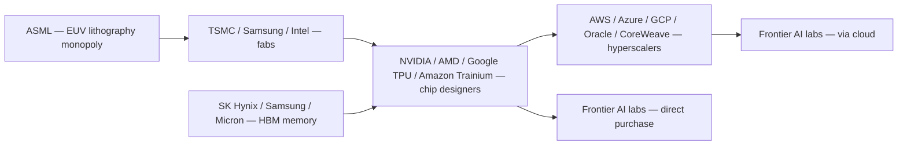

import {EntityLink, R, KBF, Calc, DataInfoBox, DataExternalLinks} from '@components/wiki';

## Quick Assessment

| Dimension | Assessment |
|-----------|------------|
| Governance relevance | Very High — compute is widely considered AI's most governable chokepoint |
| Geographic concentration | Extreme — most advanced fabrication concentrated in Taiwan, South Korea, Netherlands |
| Export-control exposure | High — US Entity List (E136) and BIS rules heavily affect chip flows |
| Key safety leverage | Chip supply constraints can slow or redirect AI scaling |
| Primary risk | Single-point failures at TSMC, ASML; multipolar miscoordination among supply chain actors |

## Overview

The compute supply chain for artificial intelligence spans five major tiers: lithography equipment, semiconductor fabrication, chip design, memory manufacturing, and cloud compute services. Each tier contains extreme concentrations of market power — in some cases approaching monopoly — that create both systemic fragility and potential governance leverage. Understanding who controls each layer of this chain, and how those actors relate to one another, is foundational to any serious analysis of Compute Governance.

The chain runs from raw silicon and rare-earth inputs through equipment manufacturers, foundries, and chip designers, ultimately reaching cloud hyperscalers and specialized AI compute providers who rent access to labs training frontier models. At every stage, a small number of firms exercise outsized control. ASML manufactures the only commercially available extreme ultraviolet (EUV) lithography machines. TSMC produces the overwhelming majority of the world's most advanced chips. NVIDIA supplies roughly 70–90% of the GPUs used to train large AI models. This stacking of concentration means that disruptions — whether from geopolitical conflict, export controls, or corporate decisions — can propagate rapidly through the entire AI development ecosystem.

From an AI safety perspective, these chokepoints are significant. Researchers including Yoshua Bengio have argued that high-end chip supply represents a meaningful leverage point: actors controlling compute could, in principle, enforce restraints on dangerous AI development and buy time for alignment research to mature. At the same time, Andrew Critch and others have highlighted the risk of **multipolar failure**: a fragmented, miscoordinated supply chain could enable uncoordinated AI scaling without any single actor imposing safety checks. The supply chain is thus simultaneously a potential instrument of governance and a potential source of systemic risk.

## History and Background

The modern AI compute supply chain emerged from several decades of semiconductor industry evolution. Henry Ford's assembly line (1913) and subsequent industrial innovations established the logic of specialized, integrated manufacturing. The formal concept of supply chain management was coined by Keith Oliver in 1982, though the semiconductor industry's own supply chain logic developed largely in parallel, shaped by Moore's Law scaling economics and the rise of the fabless design model in the 1990s.

The critical transition for AI compute occurred in the 2010s, when deep learning researchers discovered that graphics processing units — originally designed for rendering — could dramatically accelerate neural network training. NVIDIA's CUDA ecosystem, developed from the mid-2000s onward, became the dominant platform. By the early 2020s, a distinct AI compute supply chain had crystallized, with specialized chips, memory architectures (particularly high-bandwidth memory), and purpose-built cloud clusters replacing general-purpose compute infrastructure as the primary limiting factor for frontier AI development.

The COVID-19 pandemic (2020–2021) exposed extreme fragility in semiconductor supply chains, accelerating policy attention. The US CHIPS and Science Act (2022) committed over \$50 billion to domestic semiconductor manufacturing incentives. Export controls, particularly the Entity List (E136) administered by the Bureau of Industry and Security (BIS), became a central tool of US AI policy, restricting sales of advanced chips to China and other designated countries. These developments have made the geopolitics of compute supply chains inseparable from questions of AI safety and governance.

## Key Activities: The Supply Chain Tier by Tier

### Tier 1: Lithography Equipment

The most upstream chokepoint is lithography — the process of printing circuit patterns onto silicon wafers. **ASML**, a Dutch company, is the sole manufacturer of extreme ultraviolet (EUV) lithography machines, which are required to produce chips at the leading edge (currently 3nm and below). Each EUV machine costs approximately \$150–200 million, contains over 100,000 parts sourced from hundreds of suppliers across multiple countries, and takes years to manufacture and deliver.

ASML's monopoly position makes it an extraordinarily powerful chokepoint. The Dutch government, under US pressure, has restricted ASML's ability to export the most advanced EUV machines to China — a policy that directly limits China's ability to manufacture frontier AI chips domestically. No credible competitor to ASML exists in EUV, and the physics and engineering complexity of the machines means no competitor is likely to emerge within a decade. For AI Chip Governance Supply Chain purposes, ASML's export licensing represents one of the most concrete existing mechanisms of compute governance.

### Tier 2: Chip Foundries

Foundries fabricate chips designed by others. The global landscape is dominated by a small number of players:

| Foundry | Country | Advanced Node Capability | Estimated AI Chip Share |
|---------|---------|--------------------------|-------------------------|
| TSMC | Taiwan | 3nm, 2nm (in development) | ≈90% of most advanced AI chips |
| Samsung Foundry | South Korea | 3nm GAA | Small share of advanced AI chips |
| Intel Foundry | USA | 18A (in development) | Minimal current share |
| SMIC | China | ≈7nm (limited, sanctions-constrained) | Primarily domestic market |

**TSMC** (Taiwan Semiconductor Manufacturing Company) holds more than 60% of global foundry market share by revenue, and approximately 90% of the market for chips at the leading edge nodes required for frontier AI training. This geographic concentration in Taiwan — a territory subject to significant geopolitical risk — is widely cited as a systemic vulnerability. TSMC is currently investing in facilities in Arizona (with US government support), Japan, and Germany, but these fabs are not expected to close the gap with its Taiwan operations for many years.

**Samsung** is TSMC's closest competitor in advanced nodes but has faced yield challenges. **Intel Foundry** (formerly Intel Foundry Services) is a US-government-backed attempt to rebuild American advanced chip manufacturing, though it lags TSMC by at least one process generation. **SMIC**, China's leading foundry, is constrained by US export controls from accessing EUV equipment, limiting it to ~7nm nodes, which are insufficient for training frontier models.

The foundry tier is where export controls have their most direct effect. BIS restrictions prevent the sale of chips fabricated at advanced nodes to Chinese entities on the Entity List, and TSMC has announced policies to enforce these restrictions on its customers.

### Tier 3: Chip Designers

Chip designers (fabless or integrated device manufacturers) create the architectures that foundries manufacture. For AI compute, the landscape includes:

**NVIDIA** dominates AI chip design with an estimated 70–90% share of the GPU market for AI training. Its H100 and H200 series (manufactured by TSMC at 4nm) are the reference hardware for virtually all frontier model training. NVIDIA's CUDA software ecosystem creates additional lock-in beyond hardware alone. NVIDIA has also made strategic investments in compute service providers including CoreWeave and in AI labs including OpenAI, deepening its integration across the supply chain.

**AMD** competes with its MI300X series accelerator, which has gained some adoption among hyperscalers. The MI300 series represents the most credible alternative to NVIDIA in the near term, though CUDA's ecosystem advantages remain significant.

**Google** develops proprietary **Tensor Processing Units (TPUs)** used internally for training and inference within Google Cloud. TPUs represent a major investment in vertical integration — Google designs chips, has them manufactured (largely by TSMC), and deploys them in its own data centers, reducing dependence on NVIDIA.

**Amazon** similarly develops **Trainium** (for training) and **Inferentia** (for inference) chips for its own AWS cloud and select customers. These ASICs are optimized for specific workloads and offer cost advantages over NVIDIA GPUs in certain scenarios.

**Groq** produces the LPU (Language Processing Unit), an inference accelerator claiming significant speed advantages for token generation. **Cerebras** produces wafer-scale chips with extreme memory bandwidth. **Tenstorrent**, co-founded by Jim Keller, takes a RISC-V-based approach targeting AI inference and training with an open architecture. These challengers remain small relative to NVIDIA but represent the nascent diversification of the chip design layer.

### Tier 4: Memory (HBM)

High-bandwidth memory (HBM) is a distinct and critical component of AI accelerators. AI chips require massive memory bandwidth to feed matrix operations at training scale; HBM, stacked directly alongside the compute die using advanced packaging, provides this. The HBM market is effectively a triopoly:

| Manufacturer | Country | Estimated HBM Market Share |
|--------------|---------|---------------------------|
| SK Hynix | South Korea | ≈50–60% |
| Samsung | South Korea | ≈25–30% |
| Micron | USA | ≈10–15% |

**SK Hynix** is the leading supplier of HBM3 and HBM3E, the generations required for NVIDIA H100/H200 and their successors. Supply constraints at SK Hynix have repeatedly created bottlenecks in the production of AI accelerators, demonstrating how the memory tier can be as binding as the logic chip tier. Geographic concentration in South Korea creates correlated geopolitical risk alongside Taiwan's concentration of logic fabrication.

### Tier 5: Cloud Hyperscalers

Cloud providers are the primary interface between the compute supply chain and AI laboratories. They purchase or lease hardware from chip designers, deploy it in data centers, and sell access to labs and enterprises. The major actors:

| Provider | Parent | Key AI Compute Offering |
|----------|--------|------------------------|
| AWS | Amazon | H100 clusters, Trainium 2 |
| Microsoft Azure | Microsoft | H100, exclusive OpenAI infrastructure partner |
| Google Cloud (GCP) | Alphabet | H100, proprietary TPU v5 |
| Oracle Cloud | Oracle | H100 GPU clusters |
| CoreWeave | Independent | GPU-specialized cloud, NVIDIA-backed |
| Lambda Labs | Independent | GPU cloud for AI training/inference |

**AWS**, **Azure**, and **GCP** — the three dominant hyperscalers — collectively control the majority of cloud compute used for AI training. Microsoft Azure has a particularly close relationship with OpenAI, serving as its primary compute infrastructure provider. Google Cloud provides both commodity GPU access and proprietary TPU capacity. Oracle Cloud has emerged as a significant provider for large GPU clusters, notably signing agreements with OpenAI and others.

**CoreWeave** represents the leading "neocloud" — a specialized AI compute provider that focuses exclusively on GPU infrastructure. NVIDIA holds an equity stake in CoreWeave, reflecting its strategy of diversifying its customer base beyond the major hyperscalers. **Lambda Labs** similarly serves AI-focused customers with GPU cloud access, particularly for training workloads requiring flexibility beyond what hyperscalers offer.

### Tier 6: Specialized AI Clouds

Beyond the major hyperscalers and established neoclouds, a layer of more specialized providers has emerged:

**Crusoe Energy** deploys AI compute infrastructure powered by stranded natural gas, positioning compute supply alongside energy sustainability arguments. **Together AI** offers a platform combining model hosting, fine-tuning, and inference with a research-oriented positioning. These firms serve different market segments than the hyperscalers — often smaller labs, research institutions, or organizations with specific workload requirements.

## Supply Chain Flow

The flow of compute from raw inputs to AI laboratories runs roughly:

Each hop concentrates further, creating well-known chokepoints: ASML for EUV-class lithography, TSMC for leading-edge fabrication, NVIDIA for AI accelerators at scale, and a small number of hyperscalers for on-demand compute.

