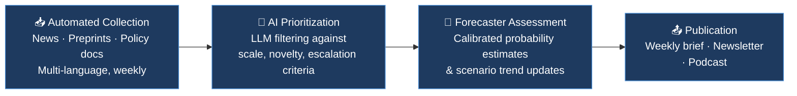

import {EntityLink, Section} from '@components/wiki';

## Quick Assessment

| Dimension | Assessment |
|-----------|------------|
| **Type** | Foresight and emergency response organization |
| **Founded** | Informal operations from approximately 2023; incorporated as US 501(c)(3) nonprofit in or after late 2024 |
| **Focus** | Anticipating and reacting to large-scale catastrophes |
| **Output** | Weekly newsletter ([blog.sentinel-team.org](https://blog.sentinel-team.org)), <EntityLink id="E566" name="sentinel">Sentinel (Catastrophic Risk Foresight)</EntityLink> Minutes podcast |
| **Team** | Forecasters including members from <EntityLink id="E560" name="samotsvety">Samotsvety</EntityLink>, <EntityLink id="E532" name="good-judgment">Good Judgment (Forecasting)</EntityLink>, <EntityLink id="E569" name="swift-centre">Swift Centre</EntityLink> |
| **Website** | [sentinel-team.org](https://sentinel-team.org) |

## Key Links

| Source | Link |
|--------|------|
| Official Website | [sentinel-team.org](https://sentinel-team.org) |
| Weekly Brief | [xrisk.fyi](https://xrisk.fyi) |
| Newsletter / Blog | [blog.sentinel-team.org](https://blog.sentinel-team.org) |
| X / Twitter | [@XriskFYI](https://x.com/XriskFYI) · [@SentinelTeamHQ](https://x.com/SentinelTeamHQ) |
| EA Forum (Nov 2024 funding memo) | [EA Forum post](https://forum.effectivealtruism.org/posts/SzuF29o9uQpLpYrqJ/sentinel-funding-memo-mitigating-gcrs-with-forecasting-and) |
| EA Forum (Nov 2025 update) | [EA Forum post](https://forum.effectivealtruism.org/posts/GAFwc5jGFjqSetJiu/sentinel-early-detection-and-response-for-global) |
| <EntityLink id="E547" name="manifund">Manifund</EntityLink> funding page | [manifund.org](https://manifund.org/projects/fund-sentinel-for-q4-2024) |

## Overview

**Sentinel** is a foresight and emergency response organization focused on anticipating and mitigating large-scale catastrophes, with particular attention to tail-risk scenarios.[^1] Co-founded by <EntityLink id="E579" name="nuno-sempere">Nuño Sempere</EntityLink> and Rai Sur, the organization began operating informally around 2023 and incorporated as a US 501(c)(3) nonprofit in or after late 2024.[^2][^3] Sentinel combines automated intelligence gathering with human probabilistic judgment: language models process large volumes of news items weekly for initial triage, and the most credible signals are then routed to forecasters who assign calibrated probabilities to emerging threats.[^1]

Sentinel was founded by Sempere, a co-founder of <EntityLink id="E560" name="samotsvety">Samotsvety Forecasting</EntityLink> — a superforecasting group that won the CSET-Foretell forecasting competition in 2020 and 2021, described by Scott Alexander as winning "by an absolutely obscene margin, around twice as good as the next-best team."[^4] Sentinel carries forward that group's emphasis on quantified risk assessment. Its core architecture has two stages: high-throughput machine scanning for weak signals, followed by deliberative probabilistic reasoning from domain-aware forecasters. This separates Sentinel from both purely algorithmic monitoring services and conventional research organizations, neither of which routinely pairs broad surveillance with calibrated probability estimates on tail risks. The intended output is probability estimates expressed as confidence intervals rather than qualitative assessments.[^1]

As of November 2025, Sentinel reports approximately \$700K on its balance sheet against a full funding target of approximately \$1.6M, and its newsletter has grown from 552 to 3,936 subscribers since its first major public fundraise in November 2024.[^5]

## Organizational Structure and Funding

Sentinel is a registered US 501(c)(3) nonprofit organization, incorporated in or after late 2024.[^3] The incorporation followed a period of informal operations bootstrapped by Nuño Sempere's consulting income and early crowdfunding.[^6] The organization accepts donations via wire transfer and [Manifund](https://manifund.org/projects/fund-sentinel-for-q4-2024), an effective altruism-aligned funding platform.[^3]

Sentinel's budget is organized around four verticals: Sustainable Leadership, AI OSINT, Foresight Team, and Content & Distribution.[^5] As of November 2025, the organization had raised approximately \$700K of a \$1.6M full-funding target.[^5] Primary funding has come from individual donors and EA-adjacent crowdfunding; no grants from large institutional funders such as <EntityLink id="E552" name="open-philanthropy">Open Philanthropy</EntityLink> have been publicly disclosed.

The organization is registered in New York (per its @XriskFYI X/Twitter account, which describes itself as a "Media & News Company based in New York City").[^7] The team is geographically distributed: co-founder Rai Sur is based in New York,[^8] while forecaster Vidur Kapur is based in the United Kingdom.[^9]

Sentinel has two structural components:[^10]

- **Foresight Team**: Monitors current events and produces weekly risk assessments. Alerts the emergency response team when assessed risk crosses defined thresholds.
- **Emergency Response Team**: A reserve team with diverse skill sets intended to search for high-impact actions during crises. Described as "somewhat inactive" on the official website as of early 2025, pending further development.[^3]

## Core Activities

### Risk Detection Pipeline

Sentinel operates a structured, multi-stage pipeline for identifying and assessing global catastrophic risks.[^1] Automated ingestion draws on millions of news items, academic preprints, policy documents, and social media signals each week across multiple languages and regions. <EntityLink id="E400" name="large-language-models">Large Language Models</EntityLink> filter this volume down to a prioritized shortlist, flagging items against predefined criteria — scale, novelty, irreversibility, and escalation potential. Forecasters with demonstrated calibration track records then evaluate each flagged item, assign probability estimates grounded in reference-class reasoning, and situate developments within longer-term risk trajectories. Final outputs are packaged into structured briefs distributed on a weekly cadence.[^1]

1. **Automated Collection**: Millions of news items, preprints, and policy documents ingested weekly across multiple languages and source types.
2. **AI Prioritization**: Language models filter and rank candidate events against standing catastrophic-risk criteria, including scale, novelty, and escalation potential.
3. **Forecaster Assessment**: Human forecasters evaluate flagged items, assign calibrated probability estimates, and update trend lines for tracked scenarios.
4. **Publication**: Curated weekly summaries distributed via newsletter and podcast.

In addition to the standard pipeline, Sentinel has been developing an AI-enabled wargaming tool called `grim` to scale up the number of catastrophic scenarios that can be explored and to improve emergency response capabilities.[^11]

### Weekly Briefs

Each weekly brief is organized around a consistent set of risk categories, enabling readers to track developments across domains without re-orienting each issue. As of 2024–2025, Sentinel has tracked threats including H5N1, solar flares, militant terrorism, AI incidents and governance developments, and indicators of potential Chinese invasion of Taiwan.[^12]

| Category | Scope |
|---|---|
| **AI risks** | Capability developments, governance breakdowns |
| **Geopolitical threats** | Interstate conflicts, nuclear escalation, gray-zone incidents |
| **Biosecurity** | Engineered or naturally emerging pandemic threats |
| **Emerging catastrophes** | Novel or poorly precedented risks lacking established monitoring frameworks |
| **Probability updates** | Quantitative shifts in forecasted likelihoods for tracked scenarios |

Central to each brief is the **risk status indicator** — a color-coded ordinal signal consolidating the forecasting team's aggregate view of near-term catastrophic risk into a single at-a-glance readout. The indicator surfaces directional changes week over week, functioning as a running thermometer for civilizational-scale threat levels. Significant movements are accompanied by brief explanatory notes attributing shifts to specific developments in the underlying risk categories.

### Track Record

No publicly available formal track record report, Brier scores, or calibration metrics have been published by Sentinel as of this writing. Sentinel's November 2024 funding memo states that "judgemental forecasting by Sentinel's expert forecasters has a very good track record for short-term forecasts," but does not provide quantitative supporting data.[^10] One documented predictive success cited by Sentinel is correctly anticipating the WHO's decision to rate monkeypox a Public Health Emergency of International Concern (PHEIC) in 2024.[^12]

## Team

Sentinel's team combines probabilistic forecasting, AI policy research, and technology backgrounds. Forecasters appear to be drawn primarily from Samotsvety and similar superforecasting circles, which recruit based on demonstrated track records on platforms including Good Judgment Open, INFER, and <EntityLink id="E199" name="metaculus">Metaculus</EntityLink>.[^13]

- **Nuño Sempere** — Co-founder and Head of Foresight. Co-founded <EntityLink id="E560" name="samotsvety">Samotsvety Forecasting</EntityLink> with Misha Yagudin, having met at a 2020 summer fellowship at Oxford's <EntityLink id="E140" name="fhi">Future of Humanity Institute</EntityLink>. Previously a researcher at the Quantified Uncertainty Research Institute (QURI), where he built [Metaforecast.org](https://metaforecast.org/), a search tool aggregating predictions from multiple forecasting platforms. Bootstrapped Sentinel through his consulting practice, Shapley Maximizers, before going full time on Sentinel in mid-2024.[^6][^13]
- **Rai Sur** — Co-founder. Previously CTO of Alongside (later renamed Universal), a crypto index platform that raised \$11M led by a16z crypto in 2023. Educated at The Cooper Union for the Advancement of Science and Art. Joined Sentinel as co-founder in mid-2024, initially committing to three months full-time.[^8][^14]
- **<EntityLink id="E580" name="vidur-kapur">Vidur Kapur</EntityLink>** — Foresight team member. Forecasts for Good Judgment, <EntityLink id="E569" name="swift-centre">Swift Centre</EntityLink>, <EntityLink id="E560" name="samotsvety">Samotsvety</EntityLink>, Sentinel, and the RAND Forecasting Initiative, as well as a hedge fund. Studied medicine and public health. Based in the United Kingdom.[^9]
- **Tolga Bilge** — Foresight team member. AI Policy Researcher at <EntityLink id="E426" name="controlai">ControlAI</EntityLink>. Also a professional forecaster for the <EntityLink id="E569" name="swift-centre">Swift Centre</EntityLink>, the RAND Forecasting Initiative (formerly INFER), and Good Judgment Inc. (Superforecaster). Holds a Bachelor's in Mathematics from the University of St Andrews and a Master's in Mathematics from the University of Bergen. Main research interests include <EntityLink id="E353" name="tmc-technical-ai-safety">Technical AI Safety</EntityLink> and governance and existential risk reduction.[^15]
- **belikewater** — Foresight team member; a pseudonym used by an anonymous forecaster previously affiliated with <EntityLink id="E560" name="samotsvety">Samotsvety</EntityLink>. Described as "an anonymous forecaster known as belikewater" in Nuño Sempere's July 2022 EA Forum forecasting newsletter, where the forecaster contributed analysis on monkeypox spread. No real name has been publicly disclosed.[^16] A podcast transcript reveals "belikewater" to be the forecasting moniker of a foresight team member named Lisa.[^17]
- **Leif Sigrúnsson** — Foresight team member (listed on official website).[^13]

Podcast episodes are collaboratively written with contributions from a wider group including Brian Yu, Kati Conen, Alex Lyzhov, Jaeho Lee, and 30+ others.[^18]

## Media and Distribution

### Newsletter

Sentinel publishes via Substack at [blog.sentinel-team.org](https://blog.sentinel-team.org). As of November 2025, the newsletter had approximately 3,936 subscribers, up from 552 in November 2024 — a 7.1x increase.[^5] As of November 2024, the newsletter had no paid/paywalled tier; Sentinel indicated it planned to introduce a pledge mechanism pending bank account setup.[^19] Donations are accepted via Manifund and wire transfer.[^3]

### Sentinel Minutes Podcast

*Sentinel Minutes* is a podcast available on Apple Podcasts (ID: 1808187161), Spotify, Podcast Addict, and RSS that provides audio narration of the weekly risk brief.[^20] Episodes are published on a daily cadence and are categorized as News Commentary. No publicly available listener count or download figures have been disclosed. The podcast is narrated by TYPE III AUDIO.[^18]

| Channel | Format | Access | Primary Audience |
|---|---|---|---|
| Substack Newsletter | Long-form written analysis | Free | Researchers, policymakers, general public |
| Sentinel Minutes Podcast | Audio summaries | Free (Apple, Spotify, RSS) | Professionals, audio-preference listeners |
| Weekly Brief | Structured risk roundup | Free at [xrisk.fyi](https://xrisk.fyi) | Decision-makers, researchers |

## Relationship to AI Safety

Sentinel's work intersects with AI safety in two distinct ways.

**AI as a monitored risk category**: Sentinel treats advanced AI as one of several catastrophic risk domains under active surveillance, assigning probabilities to AI-related scenarios to produce structured, auditable signals for a field that often relies on qualitative expert judgment.

**AI as an operational tool**: Sentinel uses <EntityLink id="E400" name="large-language-models">Large Language Models</EntityLink> within its detection and summarization pipeline, making it a live case study in AI-assisted risk assessment. This dual role — AI as both subject and instrument — raises questions about reliability and whether AI-generated signals are well-suited to detecting novel AI-related risks specifically.

| Dimension | Role of AI at Sentinel |
|---|---|
| Risk object | AI developments monitored as potential catastrophic hazards |
| Pipeline tool | LLMs used for signal detection and report summarization |
| Governance input | Forecast outputs shared with policy-oriented research communities |

Team members are active in effective altruism and rationalist communities where AI safety is a central concern, creating overlap with organizations such as <EntityLink id="E202" name="miri">MIRI</EntityLink>, <EntityLink id="E557" name="redwood-research">Redwood Research</EntityLink>, and the broader technical AI safety ecosystem. This embedding facilitates cross-pollination around threat modeling and forecasting epistemics.

## Key Uncertainties

Several unresolved questions bear on Sentinel's long-term utility and credibility.

**Detection pipeline efficacy.** AI-assisted monitoring may perform well on risk patterns resembling historical precedents but face structural challenges with genuinely novel threats — precisely the scenarios Sentinel aims to prioritize. Whether the LLM-based triage layer would surface unprecedented signal types is not publicly documented.

**Signal calibration.** The tradeoff between false positives (alarm fatigue) and false negatives (missed warnings) accumulates into reputational and institutional consequences over time. Sentinel has not publicly specified its operating thresholds or the criteria by which they are adjusted.

**Comparative validation.** No systematic benchmarking against established intelligence, geopolitical, or security organizations has been published. It is therefore difficult to determine whether Sentinel's assessments provide marginal value relative to existing monitoring efforts.

**Forecaster network quality.** Expanding the forecaster pool risks diluting the epistemic norms — calibration, scope sensitivity, and independence — that give probabilistic risk estimates their credibility.

**Funding sustainability.** Organizations focused on speculative long-run risks face persistent pressure to demonstrate near-term legible impact. Sentinel has acknowledged this challenge in its public fundraising materials and describes its emergency response team as "somewhat inactive" pending further resources.[^3]

**Evidential standards.** The field lacks consensus on what would constitute proof that anticipatory catastrophic-risk forecasting is valuable, making it difficult to evaluate Sentinel's contributions or attract sustained institutional support. Sentinel's own impact estimate — 3.5 (0.4 to 11) basis points of existential risk averted at full funding — is produced using internal assumptions and has not been externally validated.[^5]

**Track record documentation.** Sentinel's founders state in funding materials that the foresight team has "a very good track record for short-term forecasts," but no formal track record publication with scoring data has been released as of this writing.[^10]

## Sources

[^1]: [About — Sentinel Global Risks Watch](https://blog.sentinel-team.org/about), Sentinel Team (ongoing).

[^2]: [Forecasting Newsletter: July 2024](https://forecasting.substack.com/p/forecasting-newsletter-july-2024), Nuño Sempere, July 2024. Notes Sentinel "gained a cofounder and began raising money for growing operations" as of July 2024, implying pre-existing informal operations.

[^3]: [Sentinel — Official Website](https://sentinel-team.org/), Sentinel Team (ongoing). Confirms 501(c)(3) status, donation channels, and team listing.

[^4]: [A Look at Samotsvety Forecasting, One of the World's Best Predictors of the Future](https://www.nasdaq.com/articles/a-look-at-samotsvety-forecasting-one-of-the-worlds-best-predictors-of-the-future), Nasdaq (date not specified). Quotes Scott Alexander on Samotsvety's CSET-Foretell performance.

[^5]: [Sentinel: Early Detection and Response for Global Catastrophes](https://forum.effectivealtruism.org/posts/GAFwc5jGFjqSetJiu/sentinel-early-detection-and-response-for-global), Nuño Sempere and Rai Sur, EA Forum, November 18, 2025. Reports \$700K raised of \$1.6M target, 7.1x newsletter growth, and impact estimates.

[^6]: [NunoSempere — EA Forum Profile](https://forum.effectivealtruism.org/users/nunosempere), Nuño Sempere (ongoing). Describes bootstrapping Sentinel through consulting practice Shapley Maximizers.

[^7]: [@XriskFYI on X](https://x.com/XriskFYI), Sentinel Team. Account joined September 2021; listed as "Media & News Company based in New York City."

[^8]: [Rai Sur — LinkedIn Profile](https://www.linkedin.com/in/rai-sur-395a6351/), Rai Sur (ongoing). Lists Cofounder of Sentinel Research, based in New York.

[^9]: [Vidur Kapur — EA Forum Profile](https://forum.effectivealtruism.org/users/vidur_kapur), Vidur Kapur (ongoing). Lists forecasting affiliations including Sentinel, Good Judgment, Swift Centre, Samotsvety, and RAND.

[^10]: [Sentinel Funding Memo — Mitigating GCRs with Forecasting & Emergency Response](https://forum.effectivealtruism.org/posts/SzuF29o9uQpLpYrqJ/sentinel-funding-memo-mitigating-gcrs-with-forecasting-and), Nuño Sempere and Rai Sur, EA Forum, November 6, 2024. Describes two-team structure and track record claims.

[^11]: [Scaling Wargaming for Global Catastrophic Risks with AI](https://blog.sentinel-team.org/p/scaling-wargaming-for-global-catastrophic), Sentinel Team, 2024–2025. Describes the `grim` wargaming tool development.

[^12]: [Fund Sentinel for Q1-2025](https://manifund.org/projects/fund-sentinel-for-q4-2024), Nuño Sempere and Rai Sur, Manifund, late 2024. Lists tracked threats and cites monkeypox PHEIC anticipation as a track record example.

[^13]: [Sentinel — Official Website (Team Page)](https://sentinel-team.org/), Sentinel Team (ongoing). Lists named foresight team members.

[^14]: [Crypto index platform Alongside raises \$11M led by a16z](https://techcrunch.com/2023/02/15/crypto-index-platform-alongside-raises-11m-led-by-a16z/), TechCrunch, February 15, 2023. Identifies Rai Sur as CTO of Alongside.

[^15]: [About — Tolga Bilge](https://tolgabilge.com/), Tolga Bilge (ongoing). Lists forecasting affiliations and educational background.

[^16]: [Samotsvety Nuclear Risk Forecasts — March 2022](https://forum.effectivealtruism.org/posts/KRFXjCqqfGQAYirm5/samotsvety-nuclear-risk-forecasts-march-2022), Samotsvety, EA Forum, March 2022. Identifies "belikewater" as an anonymous forecaster in the Samotsvety network.

[^17]: [The Risk of Nuclear War Between India and Pakistan](https://blog.sentinel-team.org/p/the-risk-of-nuclear-war-between-india), Sentinel Team, 2025. Host Rai Sur introduces "Lisa, also known by her forecasting moniker, Be Like Water."

[^18]: [Sentinel Minutes — Apple Podcasts](https://podcasts.apple.com/us/podcast/sentinel-minutes/id1808187161), Sentinel Team (ongoing). Lists podcast contributors and confirms daily publication cadence.

[^19]: [Sentinel Funding Memo — EA Forum (Comments Section)](https://forum.effectivealtruism.org/posts/SzuF29o9uQpLpYrqJ/sentinel-funding-memo-mitigating-gcrs-with-forecasting-and), community commenters and Sentinel team, November 2024. Exchange about potential paid Substack tier; Sentinel indicated pledges were forthcoming.

[^20]: [Sentinel Minutes — Apple Podcasts](https://podcasts.apple.com/us/podcast/sentinel-minutes/id1808187161), Sentinel Team (ongoing). Confirms availability on Apple Podcasts, Spotify, Podcast Addict, and RSS.

